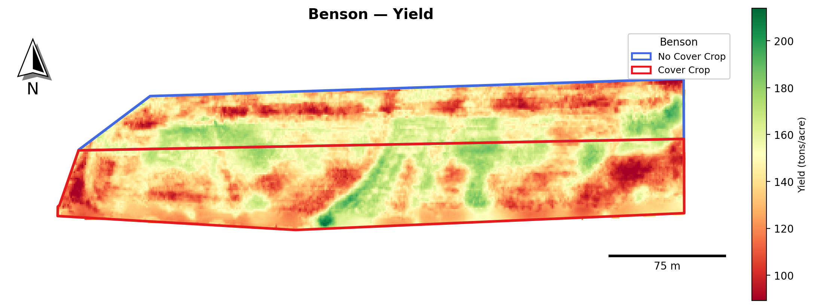
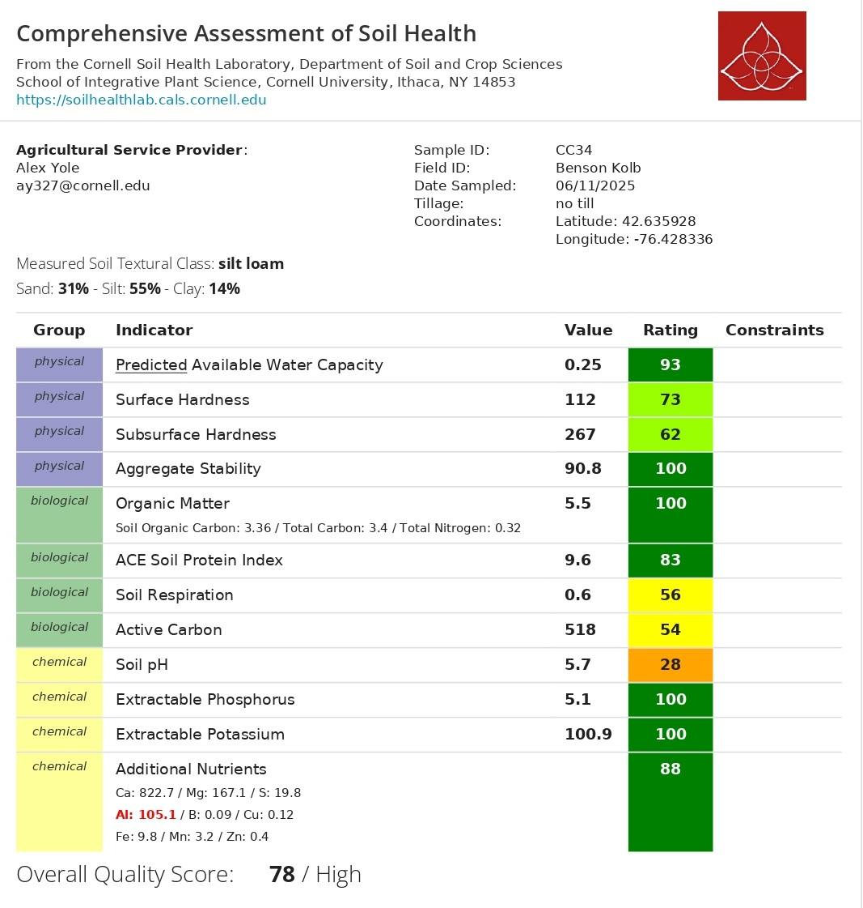
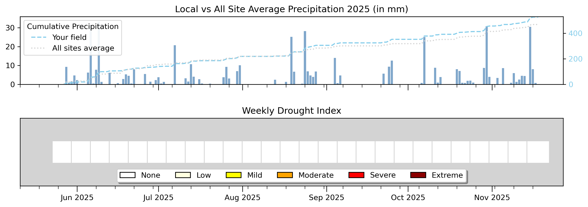

```{r setup, include=FALSE}
library(tidyverse)
library(plotly)
library(htmltools)
library(effectsize)
library(pwr)

# ============================================================
#  📂 RUTA DE DATOS — benson/
# ============================================================
data_dir <- "data"

# ============================================================
#  ARCHIVOS CSV
# ============================================================
dualex_file <- "benson_dualex_survey.csv"
cn_file     <- "OFE2025_CN.csv"
csnt_file   <- "OFE2025_CSNT.csv"

# ============================================================
#  DUALEX — LECTURA Y LIMPIEZA
#  Labels: "cover" → treatment, "control" → control
# ============================================================
df_raw <- read_csv(file.path(data_dir, dualex_file), show_col_types = FALSE)

df_clean <- df_raw |>
  mutate(
    treatment = str_squish(treatment),
    treatment = case_when(
      str_to_lower(treatment) == "control" ~ "control",
      str_to_lower(treatment) == "cover"   ~ "treatment",
      TRUE ~ str_to_lower(treatment)
    )
  ) |>
  filter(!is.na(chl)) |>
  arrange(group, meas) |>
  group_by(group) |>
  mutate(plant_id = ceiling(row_number() / 2)) |>
  ungroup()

df_avg <- df_clean |>
  group_by(date, field, treatment, group, plant_id) |>
  summarise(
    chl  = mean(chl,  na.rm = TRUE),
    flav = mean(flav, na.rm = TRUE),
    anth = mean(anth, na.rm = TRUE),
    nbi  = mean(nbi,  na.rm = TRUE),
    .groups = "drop"
  ) |>
  filter(!is.na(nbi)) |>
  mutate(treatment = factor(treatment, levels = c("control", "treatment")))

# ============================================================
#  DUALEX — ESTADÍSTICAS NBI + CHL
# ============================================================
stats_nbi <- df_avg |>
  group_by(treatment) |>
  summarise(n=n(), mean=round(mean(nbi,na.rm=TRUE),1),
            sd=round(sd(nbi,na.rm=TRUE),1), .groups="drop")

stats_chl <- df_avg |>
  group_by(treatment) |>
  summarise(n=n(), mean=round(mean(chl,na.rm=TRUE),1),
            sd=round(sd(chl,na.rm=TRUE),1), .groups="drop")

tt_nbi <- t.test(nbi ~ treatment, data = df_avg)
tt_chl <- t.test(chl ~ treatment, data = df_avg)

m_ctrl_nbi  <- stats_nbi |> filter(treatment=="control")   |> pull(mean)
m_cover_nbi <- stats_nbi |> filter(treatment=="treatment") |> pull(mean)
m_ctrl_chl  <- stats_chl |> filter(treatment=="control")   |> pull(mean)
m_cover_chl <- stats_chl |> filter(treatment=="treatment") |> pull(mean)

delta_nbi <- round(m_cover_nbi - m_ctrl_nbi, 2)
pct_nbi   <- round(100 * delta_nbi / m_ctrl_nbi, 1)
p_nbi     <- ifelse(tt_nbi$p.value < 0.001, "p < 0.001",
                    paste0("p = ", signif(tt_nbi$p.value, 3)))

delta_chl <- round(m_cover_chl - m_ctrl_chl, 2)
pct_chl   <- round(100 * delta_chl / m_ctrl_chl, 1)
p_chl     <- ifelse(tt_chl$p.value < 0.001, "p < 0.001",
                    paste0("p = ", signif(tt_chl$p.value, 3)))

# ============================================================
#  C:N BIOMASA (MaizeBiomass) — BENSON
# ============================================================
cn_all <- read_csv(file.path(data_dir, cn_file), show_col_types = FALSE)

bens_biomass <- cn_all |>
  filter(FarmName == "benson", SampleType == "MaizeBiomass") |>
  mutate(
    CN_ratio  = TotalC_pct / TotalN_pct,
    Treatment = factor(Treatment, levels = c("Control", "Treatment"))
  )

cn_summary_biomass <- bens_biomass |>
  group_by(Treatment) |>
  summarise(
    n       = n(),
    mean_N  = round(mean(TotalN_pct), 3),
    sd_N    = round(sd(TotalN_pct),   3),
    se_N    = round(sd(TotalN_pct) / sqrt(n()), 3),
    mean_CN = round(mean(CN_ratio),   2),
    sd_CN   = round(sd(CN_ratio),     2),
    .groups = "drop"
  )

mean_cover_N_bio   <- cn_summary_biomass |> filter(Treatment == "Treatment") |> pull(mean_N)
mean_nocover_N_bio <- cn_summary_biomass |> filter(Treatment == "Control")   |> pull(mean_N)
perc_N_bio         <- round((mean_cover_N_bio - mean_nocover_N_bio) / mean_nocover_N_bio * 100, 1)

mean_cover_CN_bio   <- cn_summary_biomass |> filter(Treatment == "Treatment") |> pull(mean_CN)
mean_nocover_CN_bio <- cn_summary_biomass |> filter(Treatment == "Control")   |> pull(mean_CN)
delta_CN_bio        <- round(mean_cover_CN_bio - mean_nocover_CN_bio, 2)
pct_CN_bio          <- round((mean_cover_CN_bio - mean_nocover_CN_bio) / mean_nocover_CN_bio * 100, 1)

d_N_bio  <- cohens_d(TotalN_pct ~ Treatment, data = bens_biomass)
d_CN_bio <- cohens_d(CN_ratio   ~ Treatment, data = bens_biomass)

n_cover_bio   <- bens_biomass |> filter(Treatment == "Treatment") |> nrow()
n_nocover_bio <- bens_biomass |> filter(Treatment == "Control")   |> nrow()

# ============================================================
#  C:N GRAIN (MaizeGrain — octubre) — BENSON
# ============================================================
bens_grain <- cn_all |>
  filter(FarmName == "benson", SampleType == "MaizeGrain") |>
  mutate(
    CN_ratio  = TotalC_pct / TotalN_pct,
    Treatment = factor(Treatment, levels = c("Control", "Treatment"))
  )

cn_summary_grain <- bens_grain |>
  group_by(Treatment) |>
  summarise(
    n       = n(),
    mean_N  = round(mean(TotalN_pct), 3),
    sd_N    = round(sd(TotalN_pct),   3),
    se_N    = round(sd(TotalN_pct) / sqrt(n()), 3),
    mean_CN = round(mean(CN_ratio),   2),
    sd_CN   = round(sd(CN_ratio),     2),
    .groups = "drop"
  )

mean_cover_N_gr   <- cn_summary_grain |> filter(Treatment == "Treatment") |> pull(mean_N)
mean_nocover_N_gr <- cn_summary_grain |> filter(Treatment == "Control")   |> pull(mean_N)
perc_N_gr         <- round((mean_cover_N_gr - mean_nocover_N_gr) / mean_nocover_N_gr * 100, 1)

mean_cover_CN_gr   <- cn_summary_grain |> filter(Treatment == "Treatment") |> pull(mean_CN)
mean_nocover_CN_gr <- cn_summary_grain |> filter(Treatment == "Control")   |> pull(mean_CN)
delta_CN_gr        <- round(mean_cover_CN_gr - mean_nocover_CN_gr, 2)
pct_CN_gr          <- round((mean_cover_CN_gr - mean_nocover_CN_gr) / mean_nocover_CN_gr * 100, 1)

d_N_gr  <- cohens_d(TotalN_pct ~ Treatment, data = bens_grain)
d_CN_gr <- cohens_d(CN_ratio   ~ Treatment, data = bens_grain)

n_cover_gr   <- bens_grain |> filter(Treatment == "Treatment") |> nrow()
n_nocover_gr <- bens_grain |> filter(Treatment == "Control")   |> nrow()

tt_N_gr  <- t.test(TotalN_pct ~ Treatment, data = bens_grain)
tt_CN_gr <- t.test(CN_ratio   ~ Treatment, data = bens_grain)
p_N_gr   <- ifelse(tt_N_gr$p.value  < 0.001, "p < 0.001",
                   paste0("p = ", signif(tt_N_gr$p.value, 3)))
p_CN_gr  <- ifelse(tt_CN_gr$p.value < 0.001, "p < 0.001",
                   paste0("p = ", signif(tt_CN_gr$p.value, 3)))

# ============================================================
#  CSNT — BENSON
# ============================================================
csnt_all <- read_csv(file.path(data_dir, csnt_file), show_col_types = FALSE)

bens_csnt <- csnt_all |>
  filter(FarmName == "benson") |>
  mutate(Treatment = factor(SampleID, levels = c("Control", "Treatment")))

csnt_ctrl      <- bens_csnt |> filter(Treatment == "Control")   |> pull(CSNT_ppm)
csnt_cover     <- bens_csnt |> filter(Treatment == "Treatment") |> pull(CSNT_ppm)
csnt_ctrl_lab  <- paste0(csnt_ctrl,  " ppm")
csnt_cover_lab <- paste0(csnt_cover, " ppm")

# ============================================================
#  N RATE — BENSON
# ============================================================
nrates <- read_csv(file.path(data_dir, "OFE2025_NRates.csv"), show_col_types = FALSE)
bens_nrate <- nrates |> filter(FarmName == "benson") |> pull(Nrate_lbAc)
bens_nrate_val <- bens_nrate[1]  # 74.5

# ============================================================
#  YIELD — BENSON
# ============================================================
yield_file <- "benson_yield.csv"

bens_yield <- read_csv(file.path(data_dir, yield_file), show_col_types = FALSE) |>
  rename(yield_buac = Yield) |>       # renombra directo como bu/ac
  mutate(
    Treatment = factor(Treatment, levels = c("No Cover", "Cover"))
  )

yield_summary <- bens_yield |>
  group_by(Treatment) |>
  summarise(
    n          = n(),
    mean_buac  = round(mean(yield_buac,   na.rm = TRUE), 1),
    median_buac= round(median(yield_buac, na.rm = TRUE), 1),
    sd_buac    = round(sd(yield_buac,     na.rm = TRUE), 1),
    .groups    = "drop"
  )

mean_cover_yield   <- yield_summary |> filter(Treatment == "Cover")    |> pull(mean_buac)
mean_nocover_yield <- yield_summary |> filter(Treatment == "No Cover") |> pull(mean_buac)
delta_yield        <- round(mean_cover_yield - mean_nocover_yield, 1)
pct_yield          <- round(100 * delta_yield / mean_nocover_yield, 1)

# ============================================================
#  PALETAS Y HELPERS
# ============================================================
pal    <- c("control" = "#e879a0", "treatment" = "#0d9488")
pal_cn <- c("Control" = "#e879a0", "Treatment" = "#0d9488")

fmt <- function(x) ifelse(x == round(x), as.character(round(x)), as.character(x))

sign_fmt <- function(x) ifelse(x >= 0, paste0("+", x), as.character(x))

# ============================================================
#  FUNCIÓN: 2 cards por sección
# ============================================================
section_cards <- function(mean_cover, mean_ctrl, delta, pct, p_val,
                           color_cover, color_fx) {
  HTML(paste0('
  <style>
    .sc-row {
      display: grid;
      grid-template-columns: 1fr 1fr;
      gap: 12px;
      margin: 16px 0 24px;
    }
    .sc {
      background: #fff;
      border: 1px solid #e5e7eb;
      border-radius: 12px;
      padding: 18px 20px;
      position: relative;
      overflow: hidden;
    }
    .sc-label { font-size: 10px; font-weight: 700; letter-spacing: 1.3px;
                text-transform: uppercase; color: #9ca3af; margin-bottom: 8px; }
    .sc-main  { display: flex; align-items: baseline; gap: 10px; flex-wrap: wrap; }
    .sc-val   { font-size: 2.4rem; font-weight: 700; font-family: monospace; line-height: 1; }
    .sc-delta { font-size: 1rem; font-weight: 600; color: #0d9488; }
    .sc-sub   { font-size: 11px; color: #9ca3af; margin-top: 6px; }
    .sc-p     { font-size: 12px; font-weight: 600; color: #e879a0; margin-top: 5px; }
    @media (max-width: 600px) { .sc-row { grid-template-columns: 1fr; } }
  </style>

  <div class="sc-row">
    <div class="sc" style="border-top: 4px solid ', color_cover, '">
      <div class="sc-label">Treatment</div>
      <div class="sc-main">
        <span class="sc-val">', fmt(mean_cover), '</span>
        <span class="sc-delta">', ifelse(delta >= 0, "&#8593;", "&#8595;"), ' ', sign_fmt(delta), ' vs control (', pct, '%)</span>
      </div>
      <div class="sc-sub">Control mean: ', fmt(mean_ctrl), '</div>
    </div>
    <div class="sc" style="border-top: 4px solid ', color_fx, '">
      <div class="sc-label">Effect Size</div>
      <div class="sc-main">
        <span class="sc-val">', pct, '%</span>
      </div>
      <div class="sc-sub">relative difference treatment vs control</div>
      <div class="sc-p">', p_val, ' &#10003;</div>
    </div>
  </div>
  '))
}

# ============================================================
#  FUNCIÓN: summary card simple (sin t-test confiable)
# ============================================================
cn_cards <- function(mean_cover, mean_nocover, pct_inc, cohen_d, label_metric, note) {
  HTML(paste0('
  <div class="sc-row">
    <div class="sc" style="border-top: 4px solid #0d9488">
      <div class="sc-label">Treatment — ', label_metric, '</div>
      <div class="sc-main">
        <span class="sc-val">', mean_cover, '</span>
        <span class="sc-delta">', ifelse(pct_inc >= 0, "&#8593;", "&#8595;"), ' ', sign_fmt(pct_inc), '% vs Control</span>
      </div>
      <div class="sc-sub">Control mean: ', mean_nocover, '</div>
    </div>
    <div class="sc" style="border-top: 4px solid #F9C74F">
      <div class="sc-label">Cohen\'s d (effect size)</div>
      <div class="sc-main">
        <span class="sc-val">', round(cohen_d, 2), '</span>
      </div>
      <div class="sc-sub">', note, '</div>
    </div>
  </div>
  '))
}
```

```{=html}
<div class="lab-topbar">
  <div class="lab-topbar__inner">
    <div class="lab-topbar__left">
      <div class="lab-topbar__logos">
        
        
      </div>
      <span class="lab-title">2025 Cropping Season</span>
      <span class="lab-subtitle">
        Field Kolb2 &nbsp;|&nbsp; NRate 74.5 lb N/ac &nbsp;|&nbsp;
        <strong>Research question:</strong> Will a clover cover crop supply 60 lbs of nitrogen?
      </span>
    </div>
    <div class="lab-topbar__right">
      <a class="btn btn-download" href="index.pdf" title="Download PDF version"target="_blank" rel="noopener noreferrer">
        ⬇ Download PDF
      </a>
    </div>
  </div>
</div>
```

::: {.page-intro}
**Welcome to your 2025 farm report.**
This report summarizes the on-farm nitrogen experiment conducted in your Kolb2 field, where clover cover crop strips (treatment) were compared against no-cover-crop controls. 
:::

```{=html}
<figure style="margin: 20px 0; text-align: center;">
  
  <figcaption style="font-size: 0.82rem; color: #6b7280; margin-top: 8px;">
    <strong>Figure 1.</strong> Kolb2 — treatment layout.
        &nbsp;·&nbsp; Cover crop: <em>Clover</em>
  </figcaption>
</figure>
```

::: {.page-intro}
**Take-home message:** Across all in-season nitrogen indicators (NBI, chlorophyll, biomass %N, and grain %N) corn plants in the clover cover crop strips consistently showed higher nitrogen status than control plots, and this translated into a meaningful yield advantage of +16 bu/ac (+11.8%) at harvest. That said, end-of-season cornstalk nitrate values fell below the 250 ppm deficiency threshold in both strips, suggesting that while the cover crop improved early-season nitrogen availability, the full 60 lb N/ac target was likely not met, making direct clover biomass sampling in 2026 the key next step.
:::

---

## Results Summary {#summary}

```{r summary-table, echo=FALSE, message=FALSE, warning=FALSE}
summary_df <- tibble(
  Metric = c(
    "🌽 Corn Yield(bu/ac)",
    "🌿 NBI",
    "🍃 Chlorophyll Index",
    "🧪 Biomass %N",
    "🌾 Grain %N",
    "🌽 CSNT"
  ),
  `Control` = c(
    paste0(m_ctrl_nbi),
    paste0(m_ctrl_chl),
    paste0(mean_nocover_N_bio, "%"),
    paste0(mean_nocover_N_gr, "%"),
    paste0(csnt_ctrl, " ppm"),
    paste0(mean_nocover_yield, " bu/ac")
  ),
  `Cover (Treatment)` = c(
    paste0(m_cover_nbi),
    paste0(m_cover_chl),
    paste0(mean_cover_N_bio, "%"),
    paste0(mean_cover_N_gr, "%"),
    paste0(csnt_cover, " ppm"),
    paste0(mean_cover_yield, " bu/ac")
  ),
  `Difference` = c(
    paste0(sign_fmt(delta_nbi), " (", pct_nbi, "%)"),
    paste0(sign_fmt(delta_chl), " (", pct_chl, "%)"),
    paste0(sign_fmt(perc_N_bio), "%"),
    paste0(sign_fmt(perc_N_gr), "%"),
    paste0(sign_fmt(csnt_cover - csnt_ctrl), " ppm"),
    paste0("+", delta_yield, " bu/ac (+", pct_yield, "%)")
  ),
  `p-value` = c(p_nbi, p_chl, "n too small*", p_N_gr, "n = 1", "spatial data†")
)

knitr::kable(summary_df, align = c("l","c","c","c","c"))
```

::: {style="font-size: 0.82rem; color: #9ca3af; margin-top: -8px;"}
\* Biomass C:N sample sizes are small (n = `r n_nocover_bio` Control, n = `r n_cover_bio` Treatment). Effect sizes (Cohen's d) are reported instead of p-values for that section.
† Yield monitor data contains ~130,000 GPS points with spatial autocorrelation — a simple p-value is not appropriate. The difference is reported as a descriptive field-level observation.
:::

---

## 🌾 Corn Yield {#yield}


::: {.page-intro}
The map below shows the **corn yield spatial distribution** across the Kolb2 field, displayed in bushels per acre. The line separates the clover cover crop (treatment) and control sub-fields.
:::

```{=html}
<figure style="margin: 20px 0; text-align: center;">
  
  <figcaption style="font-size: 0.82rem; color: #6b7280; margin-top: 8px;">
    <strong>Figure 2.</strong> Corn yield map.
  </figcaption>
</figure>

<div style="margin: 16px 0 24px; text-align: center;">
  <a href="https://farmersdatalab.github.io/3f1c9c5a-2e47-4c6d-9b6e-6d7a1f4a8c21/"
     target="_blank"
     rel="noopener noreferrer"
     style="display: inline-flex; align-items: center; gap: 8px;
            background: #0d9488; color: #fff; font-weight: 600;
            padding: 10px 20px; border-radius: 8px; text-decoration: none;
            font-size: 0.95rem; box-shadow: 0 2px 6px rgba(0,0,0,0.15);
            transition: opacity 0.2s;">
    🗺️ Open Interactive Map
  </a>
</div>
```

```{r yield-cards, echo=FALSE}
HTML(paste0('
<div class="sc-row">
  <div class="sc" style="border-top: 4px solid #0d9488">
    <div class="sc-label">Treatment — Mean Yield</div>
    <div class="sc-main">
      <span class="sc-val">', mean_cover_yield, '</span>
      <span class="sc-delta">&#8593; +', delta_yield, ' bu/ac vs Control (', pct_yield, '%)</span>
    </div>
    <div class="sc-sub">Control mean: ', mean_nocover_yield, ' bu/ac &nbsp;|&nbsp; n = ',
      format(yield_summary |> filter(Treatment=="Cover") |> pull(n), big.mark=","), ' yield monitor points</div>
  </div>
  <div class="sc" style="border-top: 4px solid #e879a0">
    <div class="sc-label">Difference</div>
    <div class="sc-main">
      <span class="sc-val">+', pct_yield, '%</span>
    </div>
    <div class="sc-sub">Yield monitor data — spatial autocorrelation expected.<br>
    Difference is descriptive, not a formal statistical test.</div>
  </div>
</div>
'))
```

::: {.panel-tabset}

## Density

```{r yield-density, echo=FALSE, message=FALSE, warning=FALSE}
set.seed(42)
yield_plot <- bens_yield |>
  slice_sample(n = 20000) |>
  mutate(Treatment = fct_recode(Treatment, "Treatment" = "Cover", "Control" = "No Cover"))

p_yd <- ggplot(yield_plot, aes(x = yield_buac, fill = Treatment, color = Treatment)) +
  geom_density(alpha = 0.35, linewidth = 0.8) +
  geom_vline(xintercept = mean_cover_yield,   color = "#0d9488", linewidth = 0.8,
             linetype = "dashed") +
  geom_vline(xintercept = mean_nocover_yield, color = "#e879a0", linewidth = 0.8,
             linetype = "dashed") +
  scale_fill_manual(values  = c("Treatment" = "#0d9488", "Control" = "#e879a0")) +
  scale_color_manual(values = c("Treatment" = "#0d9488", "Control" = "#e879a0")) +
  labs(
    title    = "Corn Yield Distribution",
    subtitle = paste0("Treatment mean = ", mean_cover_yield,
                      " bu/ac  |  Control mean = ", mean_nocover_yield,
                      " bu/ac  |  Delta = +", delta_yield, " bu/ac (+", pct_yield, "%)"),
    x        = "Yield (bu/ac)",
    y        = "Density",
    fill     = NULL, color = NULL,
    caption  = "Dashed lines = group means. Plotted on random sample of 20,000 yield monitor points."
  ) +
  theme_minimal(base_size = 13) +
  theme(plot.title      = element_text(face = "bold"),
        legend.position = "bottom",
        panel.grid.minor = element_blank())

ggplotly(p_yd) |> layout(legend = list(orientation = "h", y = -0.2))
```
## Boxplot

```{r yield-boxplot, echo=FALSE, message=FALSE, warning=FALSE}
p_yb <- ggplot(yield_plot, aes(x = Treatment, y = yield_buac,
                                fill = Treatment, color = Treatment)) +
  geom_boxplot(alpha = 0.35, outlier.shape = NA, linewidth = 0.8, width = 0.4) +
  geom_hline(yintercept = mean_cover_yield,   color = "#0d9488",
             linetype = "dashed", linewidth = 0.6) +
  geom_hline(yintercept = mean_nocover_yield, color = "#e879a0",
             linetype = "dashed", linewidth = 0.6) +
  scale_fill_manual(values  = c("Treatment" = "#0d9488", "Control" = "#e879a0")) +
  scale_color_manual(values = c("Treatment" = "#0d9488", "Control" = "#e879a0")) +
  scale_x_discrete(labels  = c("Cover" = "Treatment", "No Cover" = "Control")) +
  labs(
    title    = "Corn Yield by Treatment",
    subtitle = paste0("Delta = +", delta_yield, " bu/ac (+", pct_yield, "%) — Treatment vs Control"),
    x        = "Treatment",
    y        = "Yield (bu/ac)",
    caption  = "Outliers hidden for clarity. Sample of 20,000 yield monitor points."
  ) +
  theme_minimal(base_size = 13) +
  theme(plot.title      = element_text(face = "bold"),
        legend.position = "none",
        panel.grid.minor = element_blank())

ggplotly(p_yb) |> layout(showlegend = FALSE)
```

:::

---

## 🌿 Nitrogen Balance Index (NBI) {#nbi-details}

::: {.page-intro}
The **Nitrogen Balance Index (NBI)** gives us a real-time read on how well-supplied with nitrogen each corn plant is during the growing season. It works by measuring both chlorophyll (a sign of nitrogen sufficiency) and flavonoids (stress compounds that build up when the plant is nitrogen-stressed) in the same leaf. A higher NBI means the plant has plenty of nitrogen and is using it efficiently. We took two leaf readings per plant 
with the Dualex sensor, averaged them, and compared the clover strips against the control using a statistical test to see if the difference was real.
:::

```{r nbi-cards, echo=FALSE}
section_cards(m_cover_nbi, m_ctrl_nbi, delta_nbi, pct_nbi, p_nbi,
              "#0d9488", "#e879a0")
```

::: {.panel-tabset}

## Density

```{r nbi-density, echo=FALSE, message=FALSE, warning=FALSE}
p <- ggplot(df_avg, aes(x = nbi, fill = treatment, color = treatment)) +
  geom_density(alpha = 0.35, linewidth = 0.8) +
  scale_fill_manual(values  = pal,
                    labels = c("control"="Control","treatment"="Treatment")) +
  scale_color_manual(values = pal,
                     labels = c("control"="Control","treatment"="Treatment")) +
  labs(
    title    = "Nitrogen Balance Index (NBI)",
    subtitle = paste0("Treatment − Control = ", delta_nbi, " (", pct_nbi, "%) · ", p_nbi),
    x = "Nitrogen Balance Index (Dualex)", y = "Density",
    fill = NULL, color = NULL
  ) +
  theme_minimal(base_size = 13) +
  theme(plot.title = element_text(face="bold"), legend.position = "bottom",
        panel.grid.minor = element_blank())

ggplotly(p) |> layout(legend = list(orientation="h", y=-0.2))
```

## Boxplot

```{r nbi-boxplot, echo=FALSE, message=FALSE, warning=FALSE}
p <- ggplot(df_avg, aes(x=treatment, y=nbi, fill=treatment, color=treatment)) +
  geom_boxplot(alpha=0.35, outlier.shape=NA, linewidth=0.8, width=0.4) +
  geom_jitter(width=0.15, alpha=0.5, size=1.8) +
  scale_fill_manual(values  = pal,
                    labels = c("control"="control","treatment"="treatment")) +
  scale_color_manual(values = pal,
                     labels = c("control"="control","treatment"="treatment)")) +
  scale_x_discrete(labels = c("control"="control","treatment"="treatment")) +
  labs(title="Nitrogen Balance Index (NBI)", subtitle=p_nbi,
       x="Treatment", y="Nitrogen Balance Index (Dualex)") +
  theme_minimal(base_size=13) +
  theme(plot.title=element_text(face="bold"), legend.position="none",
        panel.grid.minor=element_blank())

ggplotly(p) |> layout(showlegend=FALSE)
```

:::

---

## 🍃 Chlorophyll (Chl) {#chl-details}

::: {.page-intro}
Leaf greenness is one of the most direct, visible signals that a corn plant has enough nitrogen. The Chlorophyll Index, measured with the same Dualex sensor as the NBI, captures this at the leaf level. A higher value means 
a greener, more photosynthetically active leaf, the kind of leaf that comes from a plant with good nitrogen access. We averaged two readings per plant and compared clover vs. control strips with a statistical test (t-test). When both the NBI and the chlorophyll are elevated in the same strips, that's a consistent and reliable signal. 
:::

```{r chl-cards, echo=FALSE}
section_cards(m_cover_chl, m_ctrl_chl, delta_chl, pct_chl, p_chl,
              "#4CAF50", "#F9C74F")
```

::: {.panel-tabset}

## Density

```{r chl-density, echo=FALSE, message=FALSE, warning=FALSE}
p <- ggplot(df_avg, aes(x=chl, fill=treatment, color=treatment)) +
  geom_density(alpha=0.35, linewidth=0.8) +
  scale_fill_manual(values  = pal,
                    labels = c("control"="Control","treatment"="Cover (Clover)")) +
  scale_color_manual(values = pal,
                     labels = c("control"="Control","treatment"="Cover (Clover)")) +
  labs(
    title    = "Chlorophyll (Chl)",
    subtitle = paste0("Cover − Control = ", delta_chl, " (", pct_chl, "%) · ", p_chl),
    x = "Chlorophyll Index (Dualex)", y = "Density",
    fill = NULL, color = NULL
  ) +
  theme_minimal(base_size=13) +
  theme(plot.title=element_text(face="bold"), legend.position="bottom",
        panel.grid.minor=element_blank())

ggplotly(p) |> layout(legend=list(orientation="h", y=-0.2))
```

## Boxplot

```{r chl-boxplot, echo=FALSE, message=FALSE, warning=FALSE}
p <- ggplot(df_avg, aes(x=treatment, y=chl, fill=treatment, color=treatment)) +
  geom_boxplot(alpha=0.35, outlier.shape=NA, linewidth=0.8, width=0.4) +
  geom_jitter(width=0.15, alpha=0.5, size=1.8) +
  scale_fill_manual(values  = pal,
                    labels = c("control"="control","treatment"="treatment")) +
  scale_color_manual(values = pal,
                     labels = c("control"="control","treatment"="treatment")) +
  scale_x_discrete(labels = c("control"="control","treatment"="treatment")) +
  labs(title="Chlorophyll (Chl)", subtitle=p_chl,
       x="Treatment", y="Chlorophyll Index (Dualex)") +
  theme_minimal(base_size=13) +
  theme(plot.title=element_text(face="bold"), legend.position="none",
        panel.grid.minor=element_blank())

ggplotly(p) |> layout(showlegend=FALSE)
```

:::

---

## 🧪 C:N in Corn Biomass —  {#cn-biomass-details}

::: {.page-intro}
Corn biomass was collected and sent for laboratory C:N analysis. This tells us how much nitrogen the plant had absorbed and incorporated into its tissue up to that point in the season, a more direct measure than the leaf sensor readings. Because the number of samples per treatment is small, we report effect size (Cohen's d) rather than a p-value. 
:::

### Total Nitrogen in Biomass (%N)

::: {.page-intro}
A higher %N in the tissue means the plant had better access to nitrogen during the early-to-mid season growth window. The clover strips came in notably higher than the control, consistent with the in-season Dualex readings.
:::

```{r cn-biomass-n-cards, echo=FALSE}
cn_cards(
  mean_cover   = mean_cover_N_bio,
  mean_nocover = mean_nocover_N_bio,
  pct_inc      = perc_N_bio,
  cohen_d      = d_N_bio$Cohens_d,
  label_metric = "Mean %N (Biomass)",
  note         = paste0("n = ", n_nocover_bio, " Control · n = ", n_cover_bio, " Treatment")
)
```

::: {.panel-tabset}

## Bar Chart (%N)

```{r cn-biomass-n-bar, echo=FALSE, message=FALSE, warning=FALSE}
mean_data_N_bio <- cn_summary_biomass |>
  select(Treatment, mean_N, se_N)

p_n_bio <- ggplot(mean_data_N_bio, aes(x = Treatment, y = mean_N, fill = Treatment)) +
  geom_col(width = 0.55, color = "black", alpha = 0.9) +
  geom_errorbar(aes(ymin = mean_N - se_N, ymax = mean_N + se_N),
                width = 0.15, linewidth = 1) +
  scale_fill_manual(values = pal_cn) +
  scale_y_continuous(expand = expansion(mult = c(0, 0.2))) +
  labs(
    title    = "N in Corn Biomass (Mean %N ± SE)",
    subtitle = paste0("Cover = +", perc_N_bio, "% N  |  Cohen's d = ",
                      round(d_N_bio$Cohens_d, 2),
                      "  |  n = ", n_nocover_bio, " vs ", n_cover_bio),
    x = "Treatment", y = "Nitrogen (%)",
    caption  = "Note: small sample size — results are descriptive only."
  ) +
  theme_minimal(base_size = 13) +
  theme(legend.position = "none", plot.title = element_text(face = "bold"),
        panel.grid.minor = element_blank())

ggplotly(p_n_bio) |> layout(showlegend = FALSE)
```

## Raw Data (%N)

```{r cn-biomass-n-raw, echo=FALSE, message=FALSE, warning=FALSE}
p_raw_N_bio <- ggplot(bens_biomass, aes(x = Treatment, y = TotalN_pct,
                                         color = Treatment, fill = Treatment)) +
  geom_jitter(width = 0.12, size = 3.5, alpha = 0.7) +
  stat_summary(fun = mean, geom = "crossbar", width = 0.35,
               linewidth = 0.8, fatten = 2) +
  scale_color_manual(values = pal_cn) +
  scale_fill_manual(values  = pal_cn) +
  labs(title = "Individual Sample Values",
       subtitle = "Horizontal bar = group mean",
       x = "Treatment", y = "Total Nitrogen (%)") +
  theme_minimal(base_size = 13) +
  theme(legend.position = "none", plot.title = element_text(face = "bold"),
        panel.grid.minor = element_blank())

ggplotly(p_raw_N_bio) |> layout(showlegend = FALSE)
```

:::

### C:N Ratio — Biomass

```{r cn-biomass-ratio-cards, echo=FALSE}
cn_cards(
  mean_cover   = mean_cover_CN_bio,
  mean_nocover = mean_nocover_CN_bio,
  pct_inc      = pct_CN_bio,
  cohen_d      = d_CN_bio$Cohens_d,
  label_metric = "Mean C:N Ratio",
  note         = "Lower C:N = more nitrogen-rich tissue"
)
```

::: {.panel-tabset}

## Bar Chart (C:N)

```{r cn-biomass-ratio-bar, echo=FALSE, message=FALSE, warning=FALSE}
mean_data_CN_bio <- cn_summary_biomass |>
  select(Treatment, mean_CN, sd_CN, n) |>
  mutate(se_CN = round(sd_CN / sqrt(n), 2))

p_cn_bio <- ggplot(mean_data_CN_bio, aes(x = Treatment, y = mean_CN, fill = Treatment)) +
  geom_col(width = 0.55, color = "black", alpha = 0.9) +
  geom_errorbar(aes(ymin = mean_CN - se_CN, ymax = mean_CN + se_CN),
                width = 0.15, linewidth = 1) +
  scale_fill_manual(values = pal_cn) +
  scale_y_continuous(expand = expansion(mult = c(0, 0.2))) +
  labs(
    title    = "C:N Ratio in Corn Biomass (Mean ± SE)",
    subtitle = paste0("Cover C:N = ", mean_cover_CN_bio,
                      " vs Control = ", mean_nocover_CN_bio,
                      "  |  Cohen's d = ", round(d_CN_bio$Cohens_d, 2)),
    x = "Treatment", y = "C:N Ratio",
    caption = "Lower C:N ratio = more nitrogen-rich plant tissue."
  ) +
  theme_minimal(base_size = 13) +
  theme(legend.position = "none", plot.title = element_text(face = "bold"),
        panel.grid.minor = element_blank())

ggplotly(p_cn_bio) |> layout(showlegend = FALSE)
```

## Raw Data (C:N)

```{r cn-biomass-ratio-raw, echo=FALSE, message=FALSE, warning=FALSE}
p_raw_CN_bio <- ggplot(bens_biomass, aes(x = Treatment, y = CN_ratio,
                                          color = Treatment, fill = Treatment)) +
  geom_jitter(width = 0.12, size = 3.5, alpha = 0.7) +
  stat_summary(fun = mean, geom = "crossbar", width = 0.35,
               linewidth = 0.8, fatten = 2) +
  scale_color_manual(values = pal_cn) +
  scale_fill_manual(values  = pal_cn) +
  labs(title = "Individual Sample Values — C:N Ratio",
       subtitle = "Horizontal bar = group mean",
       x = "Treatment", y = "C:N Ratio") +
  theme_minimal(base_size = 13) +
  theme(legend.position = "none", plot.title = element_text(face = "bold"),
        panel.grid.minor = element_blank())

ggplotly(p_raw_CN_bio) |> layout(showlegend = FALSE)
```

:::

---

## 🌾 C:N in Corn Grain {#cn-grain-details}

::: {.page-intro}
Grain samples were collected and analyzed for C:N content. A lower ratio means the tissue is more nitrogen-rich relative to its carbon content. If the clover strips show a lower C:N, it confirms that those plants were not just taking up more nitrogen in absolute terms, they were incorporating it more efficiently into their tissue structure. A C:N below 20 in corn 
biomass at this growth stage is generally a sign of a well-nourished plant.
:::

### Total Nitrogen in Grain (%N) 

```{r cn-grain-n-cards, echo=FALSE}
section_cards(
  mean_cover  = mean_cover_N_gr,
  mean_ctrl   = mean_nocover_N_gr,
  delta       = round(mean_cover_N_gr - mean_nocover_N_gr, 3),
  pct         = perc_N_gr,
  p_val       = p_N_gr,
  color_cover = "#0d9488",
  color_fx    = "#e879a0"
)
```

::: {.panel-tabset}

## Bar Chart (%N — Grain)

```{r cn-grain-n-bar, echo=FALSE, message=FALSE, warning=FALSE}
mean_data_N_gr <- cn_summary_grain |>
  select(Treatment, mean_N, se_N)

p_n_gr <- ggplot(mean_data_N_gr, aes(x = Treatment, y = mean_N, fill = Treatment)) +
  geom_col(width = 0.55, color = "black", alpha = 0.9) +
  geom_errorbar(aes(ymin = mean_N - se_N, ymax = mean_N + se_N),
                width = 0.15, linewidth = 1) +
  scale_fill_manual(values = pal_cn) +
  scale_y_continuous(expand = expansion(mult = c(0, 0.2))) +
  labs(
    title    = "N in Corn Grain (Mean %N ± SE)",
    subtitle = paste0("Cover = ", sign_fmt(perc_N_gr), "% N  |  Cohen's d = ",
                      round(d_N_gr$Cohens_d, 2),
                      "  |  n = ", n_nocover_gr, " vs ", n_cover_gr,
                      "  |  ", p_N_gr),
    x = "Treatment", y = "Nitrogen (%)"
  ) +
  theme_minimal(base_size = 13) +
  theme(legend.position = "none", plot.title = element_text(face = "bold"),
        panel.grid.minor = element_blank())

ggplotly(p_n_gr) |> layout(showlegend = FALSE)
```

## Boxplot (%N — Grain)

```{r cn-grain-n-box, echo=FALSE, message=FALSE, warning=FALSE}
p_box_N_gr <- ggplot(bens_grain, aes(x = Treatment, y = TotalN_pct,
                                      fill = Treatment, color = Treatment)) +
  geom_boxplot(alpha=0.35, outlier.shape=NA, linewidth=0.8, width=0.4) +
  geom_jitter(width=0.15, alpha=0.6, size=2) +
  stat_summary(fun=mean, geom="crossbar", width=0.3, linewidth=0.7, fatten=2) +
  scale_fill_manual(values  = pal_cn) +
  scale_color_manual(values = pal_cn) +
  labs(title = "Grain %N",
       subtitle = paste0(p_N_gr, "  |  n = ", n_nocover_gr, " Control · ",
                         n_cover_gr, " Treatment"),
       x = "Treatment", y = "Total Nitrogen (%)") +
  theme_minimal(base_size = 13) +
  theme(legend.position = "none", plot.title = element_text(face = "bold"),
        panel.grid.minor = element_blank())

ggplotly(p_box_N_gr) |> layout(showlegend = FALSE)
```

## Raw Data (%N — Grain)

```{r cn-grain-n-raw, echo=FALSE, message=FALSE, warning=FALSE}
p_raw_N_gr <- ggplot(bens_grain, aes(x = Treatment, y = TotalN_pct,
                                      color = Treatment, fill = Treatment)) +
  geom_jitter(width = 0.12, size = 3.5, alpha = 0.7) +
  stat_summary(fun = mean, geom = "crossbar", width = 0.35,
               linewidth = 0.8, fatten = 2) +
  scale_color_manual(values = pal_cn) +
  scale_fill_manual(values  = pal_cn) +
  labs(title = "Individual Sample Values",
       subtitle = "Horizontal bar = group mean",
       x = "Treatment", y = "Total Nitrogen (%)") +
  theme_minimal(base_size = 13) +
  theme(legend.position = "none", plot.title = element_text(face = "bold"),
        panel.grid.minor = element_blank())

ggplotly(p_raw_N_gr) |> layout(showlegend = FALSE)
```

:::

### C:N Ratio — Grain

```{r cn-grain-ratio-cards, echo=FALSE}
section_cards(
  mean_cover  = mean_cover_CN_gr,
  mean_ctrl   = mean_nocover_CN_gr,
  delta       = delta_CN_gr,
  pct         = pct_CN_gr,
  p_val       = p_CN_gr,
  color_cover = "#0d9488",
  color_fx    = "#F9C74F"
)
```

::: {.panel-tabset}

## Bar Chart (C:N — Grain)

```{r cn-grain-ratio-bar, echo=FALSE, message=FALSE, warning=FALSE}
mean_data_CN_gr <- cn_summary_grain |>
  select(Treatment, mean_CN, sd_CN, n) |>
  mutate(se_CN = round(sd_CN / sqrt(n), 2))

p_cn_gr <- ggplot(mean_data_CN_gr, aes(x = Treatment, y = mean_CN, fill = Treatment)) +
  geom_col(width = 0.55, color = "black", alpha = 0.9) +
  geom_errorbar(aes(ymin = mean_CN - se_CN, ymax = mean_CN + se_CN),
                width = 0.15, linewidth = 1) +
  scale_fill_manual(values = pal_cn) +
  scale_y_continuous(expand = expansion(mult = c(0, 0.2))) +
  labs(
    title    = "C:N Ratio in Corn Grain (Mean ± SE)",
    subtitle = paste0("Cover C:N = ", mean_cover_CN_gr,
                      " vs Control = ", mean_nocover_CN_gr,
                      "  |  ", p_CN_gr),
    x = "Treatment", y = "C:N Ratio",
    caption = "Lower C:N ratio = more nitrogen-rich grain."
  ) +
  theme_minimal(base_size = 13) +
  theme(legend.position = "none", plot.title = element_text(face = "bold"),
        panel.grid.minor = element_blank())

ggplotly(p_cn_gr) |> layout(showlegend = FALSE)
```

## Raw Data (C:N — Grain)

```{r cn-grain-ratio-raw, echo=FALSE, message=FALSE, warning=FALSE}
p_raw_CN_gr <- ggplot(bens_grain, aes(x = Treatment, y = CN_ratio,
                                       color = Treatment, fill = Treatment)) +
  geom_jitter(width = 0.12, size = 3.5, alpha = 0.7) +
  stat_summary(fun = mean, geom = "crossbar", width = 0.35,
               linewidth = 0.8, fatten = 2) +
  scale_color_manual(values = pal_cn) +
  scale_fill_manual(values  = pal_cn) +
  labs(title = "Individual Sample Values — Grain C:N Ratio",
       subtitle = "Horizontal bar = group mean",
       x = "Treatment", y = "C:N Ratio") +
  theme_minimal(base_size = 13) +
  theme(legend.position = "none", plot.title = element_text(face = "bold"),
        panel.grid.minor = element_blank())

ggplotly(p_raw_CN_gr) |> layout(showlegend = FALSE)
```

:::

---

## 🌽 Cornstalk Nitrate Test (CSNT) {#csnt-details}

::: {.page-intro}
The Cornstalk Nitrate Test (CSNT) measures nitrate concentration in the lower cornstalk at the end of the season. It is a post-harvest diagnostic tool: values **below 250 ppm indicate insufficient nitrogen**, while the **optimal range is between 750 and 2000 ppm**. Because only **one sample per treatment** was collected, no statistical comparison is possible — this is a field-level observation.
:::

```{r csnt-card, echo=FALSE}
HTML(paste0('
<div class="sc-row">
  <div class="sc" style="border-top: 4px solid #e879a0">
    <div class="sc-label">Control</div>
    <div class="sc-main">
      <span class="sc-val">', csnt_ctrl_lab, '</span>
    </div>
    <div class="sc-sub">⚠ Below 250 ppm deficiency threshold</div>
  </div>
  <div class="sc" style="border-top: 4px solid #0d9488">
    <div class="sc-label">Treatment</div>
    <div class="sc-main">
      <span class="sc-val">', csnt_cover_lab, '</span>
    </div>
    <div class="sc-sub">⚠ Below 250 ppm deficiency  threshold</div>
  </div>
</div>
'))
```

```{r csnt-plot, echo=FALSE, message=FALSE, warning=FALSE}
p_csnt <- ggplot(bens_csnt, aes(x = Treatment, y = CSNT_ppm, fill = Treatment)) +
  geom_col(width = 0.5, color = "black", alpha = 0.9) +
geom_hline(yintercept = 250, linetype = "dashed", color = "#e57373", linewidth = 0.8) +
  scale_fill_manual(values = c("Control" = "#e879a0", "Treatment" = "#0d9488")) +
  scale_y_continuous(expand = expansion(mult = c(0, 0.3))) +
  labs(
    title   = "Cornstalk Nitrate Test (CSNT) — Benson Kolb2",
    x = "Treatment", y = "CSNT (ppm)",
    caption = "Single measurement per treatment — field-level observation only. Both values below 250 ppm sufficiency threshold."
  ) +
  theme_minimal(base_size = 13) +
  theme(legend.position = "none", plot.title = element_text(face = "bold"),
        panel.grid.minor = element_blank())

ggplotly(p_csnt) |> layout(showlegend = FALSE)
```

---

## 🌱 Soil Health Assessment {#soilhealth}

::: {.page-intro}
Soil health was assessed using the **Cornell Soil Health Test**. The overall quality score was **78/100 (High)**. Key items to watch: **Soil pH** scored 28 (Low, orange) at 5.7, below the optimal 6.2 - 6.8 range for corn, which can reduce nutrient availability and should be addressed with lime. **Soil Respiration** (score 56) and **Active Carbon** (score 54) are both in the Medium range, indicating microbial activity and labile carbon could improve. Physical and most biological indicators are strong: Aggregate Stability (100), Organic Matter (100), and AWC (93) reflect the benefits of no-till management. Aluminum (105.1 ppm) is flagged as excessive, which is linked to the low pH.
:::

```{=html}
<figure style="margin: 20px 0; text-align: center;">
  
</figure>

<div style="margin: 16px 0 24px;">
  <a href="data/benson_soilhealth.pdf"
     target="_blank"
     rel="noopener noreferrer"
     style="display: inline-flex; align-items: center; gap: 8px;
            background: #4CAF50; color: #fff; font-weight: 600;
            padding: 10px 18px; border-radius: 8px; text-decoration: none;
            font-size: 0.95rem; box-shadow: 0 2px 6px rgba(0,0,0,0.12);">
    ↗ Open Full Soil Health Report (PDF)
  </a>
</div>

```
---

## 🌧️Weather & Drought Conditions {#weatherDrought}

::: {.page-intro}
**Cumulative precipitation** at your field compared to the all-site average, alongside the weekly drought index from June through November 2025. Your field had a very clean growing season from a weather standpoint. Rainfall was well-distributed from June through November, tracking closely with the all-site average and finishing near 400 mm cumulative. Individual rain events were moderate and spread out — no single extreme event, but also no prolonged dry spells. The drought index stayed at None for the entire growing season, from planting through harvest, with no drought stress recorded at any point.  
:::
```{=html}
<figure style="margin: 0 0 24px; text-align: center;">
  
</figure>
```
---

## 📝 Conclusions {#conclusions}

```{r conclusion-callouts, echo=FALSE}
HTML(paste0('
<style>
  .conclusion-grid {
    display: grid;
    grid-template-columns: 1fr 1fr;
    gap: 14px;
    margin: 20px 0;
  }
  .conc-card {
    background: #fff;
    border: 1px solid #e5e7eb;
    border-left: 6px solid #4CAF50;
    border-radius: 8px;
    padding: 14px 16px;
    font-size: 0.93rem;
  }
  .conc-card.amber { border-left-color: #F9C74F; }
  .conc-card.teal  { border-left-color: #0d9488; }
  .conc-card.pink  { border-left-color: #e879a0; }
  .conc-card.red   { border-left-color: #ef4444; }
  .conc-title { font-weight: 700; font-size: 0.85rem; text-transform: uppercase;
                letter-spacing: 0.8px; color: #6b7280; margin-bottom: 6px; }
  @media (max-width: 700px) { .conclusion-grid { grid-template-columns: 1fr; } }
</style>

<div class="conclusion-grid">

<div class="conc-card teal">
  <div class="conc-title">🌿 Leaf Nitrogen Status (NBI)</div>
  Cover crop plots showed a <strong>16.3% higher NBI</strong> compared to Control
  (48.4 vs 41.6). Chlorophyll was also higher by <strong>16.3%</strong>. Both in-season readings point in the same direction: corn plants
  in cover crop strips had consistently better nitrogen status during the growing season.
</div>

<div class="conc-card amber">
  <div class="conc-title">🧪 Biomass Nitrogen (%N)</div>
  Laboratory analysis of corn biomass showed cover plots had
  <strong>+18.2% more nitrogen</strong> in their tissue (2.828% vs 2.392%). Cohens d = -1.53, indicating a large biological effect. With n = 5 per group,
  formal statistical testing is not appropriate, but the magnitude of the
  difference is notable and consistent with the Dualex readings.
</div>

<div class="conc-card">
  <div class="conc-title">🌾 Grain Nitrogen (%N)</div>
  At harvest, grain %N was <strong>+16.3% higher</strong> in cover strips
  (1.262% vs 1.085%). This is a statistically significant result, and reflects the full-season nitrogen story:cover crop plants not only showed better in-season status but also accumulated
  more nitrogen in the grain itself.
</div>

<div class="conc-card pink">
  <div class="conc-title">🌽 CSNT — N Limiting in Both Strips</div>
  End-of-season stalk nitrate was below the 250 ppm deficiency threshold in
  both treatments (Control: <strong>74 ppm</strong>; Cover: <strong>57 ppm</strong>).
  This indicates the corn crop was nitrogen-limited regardless of treatment.
  The 60 lb/ac clover N target was not demonstrably met this season,
  direct clover biomass sampling would help quantify actual N supply in 2026.
</div>

<div class="conc-card teal">
  <div class="conc-title">🌾 Corn Yield — Cover vs No Cover</div>
  Yield monitor data showed cover crop strips averaged <strong>142.7 bu/ac</strong>
  vs <strong>133 bu/ac</strong> in control strips, a difference of
  <strong>+9.7 bu/ac (+7.3%)</strong>. Given the spatial autocorrelation inherent
  in yield monitor data, this is a descriptive field observation rather than a
  formal statistical result, but the direction is consistent with all in-season
  nitrogen indicators.
</div>
'))
```


---

::: {style="font-size: 0.82rem; color: #9ca3af; text-align: center; margin-top: 32px; border-top: 1px solid #e5e7eb; padding-top: 16px;"}
Report generated by <strong><a href="https://www.farmersdatalab.org/" target="_blank">Farmers DataLab</a></strong> - Cornell University ·
