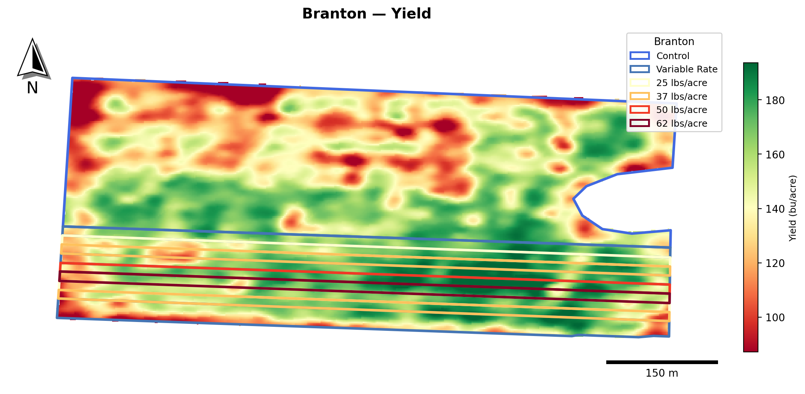
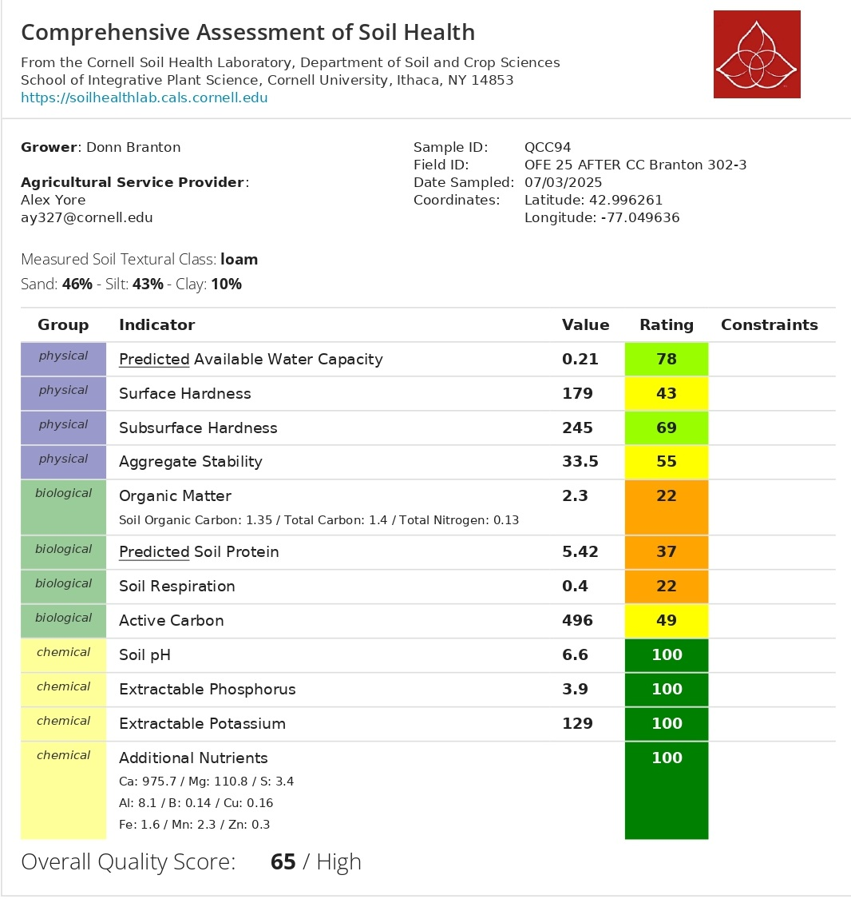

```{r setup, include=FALSE}
library(tidyverse)
library(plotly)
library(htmltools)
library(dplyr)

# ============================================================
#  DATA PATH
# ============================================================
data_dir <- "data"

cn_file     <- "OFE2025_CN.csv"
csnt_file   <- "OFE2025_CSNT.csv"
nrates_file <- "OFE2025_NRates.csv"

# ============================================================
#  N RATES — Branton 302-3
#  R0,R1,R6,R9 = variable; R2=37, R3=25, R4=62, R5=50, R7=37, R8=25
# ============================================================
nrates_raw <- read.csv(file.path(data_dir, nrates_file),
                       stringsAsFactors = FALSE, strip.white = TRUE)
bra_nrates_raw <- nrates_raw[trimws(nrates_raw$FarmName) == "branton", ]

# Build nrates table — assign NGroup label
bra_nrates <- data.frame(
  PlotName = trimws(bra_nrates_raw$PlotName),
  Nrate_raw = trimws(bra_nrates_raw$Nrate_lbAc),
  stringsAsFactors = FALSE
) |>
  mutate(
    Nrate    = suppressWarnings(as.numeric(Nrate_raw)),
    NGroup   = ifelse(is.na(Nrate), "Variable", paste0(Nrate, " lb N/ac")),
    NGroup   = factor(NGroup, levels = c("25 lb N/ac","37 lb N/ac",
                                          "50 lb N/ac","62 lb N/ac","Variable"))
  )

# ============================================================
#  C:N BIOMASS — Branton MaizeBiomass
# ============================================================
cn_raw <- read.csv(file.path(data_dir, cn_file),
                   stringsAsFactors = FALSE, strip.white = TRUE)

bra_cn <- cn_raw[trimws(cn_raw$FarmName) == "branton" &
                   trimws(cn_raw$SampleType) == "MaizeBiomass" &
                   !is.na(cn_raw$TotalN_pct), ]

# SampleID is like R0A, R0B → PlotName = R0, subsample = A/B
bra_cn$PlotName <- gsub("[AB]$", "", bra_cn$SampleID)

# Merge N rate info
bra_cn <- merge(bra_cn, bra_nrates[, c("PlotName","Nrate","NGroup")],
                by = "PlotName", all.x = TRUE)
bra_cn$CN_ratio <- bra_cn$TotalC_pct / bra_cn$TotalN_pct

# Average A and B within each plot
bra_cn_plot <- bra_cn |>
  group_by(PlotName, NGroup, Nrate) |>
  summarise(
    TotalN_pct = mean(TotalN_pct, na.rm = TRUE),
    CN_ratio   = mean(CN_ratio,   na.rm = TRUE),
    n_sub      = n(),
    .groups = "drop"
  )

# Summary by NGroup (for bar chart — averaging variable-rate as one group)
cn_summary <- bra_cn_plot |>
  group_by(NGroup) |>
  summarise(
    n       = n(),
    mean_N  = round(mean(TotalN_pct, na.rm = TRUE), 3),
    sd_N    = round(sd(TotalN_pct,   na.rm = TRUE), 3),
    se_N    = round(sd_N / sqrt(n), 3),
    mean_CN = round(mean(CN_ratio,   na.rm = TRUE), 2),
    sd_CN   = round(sd(CN_ratio,     na.rm = TRUE), 2),
    se_CN   = round(sd_CN / sqrt(n), 2),
    .groups = "drop"
  )

# ============================================================
#  CSNT — Branton
#  SampleIDs: 1E–10E and 1W–10W (strips 1–10 = R0–R9)
# ============================================================
csnt_raw <- read.csv(file.path(data_dir, csnt_file),
                     stringsAsFactors = FALSE, strip.white = TRUE)

bra_csnt <- csnt_raw[trimws(csnt_raw$FarmName) == "branton", ]

# Parse strip number from SampleID (e.g. "1E" → strip 1 → R0)
bra_csnt$StripNum <- as.integer(gsub("[EW]$", "", bra_csnt$SampleID))
bra_csnt$Position <- gsub("[0-9]+", "", bra_csnt$SampleID)

# Map strip number (1-indexed) to plot name (R0–R9 = 0-indexed)
bra_csnt$PlotName <- paste0("R", bra_csnt$StripNum - 1)

# Merge N rate
bra_csnt <- merge(bra_csnt, bra_nrates[, c("PlotName","Nrate","NGroup")],
                  by = "PlotName", all.x = TRUE)
bra_csnt <- bra_csnt[!is.na(bra_csnt$CSNT_ppm), ]

# Average E and W per plot
bra_csnt_plot <- bra_csnt |>
  group_by(PlotName, NGroup, Nrate) |>
  summarise(
    CSNT_ppm = mean(CSNT_ppm, na.rm = TRUE),
    .groups = "drop"
  )

# Summary by NGroup
csnt_summary <- bra_csnt_plot |>
  group_by(NGroup) |>
  summarise(
    n         = n(),
    mean_csnt = round(mean(CSNT_ppm, na.rm = TRUE), 0),
    sd_csnt   = round(sd(CSNT_ppm,   na.rm = TRUE), 0),
    se_csnt   = round(sd_csnt / sqrt(n), 0),
    .groups   = "drop"
  )

# ============================================================
#  COVER CROP C:N (for reference)
# ============================================================
bra_cc <- cn_raw[trimws(cn_raw$FarmName) == "branton" &
                   trimws(cn_raw$SampleType) == "CoverCrop" &
                   !is.na(cn_raw$TotalN_pct), ]
bra_cc$CN_ratio <- bra_cc$TotalC_pct / bra_cc$TotalN_pct
cc_mean_N  <- round(mean(bra_cc$TotalN_pct, na.rm = TRUE), 2)
cc_mean_CN <- round(mean(bra_cc$CN_ratio,   na.rm = TRUE, 1))

# ============================================================
#  YIELD DATA — Branton 302-3
# ============================================================
yield_file <- "branton_yield.csv"
yield_raw  <- read.csv(file.path(data_dir, yield_file),
                       stringsAsFactors = FALSE, strip.white = TRUE)

yield_raw$NGroup <- dplyr::recode(trimws(yield_raw$NRate),
  "25 lb/Ac" = "25 lb N/ac",
  "37 lb/Ac" = "37 lb N/ac",
  "50 lb/Ac" = "50 lb N/ac",
  "62 lb/Ac" = "62 lb N/ac",
  "Variable"  = "Variable"
)
yield_raw$NGroup <- factor(yield_raw$NGroup,
  levels = c("25 lb N/ac","37 lb N/ac","50 lb N/ac","62 lb N/ac","Variable"))
yield_raw$Strip  <- factor(trimws(yield_raw$Strip), levels = paste0("R", 0:9))

# Remove outliers: per-strip ±3 SD
yield_clean <- yield_raw |>
  group_by(Strip) |>
  mutate(m = mean(Yield, na.rm = TRUE), s = sd(Yield, na.rm = TRUE),
         keep = Yield >= (m - 3*s) & Yield <= (m + 3*s)) |>
  filter(keep) |> select(-m, -s, -keep) |> ungroup()

n_removed <- nrow(yield_raw) - nrow(yield_clean)

yield_group_sum <- yield_clean |>
  group_by(NGroup) |>
  summarise(
    n        = n(),
    mean_yld = round(mean(Yield, na.rm = TRUE), 1),
    sd_yld   = round(sd(Yield,   na.rm = TRUE), 1),
    se_yld   = round(sd_yld / sqrt(n), 1),
    .groups  = "drop"
  )

# ============================================================
#  COLOUR PALETTE — 5 groups (fixed rates + Variable)
# ============================================================
pal5 <- c("25 lb N/ac" = "#d1e5f0",
           "37 lb N/ac" = "#74add1",
           "50 lb N/ac" = "#4575b4",
           "62 lb N/ac" = "#1a6136",
           "Variable"   = "#e879a0")

# ============================================================
#  HELPER: simple summary card pair
# ============================================================
info_cards <- function(note_left, val_left, note_right, val_right,
                       color_left = "#1a6136", color_right = "#e879a0") {
  HTML(paste0('
  <style>
    .sc-row { display: grid; grid-template-columns: 1fr 1fr;
              gap: 12px; margin: 16px 0 24px; }
    .sc { background:#fff; border:1px solid #e5e7eb; border-radius:12px;
          padding:18px 20px; }
    .sc-label { font-size:10px; font-weight:700; letter-spacing:1.3px;
                text-transform:uppercase; color:#9ca3af; margin-bottom:8px; }
    .sc-main  { display:flex; align-items:baseline; gap:10px; flex-wrap:wrap; }
    .sc-val   { font-size:2.0rem; font-weight:700; font-family:monospace; line-height:1; }
    @media (max-width:600px) { .sc-row { grid-template-columns:1fr; } }
  </style>
  <div class="sc-row">
    <div class="sc" style="border-top:4px solid ', color_left, '">
      <div class="sc-label">', note_left, '</div>
      <div class="sc-main"><span class="sc-val">', val_left, '</span></div>
    </div>
    <div class="sc" style="border-top:4px solid ', color_right, '">
      <div class="sc-label">', note_right, '</div>
      <div class="sc-main"><span class="sc-val">', val_right, '</span></div>
    </div>
  </div>'))
}
```

```{=html}
<div class="lab-topbar">
  <div class="lab-topbar__inner">
    <div class="lab-topbar__left">
      <div class="lab-topbar__logos">
        
        
      </div>
      <span class="lab-title">2025 Cropping Season</span>
      <span class="lab-subtitle">
        Field 302-3 &nbsp;|&nbsp; Fixed rates: 25–62 lb N/ac &nbsp;|&nbsp; Variable-rate: R0, R1, R6, R9 &nbsp;|&nbsp;
        <strong>Research question:</strong> Do cover crops and improved soil health compensate for reductions in applied nitrogen when it comes to grain yield?
      </span>
    </div>
    <div class="lab-topbar__right">
      <a class="btn btn-download" href="index.pdf">⬇ Download PDF</a>
    </div>
  </div>
</div>
```

::: {.page-intro}
**Welcome to your 2025 farm report.**
This report summarizes the on-farm nitrogen rate experiment conducted in field 302-3. **The entire field has cover crop**. The field contains 10 N rate strips (R0–R9): strips R2, R3, R4, R5, R7, and R8 received fixed N rates (25–62 lb N/ac), while strips R0, R1, R6, and R9 received **variable rates**. The "Control" label in the data refers to the area of the field **with variable N rate (avg 30 lb/ac)**. Variable-rate strips are presented as a single "Variable" group, allowing a direct comparison of fixed vs. variable-rate N management.
:::

```{=html}
<figure style="margin: 20px 0; text-align: center;">
  
  <figcaption style="font-size:0.82rem; color:#6b7280; margin-top:8px;">
    <strong>Figure 1.</strong> Field 302-3 experiment layout.
  </figcaption>
</figure>
```

::: {.page-intro}
**Take-home message:** I will populate this once yield data is available to answer the research question :)
:::

---

## Results Summary {#summary}

```{r summary-table, echo=FALSE, message=FALSE, warning=FALSE}
lvls <- levels(cn_summary$NGroup)
summary_df <- tibble(
  `N Rate Group`     = lvls,
  `Plots`            = cn_summary$n[match(lvls, cn_summary$NGroup)],
  `Mean %N (Biomass)`= cn_summary$mean_N[match(lvls, cn_summary$NGroup)],
  `Mean CSNT (ppm)`  = csnt_summary$mean_csnt[match(lvls, csnt_summary$NGroup)],
  `Mean Yield (bu/ac)` = yield_group_sum$mean_yld[match(lvls, yield_group_sum$NGroup)]
)

knitr::kable(summary_df, align = c("l","c","c","c","c"))
```

::: {style="font-size:0.82rem; color:#9ca3af; margin-top:-8px;"}
Fixed N rate strips: R2 & R7 = 37 lb N/ac, R3 & R8 = 25 lb N/ac, R4 = 62 lb N/ac, R5 = 50 lb N/ac. Variable-rate strips: R0, R1, R6, R9. Small sample sizes (n = 1–4 plots per group) preclude formal statistical testing.
:::

---

## 🌾 Corn Yield {#yield}

::: {.page-intro}
The map below shows the **corn yield spatial distribution** across field 302-3, with the experimental strip design overlaid.
:::

```{=html}
<figure style="margin: 20px 0; text-align: center;">
  
  <figcaption style="font-size:0.82rem; color:#6b7280; margin-top:8px;">
    <strong>Figure 2.</strong> Corn yield spatial distribution (quantile color scale). Blue lines = N rate plot boundaries.
  </figcaption>
</figure>

```

::: {.page-intro}
The charts below summarize **yield monitor data** from field 302-3 across the 10 N rate strips (R0–R9). Outliers beyond ±3 SD within each strip were removed before analysis (`r n_removed` points excluded out of `r nrow(yield_raw)` total).
:::

::: {.panel-tabset}

## Density by N Rate Group

```{r yield-density, echo=FALSE, message=FALSE, warning=FALSE, fig.height=4}
p <- ggplot(yield_clean, aes(x = Yield, fill = NGroup, color = NGroup)) +
  geom_density(alpha = 0.35, linewidth = 0.8) +
  scale_fill_manual(values  = pal5) +
  scale_color_manual(values = pal5) +
  labs(
    title    = "Yield Distribution by N Rate Group",
    subtitle = "Kernel density of yield monitor points (±3 SD filter applied per strip)",
    x        = "Yield (bu/ac)",
    y        = "Density",
    fill     = NULL,
    color    = NULL,
    caption  = "Each curve aggregates all cleaned yield monitor points within that N rate group."
  ) +
  theme_minimal(base_size = 13) +
  theme(plot.title = element_text(face = "bold"),
        panel.grid.minor = element_blank())

ggplotly(p) |>
  config(displaylogo = FALSE) |>
  layout(
    legend = list(
      orientation = "h",
      x = 0.5, xanchor = "center",
      y = -0.35, yanchor = "top"
    ),
    margin = list(b = 90))
```

## Yield Distribution by Strip

```{r yield-boxplot, echo=FALSE, message=FALSE, warning=FALSE, fig.height=4}
p <- ggplot(yield_clean, aes(x = Strip, y = Yield, fill = NGroup)) +
  geom_boxplot(alpha = 0.85, outlier.size = 0.8, outlier.alpha = 0.4,
               color = "black", linewidth = 0.5) +
  scale_fill_manual(values = pal5) +
  labs(
    title    = "Yield Distribution by Individual Strip",
    subtitle = "Box = IQR, whiskers = 1.5×IQR; outlier filter (±3 SD) applied before plotting",
    x        = "Strip",
    y        = "Yield (bu/ac)",
    fill     = NULL,
    caption  = "Strip order matches field layout (R0 = northernmost strip)."
  ) +
  theme_minimal(base_size = 13) +
  theme(plot.title = element_text(face = "bold"),
        panel.grid.minor = element_blank())

ggplotly(p) |>
  config(displaylogo = FALSE) |>
  layout(
    legend = list(
      orientation = "h",
      x = 0.5, xanchor = "center",
      y = -0.30, yanchor = "top"
    ),
    margin = list(b = 90))
```

## Mean ± SE by N Rate Group

```{r yield-bar, echo=FALSE, message=FALSE, warning=FALSE, fig.height=4}
p <- ggplot(yield_group_sum, aes(x = NGroup, y = mean_yld, fill = NGroup)) +
  geom_col(width = 0.65, color = "black", alpha = 0.9) +
  geom_errorbar(aes(ymin = mean_yld - se_yld, ymax = mean_yld + se_yld),
                width = 0.18, linewidth = 0.9) +
  scale_fill_manual(values = pal5) +
  scale_y_continuous(expand = expansion(mult = c(0, 0.15))) +
  labs(
    title    = "Mean Yield ± SE by N Rate Group",
    subtitle = "Variable-rate plots (R0, R1, R6, R9) averaged as one group",
    x        = "N Rate Group",
    y        = "Yield (bu/ac)",
    caption  = "Error bars = ±SE. Results are descriptive; yield monitor data are not plot-level replicated measurements."
  ) +
  theme_minimal(base_size = 13) +
  theme(legend.position = "none",
        plot.title = element_text(face = "bold"),
        panel.grid.minor = element_blank())

ggplotly(p) |> config(displaylogo = FALSE) |> layout(showlegend = FALSE)
```

:::

---

## 🌱 Cover Crop Biomass C:N {#covercrop-cn}

::: {.page-intro}
Cover crop biomass was sampled across field 302-3 in spring **before treatment strips were defined** — all samples represent the field as a whole. The %N and C:N ratio of the residue indicate how quickly nutrients will be released to the following corn crop. A C:N ratio below ~25 suggests relatively fast N release during decomposition.
:::

```{r cc-summary, echo=FALSE, message=FALSE, warning=FALSE}
# Field-level summary (all samples pooled — strips not yet defined)
cc_field <- bra_cc |>
  summarise(
    n        = n(),
    mean_N   = round(mean(TotalN_pct, na.rm = TRUE), 2),
    sd_N     = round(sd(TotalN_pct,   na.rm = TRUE), 2),
    min_N    = round(min(TotalN_pct,  na.rm = TRUE), 2),
    max_N    = round(max(TotalN_pct,  na.rm = TRUE), 2),
    mean_CN  = round(mean(CN_ratio,   na.rm = TRUE), 1),
    sd_CN    = round(sd(CN_ratio,     na.rm = TRUE), 1),
    min_CN   = round(min(CN_ratio,    na.rm = TRUE), 1),
    max_CN   = round(max(CN_ratio,    na.rm = TRUE), 1)
  )

HTML(paste0('
<style>
  .cc-cards { display:grid; grid-template-columns:1fr 1fr 1fr; gap:14px; margin:20px 0 24px; }
  .cc-card  { background:#fff; border:1px solid #e5e7eb; border-top:5px solid #0d9488;
              border-radius:10px; padding:16px 18px; text-align:center; }
  .cc-card .label { font-size:0.78rem; font-weight:700; text-transform:uppercase;
                    letter-spacing:0.8px; color:#6b7280; margin-bottom:6px; }
  .cc-card .big   { font-size:2rem; font-weight:800; color:#0d9488; line-height:1.1; }
  .cc-card .sub   { font-size:0.82rem; color:#6b7280; margin-top:4px; }
  @media (max-width:600px) { .cc-cards { grid-template-columns:1fr; } }
</style>
<div class="cc-cards">
  <div class="cc-card">
    <div class="label">Mean %N</div>
    <div class="big">', cc_field$mean_N, '%</div>
    <div class="sub">SD = ', cc_field$sd_N, ' &nbsp;|&nbsp; range: ', cc_field$min_N, '–', cc_field$max_N, '%</div>
  </div>
  <div class="cc-card">
    <div class="label">Mean C:N Ratio</div>
    <div class="big">', cc_field$mean_CN, '</div>
    <div class="sub">SD = ', cc_field$sd_CN, ' &nbsp;|&nbsp; range: ', cc_field$min_CN, '–', cc_field$max_CN, '</div>
  </div>
</div>
'))
```

```{r cc-field-plot, echo=FALSE, message=FALSE, warning=FALSE, fig.height=4}
# Pre-compute mean and SD explicitly (avoids plotly stat_summary issues)
cc_mean <- mean(bra_cc$TotalN_pct, na.rm = TRUE)
cc_sd   <- sd(bra_cc$TotalN_pct,   na.rm = TRUE)

# Add jitter column for reproducibility
set.seed(42)
bra_cc_j <- bra_cc |>
  mutate(x_jit = runif(n(), 0.85, 1.15))

p <- ggplot() +
  # Individual sample dots (jittered manually)
  geom_point(data = bra_cc_j,
             aes(x = x_jit, y = TotalN_pct,
                 text = paste0("Sample ", SampleID, "<br>%N: ", TotalN_pct)),
             size = 3.5, alpha = 0.75, color = "#0d9488", shape = 16) +
  # Mean line
  annotate("segment", x = 0.7, xend = 1.3,
           y = cc_mean, yend = cc_mean,
           color = "black", linewidth = 1.1) +
  # SD error bar
  annotate("segment", x = 1, xend = 1,
           y = cc_mean - cc_sd, yend = cc_mean + cc_sd,
           color = "black", linewidth = 0.9) +
  annotate("segment", x = 0.88, xend = 1.12,
           y = cc_mean - cc_sd, yend = cc_mean - cc_sd,
           color = "black", linewidth = 0.9) +
  annotate("segment", x = 0.88, xend = 1.12,
           y = cc_mean + cc_sd, yend = cc_mean + cc_sd,
           color = "black", linewidth = 0.9) +
  scale_y_continuous(limits = c(0, NA), expand = expansion(mult = c(0, 0.15))) +
  scale_x_continuous(limits = c(0.5, 1.5), breaks = NULL) +
  labs(
    title    = "Cover Crop Biomass %N — Field Overview",
    subtitle = paste0("n = ", nrow(bra_cc), " samples | field-wide, pre-treatment | mean ± 1 SD shown"),
    x = NULL, y = "Total Nitrogen (%)",
    caption  = "Samples collected before strip treatments were defined. Dots = individual samples; bar = mean ± 1 SD."
  ) +
  theme_minimal(base_size = 13) +
  theme(plot.title         = element_text(face = "bold"),
        axis.text.x        = element_blank(),
        panel.grid.major.x = element_blank(),
        panel.grid.minor   = element_blank())

ggplotly(p, tooltip = "text") |> config(displaylogo = FALSE) |> layout(showlegend = FALSE)
```

---

## 🧪 C:N in Corn Biomass {#cn-details}

::: {.page-intro}
Corn biomass was collected from the 10 N rate strips. Each strip had two sub-samples (A and B); their average is used as the plot value. The bar chart below shows the mean %N ± SE by N rate group. **Variable-rate strips (R0, R1, R6, R9) are averaged as one group**, allowing comparison with fixed-rate management. Given the small number of observations per group (n = 1–4), no formal ANOVA is applied; results are descriptive.
:::

::: {.panel-tabset}
## Mean ± SE by N Rate Group

```{r cn-bar, echo=FALSE, message=FALSE, warning=FALSE, fig.height=3.8}
p <- ggplot(cn_summary, aes(x = NGroup, y = mean_N, fill = NGroup)) +
  geom_col(width = 0.65, color = "black", alpha = 0.9) +
  geom_errorbar(aes(ymin = mean_N - se_N, ymax = mean_N + se_N),
                width = 0.18, linewidth = 0.9) +
  scale_fill_manual(values = pal5) +
  scale_y_continuous(expand = expansion(mult = c(0, 0.2))) +
  labs(
    title   = "N in Corn Biomass - Mean %N ± SE by N Rate",
    subtitle = "Variable-rate plots (R0, R1, R6, R9) averaged as one group",
    x = "N Rate Group", y = "Total Nitrogen in Biomass (%)",
    caption = "Error bars = ±SE. Small n per group; results are descriptive only."
  ) +
  theme_minimal(base_size = 13) +
  theme(legend.position = "none", plot.title = element_text(face = "bold"),
        panel.grid.minor = element_blank())

ggplotly(p) |> config(displaylogo = FALSE) |> layout(showlegend = FALSE)
```

## By Individual Plot

```{r cn-plot, echo=FALSE, message=FALSE, warning=FALSE, fig.height=3.8}
bra_cn_plot2 <- bra_cn_plot |>
  mutate(PlotName = factor(PlotName, levels = paste0("R", 0:9)))

p <- ggplot(bra_cn_plot2, aes(x = PlotName, y = TotalN_pct, fill = NGroup)) +
  geom_col(width = 0.7, color = "black", alpha = 0.9) +
  scale_fill_manual(values = pal5) +
  scale_y_continuous(expand = expansion(mult = c(0, 0.15))) +
  labs(
    title   = "Biomass %N by Individual Strip",
    subtitle = "Each bar = mean of sub-samples A and B",
    x = "Strip", y = "Total Nitrogen (%)",
    fill = " ",
    caption = "Strip order matches field layout (R0 = northernmost strip)."
  ) +
  theme_minimal(base_size = 13) +
  theme(plot.title = element_text(face = "bold"),
        panel.grid.minor = element_blank())

ggplotly(p) |>
  config(displaylogo = FALSE) |>
  layout(
	legend = list(
  	orientation = "h",
  	x = 0.5,
  	xanchor = "center",
  	y = -0.30,
  	yanchor = "top"
	),
	margin = list(b = 90))

```
:::

---

## 🌽 Cornstalk Nitrate Test (CSNT) {#csnt-details}

::: {.page-intro}
The **Cornstalk Nitrate Test (CSNT)** measures residual nitrate in the lower stalk at season end. Values **above 250 ppm** indicate adequate nitrogen supply; values **below 250 ppm** suggest N was limiting during the season. Each strip had two samples (East = E, West = W positions), and their average is used as the plot value. 
:::

::: {.panel-tabset}

## Mean ± SE by N Rate Group

```{r csnt-bar, echo=FALSE, message=FALSE, warning=FALSE, fig.height=3.8}
p <- ggplot(csnt_summary, aes(x = NGroup, y = mean_csnt, fill = NGroup)) +
  geom_col(width = 0.65, color = "black", alpha = 0.9) +
  geom_errorbar(aes(ymin = mean_csnt - se_csnt, ymax = mean_csnt + se_csnt),
                width = 0.18, linewidth = 0.9) +
  geom_hline(yintercept = 250, linetype = "dashed", color = "gray40", linewidth = 0.8) +
  annotate("text", x = 0.55, y = 330, label = "Sufficient N: 250 ppm",
           hjust = 0, size = 3.5, color = "gray40") +
  scale_fill_manual(values = pal5) +
  scale_y_continuous(expand = expansion(mult = c(0, 0.25))) +
  labs(
    title   = "Cornstalk Nitrate (CSNT) — Mean ± SE by N Rate Group",
    subtitle = "Variable-rate plots (R0, R1, R6, R9) averaged as one group",
    x = "N Rate Group", y = "CSNT (ppm)",
    caption = "Error bars = ±SE. Dashed = 250 ppm sufficiency threshold. Descriptive only."
  ) +
  theme_minimal(base_size = 13) +
  theme(legend.position = "none", plot.title = element_text(face = "bold"),
        panel.grid.minor = element_blank())

ggplotly(p) |> config(displaylogo = FALSE) |> layout(showlegend = FALSE)
```

## By Individual Strip

```{r csnt-plot, echo=FALSE, message=FALSE, warning=FALSE, fig.height=3.8}
bra_csnt_plot2 <- bra_csnt_plot |>
  mutate(PlotName = factor(PlotName, levels = paste0("R", 0:9)))

p <- ggplot(bra_csnt_plot2, aes(x = PlotName, y = CSNT_ppm, fill = NGroup)) +
  geom_col(width = 0.7, color = "black", alpha = 0.9) +
  geom_hline(yintercept = 250, linetype = "dashed", color = "gray40", linewidth = 0.8) +
  scale_fill_manual(values = pal5) +
  scale_y_continuous(expand = expansion(mult = c(0, 0.15))) +
  labs(
    title   = "CSNT by Individual Strip (E+W average)",
    x = "Strip", y = "CSNT (ppm)",
    fill = "N Rate Group",
    caption = "Dashed line = 250 ppm sufficiency threshold."
  ) +
  theme_minimal(base_size = 13) +
  theme(plot.title = element_text(face = "bold"),
        panel.grid.minor = element_blank())

ggplotly(p) |>
  config(displaylogo = FALSE) |>
  layout(
	legend = list(
  	orientation = "h",
  	x = 0.5,
  	xanchor = "center",
  	y = -0.30,
  	yanchor = "top"
	),
	margin = list(b = 90))

```
:::

---

## 🌱 Soil Health Assessment {#soilhealth}

::: {.page-intro}
Soil health was assessed using the **Cornell Soil Health Test**. The overall quality score was **65/100 (High)**. Chemical indicators (pH, P, K, additional nutrients) all scored 100 - ideal. Key opportunities for improvement are in **biological indicators**: Organic Matter (score 22 - Low), Soil Respiration (score 22 - Low), and Predicted Soil Protein (score 37 - Low). These suggest that microbial activity and organic matter are limiting long-term soil function, which is directly relevant to the potential for internal nitrogen supply from cover crop residues.
:::

```{=html}
<figure style="margin: 20px 0; text-align: center;">
  
</figure>

<div style="margin: 16px 0 24px;">
  <a href="data/branton_soilhealth.pdf"
     target="_blank" rel="noopener noreferrer"
     style="display:inline-flex; align-items:center; gap:8px; background:#4CAF50;
            color:#fff; font-weight:600; padding:10px 18px; border-radius:8px;
            text-decoration:none; font-size:0.95rem; box-shadow:0 2px 6px rgba(0,0,0,0.12);">
    ↗ Open Full Soil Health Report (PDF)
  </a>
</div>
```

---

## 📝 Conclusion {#conclusion}

```{r conclusion, echo=FALSE}
var_cn   <- filter(cn_summary, NGroup == "Variable")$mean_N
var_csnt_val <- filter(csnt_summary, NGroup == "Variable")$mean_csnt

HTML(paste0('
<style>
  .conclusion-grid { display:grid; grid-template-columns:1fr 1fr; gap:14px; margin:20px 0; }
  .conc-card { background:#fff; border:1px solid #e5e7eb; border-left:6px solid #4CAF50;
               border-radius:8px; padding:14px 16px; font-size:0.93rem; }
  .conc-card.amber { border-left-color:#F9C74F; }
  .conc-card.teal  { border-left-color:#0d9488; }
  .conc-card.pink  { border-left-color:#e879a0; }
  .conc-title { font-weight:700; font-size:0.85rem; text-transform:uppercase;
                letter-spacing:0.8px; color:#6b7280; margin-bottom:6px; }
  @media (max-width:700px) { .conclusion-grid { grid-template-columns:1fr; } }
</style>

<div class="conclusion-grid">

  <div class="conc-card teal">
    <div class="conc-title">🌱 Cover Crop Biomass</div>
    The cover crop averaged <strong>', cc_mean_N, '% N</strong> and a C:N ratio of <strong>', cc_mean_CN, '</strong>.
    A C:N below ~25 indicates the cover crop should release N relatively quickly during decomposition,
    potentially contributing to early-season corn N supply.
  </div>

  <div class="conc-card amber">
    <div class="conc-title">🧪 Biomass %N in Corn</div>
    Variable-rate strips (R0, R1, R6, R9) averaged <strong>', var_cn, '% N</strong> in corn biomass at V6.
    Descriptive comparison across N rate groups suggests
    ', ifelse(var_cn > max(filter(cn_summary, NGroup != "Variable")$mean_N),
      "variable-rate technology delivered the highest tissue N of any group.",
      "fixed-rate strips were comparable or higher in tissue N."), '
    Formal testing is not appropriate given the small number of plots per group.
  </div>

  <div class="conc-card pink">
    <div class="conc-title">🌽 Cornstalk Nitrate (CSNT)</div>
    End-of-season stalk nitrate for variable-rate strips averaged <strong>',
    var_csnt_val, ' ppm</strong>.
    The 250 ppm sufficiency threshold was
    ', ifelse(var_csnt_val >= 250,
      "met by variable-rate strips, suggesting adequate N supply.",
      "not met by variable-rate strips on average, suggesting N may have been limiting."), '
    High within-strip variability (E vs W positions) underscores field spatial heterogeneity.
  </div>

  <div class="conc-card">
    <div class="conc-title">🌱 Soil Health</div>
    The overall soil health score of <strong>65/100 (High)</strong> reflects excellent chemical status
    but low biological activity. Improving organic matter and microbial activity through continued
    cover cropping and reduced tillage could enhance internal N cycling over time — directly relevant
    to whether the cover crop system can compensate for reduced applied N rates.
  </div>

</div>
'))
```

