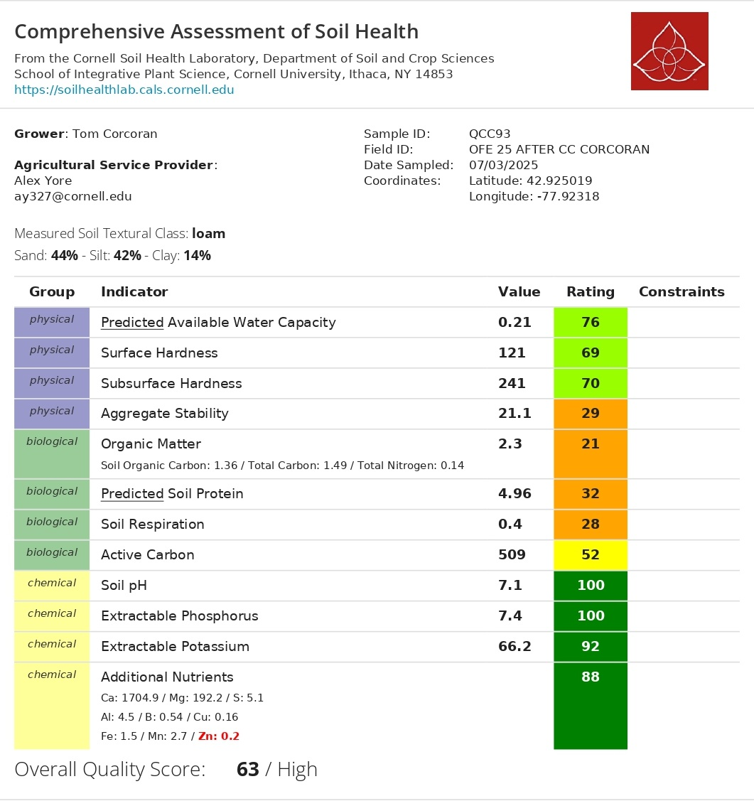
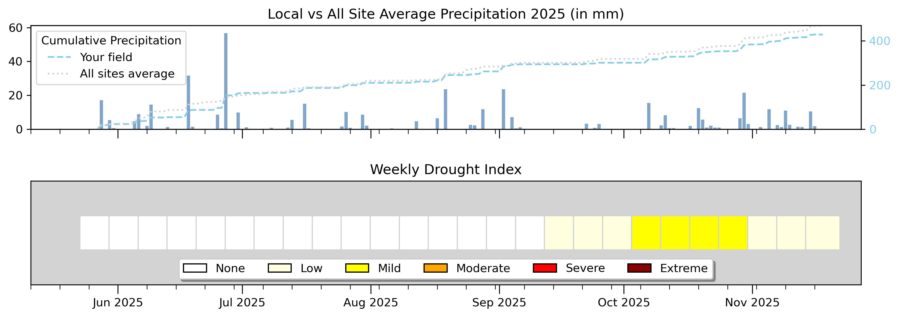

```{r setup, include=FALSE}
library(tidyverse)
library(plotly)
library(htmltools)
library(effectsize)

# ============================================================
#  📂 RUTA DE DATOS — MODIFICAR AQUÍ
# ============================================================
data_dir <- "data"

# ============================================================
#  ARCHIVOS CSV
# ============================================================
cn_file     <- "OFE2025_CN.csv"
nrates_file <- "OFE2025_NRates.csv"
yield_file  <- "OFE2025_Yield_Strips.csv"

# ============================================================
#  N RATES — LECTURA Y FILTRO CORCORAN
# ============================================================
nrates_all <- read_csv(file.path(data_dir, nrates_file), show_col_types = FALSE)

corc_nrates <- nrates_all |>
  filter(FarmName == "corcoran") |>
  rename(PlotID = PlotName, Nrate = Nrate_lbAc)

# ============================================================
#  YIELD — LECTURA Y FILTRO CORCORAN
# ============================================================
yield_all <- read_csv(file.path(data_dir, yield_file), show_col_types = FALSE)

corc_yield <- yield_all |>
  filter(FarmName == "Corcoran") |>
  mutate(Treatment = factor(PlotName, levels = c("T0", "T1", "T2", "T3"))) |>
  left_join(corc_nrates |> select(PlotID, Nrate),
            by = c("PlotName" = "PlotID")) |>
  mutate(
    Nrate_label = paste0(Nrate, " lb N/ac"),
    Trt_label   = paste0(Treatment, " (", Nrate, " lb N/ac)")
  )

yield_summary <- corc_yield |>
  group_by(Treatment, Nrate) |>
  summarise(
    n         = n(),
    mean_yield = round(mean(Yield_buAc, na.rm = TRUE), 1),
    sd_yield  = round(sd(Yield_buAc,   na.rm = TRUE), 1),
    .groups   = "drop"
  ) |>
  arrange(Treatment)

ctrl_yield <- yield_summary |> filter(Treatment == "T0") |> pull(mean_yield)

# ============================================================
#  C:N BIOMASA — LECTURA Y CÁLCULO CORCORAN
# ============================================================
cn_all <- read_csv(file.path(data_dir, cn_file), show_col_types = FALSE)

corc_cn <- cn_all |>
  filter(FarmName == "corcoran", SampleType == "MaizeBiomass") |>
  mutate(
    CN_ratio  = TotalC_pct / TotalN_pct,
    Treatment = factor(Treatment, levels = c("T0", "T1", "T2", "T3"))
  ) |>
  left_join(corc_nrates |> select(PlotID, Nrate),
            by = c("Treatment" = "PlotID")) |>
  mutate(
    Nrate_label = paste0(Nrate, " lb N/ac"),
    Trt_label   = paste0(Treatment, " (", Nrate, " lb N/ac)")
  )

# ============================================================
#  SUMMARY POR TRATAMIENTO
# ============================================================
cn_summary <- corc_cn |>
  group_by(Treatment, Nrate) |>
  summarise(
    n        = n(),
    mean_N   = round(mean(TotalN_pct, na.rm = TRUE), 3),
    sd_N     = round(sd(TotalN_pct,   na.rm = TRUE), 3),
    se_N     = round(sd_N / sqrt(n), 3),
    mean_CN  = round(mean(CN_ratio,   na.rm = TRUE), 2),
    sd_CN    = round(sd(CN_ratio,     na.rm = TRUE), 2),
    se_CN    = round(sd_CN / sqrt(n), 2),
    .groups  = "drop"
  ) |>
  arrange(Nrate)

# Valores de referencia: T0 = Control (60 lb N/ac, farmer rate)
ctrl_N  <- cn_summary |> filter(Treatment == "T0") |> pull(mean_N)
ctrl_CN <- cn_summary |> filter(Treatment == "T0") |> pull(mean_CN)

# ============================================================
#  PALETAS Y HELPERS
# ============================================================
pal_trt <- c("T0" = "#e879a0",   # control — pink
             "T1" = "#0d9488",   # 60 lb N/ac — teal
             "T2" = "#3b82f6",   # 50 lb N/ac — blue
             "T3" = "#f59e0b")   # 40 lb N/ac — amber

fmt <- function(x) ifelse(x == round(x), as.character(round(x)), as.character(x))

# ============================================================
#  FUNCIÓN: tarjeta simple por tratamiento
# ============================================================
nrate_cards <- function(summary_df, metric_col, label_suffix, note = "") {
  vals       <- round(summary_df[[metric_col]], 3)
  treatments <- as.character(summary_df[["Treatment"]])
  nrates     <- summary_df[["Nrate"]]

  cards_html <- mapply(function(trt, nr, val) {
    border_col <- pal_trt[trt]
    paste0(
      '<div class="sc" style="border-top: 4px solid ', border_col, '">',
        '<div class="sc-label">', trt, ' — ', nr, ' lb N/ac</div>',
        '<div class="sc-main">',
          '<span class="sc-val">', val, '</span>',
          '<span class="sc-delta" style="font-size:0.85rem;">', label_suffix, '</span>',
        '</div>',
      '</div>'
    )
  }, treatments, nrates, vals) |>
    paste(collapse = "\n")

  HTML(paste0(
    '<style>
      .sc-row { display: grid; grid-template-columns: repeat(4, 1fr);
                gap: 12px; margin: 16px 0 24px; }
      .sc { background: #fff; border: 1px solid #e5e7eb; border-radius: 12px;
            padding: 18px 20px; overflow: hidden; }
      .sc-label { font-size: 10px; font-weight: 700; letter-spacing: 1.3px;
                  text-transform: uppercase; color: #9ca3af; margin-bottom: 8px; }
      .sc-main  { display: flex; align-items: baseline; gap: 10px; flex-wrap: wrap; }
      .sc-val   { font-size: 2rem; font-weight: 700; font-family: monospace; line-height: 1; }
      .sc-delta { font-size: 0.85rem; font-weight: 600; color: #6b7280; }
      .sc-sub   { font-size: 11px; color: #9ca3af; margin-top: 6px; }
      @media (max-width: 800px) { .sc-row { grid-template-columns: 1fr 1fr; } }
      @media (max-width: 500px) { .sc-row { grid-template-columns: 1fr; } }
    </style>
    <div class="sc-row">',
    cards_html,
    '</div>',
    if (nchar(note) > 0) paste0('<p style="font-size:0.82rem;color:#9ca3af;margin-top:-8px;">', note, '</p>') else ""
  ))
}
```

```{=html}
<div class="lab-topbar">
  <div class="lab-topbar__inner">
    <div class="lab-topbar__left">
      <div class="lab-topbar__logos">
        
        
      </div>
      <span class="lab-title">2025 Cropping Season</span>
      <span class="lab-subtitle">
       <strong>Research question:</strong> Can we reduce nitrogen rates after a cover crop planted behind soybeans or dry beans?
      </span>
    </div>
    <div class="lab-topbar__right">
      <a class="btn btn-download" href="index.pdf" title="Download PDF version"target="_blank" rel="noopener noreferrer">
        ⬇ Download PDF
      </a>
    </div>
  </div>
</div>
```

::: {.page-intro}
**Welcome to your 2025 farm report.**
This report summarizes the on-farm nitrogen rate experiment conducted in your field. Four nitrogen application rates (Control T0 = 60, T1 = 60, T2 = 50, T3 = 40 lb N/ac) were compared following a cover crop planted behind soybeans or dry beans. The goal was to determine whether a cover crop allows a reduction in nitrogen inputs without sacrificing crop nitrogen status.
:::

```{=html}
<figure style="margin: 20px 0; text-align: center;">
  
  <div id="field-placeholder" style="display:none; background:#f3f4f6; border-radius:8px;
       padding:40px; color:#9ca3af; font-size:0.9rem; border:1px dashed #d1d5db;">
    📍 Field map — place <code>corcoran_field.png</code> in the <code>images/</code> folder
  </div>
  <figcaption style="font-size: 0.82rem; color: #6b7280; margin-top: 8px;">
    <strong>Figure 1.</strong> Treatment layout.
  </figcaption>
</figure>
<div style="margin: 16px 0 24px; text-align: center;">
  <a href="https://farmersdatalab.github.io/b1e5f3a7-9c62-4d88-a2f1-7e3c5b9d0a44/"
     target="_blank"
     rel="noopener noreferrer"
     style="display: inline-flex; align-items: center; gap: 8px;
            background: #0d9488; color: #fff; font-weight: 600;
            padding: 10px 20px; border-radius: 8px; text-decoration: none;
            font-size: 0.95rem; box-shadow: 0 2px 6px rgba(0,0,0,0.15);
            transition: opacity 0.2s;">
    🗺️ Open Interactive NDVI Map
  </a>
</div>
```

::: {.page-intro}
**Take-home message:** In this season, dropping the nitrogen rate from 60 down to 40–50 lb N/ac made very little difference in how much nitrogen ended up in the plant tissue. Yield was somewhat lower in the reduced-rate strips, but the strip that got the same rate as the control (T1 = 60 lb N/ac) also yielded less, which tells us the field itself has some natural variation that's harder to separate from the N rate effect. With only one strip per treatment, we can't call anything a firm conclusion yet. What we can say is that the cover crop system is showing real promise, and running this trial again with more strips will give us the confidence to know whether you can safely cut back on nitrogen inputs.
:::

---

## Results Summary {#summary}

```{r summary-table, echo=FALSE, message=FALSE, warning=FALSE}
# Build yield row
yield_row <- corc_yield |>
  select(Treatment, Yield_buAc) |>
  group_by(Treatment) |>
  summarise(val = paste0(round(mean(Yield_buAc, na.rm=TRUE), 1), " bu/ac"), .groups="drop") |>
  pivot_wider(names_from = Treatment, values_from = val) |>
  mutate(Metric = "🌾 Corn Yield (bu/ac)", n = "1 per strip") |>
  select(Metric, n, T0, T1, T2, T3)

# Build CN rows
cn_row_N <- cn_summary |>
  mutate(val = paste0(mean_N, " ± ", se_N, "%")) |>
  select(Treatment, val) |>
  pivot_wider(names_from = Treatment, values_from = val) |>
  mutate(Metric = "🧪 Biomass %N", n = "4 per strip") |>
  select(Metric, n, T0, T1, T2, T3)

cn_row_CN <- cn_summary |>
  mutate(val = paste0(mean_CN, " ± ", se_CN)) |>
  select(Treatment, val) |>
  pivot_wider(names_from = Treatment, values_from = val) |>
  mutate(Metric = "🧪 C:N Ratio", n = "4 per strip") |>
  select(Metric, n, T0, T1, T2, T3)

summary_display <- bind_rows(yield_row, cn_row_N, cn_row_CN)

knitr::kable(summary_display,
             col.names = c("Metric", "n", "T0 (60 lb N/ac)", "T1 (60 lb N/ac)", "T2 (50 lb N/ac)", "T3 (40 lb N/ac)"),
             align = c("l","c","c","c","c","c"),
             caption = "Summary of corn yield and biomass nitrogen by N-rate treatment.")
```

::: {style="font-size: 0.82rem; color: #9ca3af; margin-top: -8px;"}
n = 4 samples per treatment. T0 = Control (farmer rate, 60 lb N/ac). Results are descriptive; effect sizes are reported given small sample sizes.
:::

---

## 🌾 Corn Yield {#yield}

::: {.page-intro}
Corn yield was measured by strip across the four N-rate treatments (T0–T3). Each strip corresponds to one measurement. Because there is **one observation per treatment**, no statistical test is possible. Results are presented as a field-level comparison. **Keep in mind**: when two strips at the same rate give different yields, that's the field talking, not the nitrogen.
:::

```{r yield-cards, echo=FALSE}
nrate_cards(
  yield_summary,
  metric_col   = "mean_yield",
  label_suffix = "bu/ac",
  note         = "n = 1 per strip — field-level observation only."
)
```

```{r yield-bar, echo=FALSE, message=FALSE, warning=FALSE}
p_y <- ggplot(corc_yield,
              aes(x = fct_reorder(paste0(PlotName, "\n(", Nrate, " lb N/ac)"), Nrate),
                  y = Yield_buAc, fill = Treatment)) +
  geom_col(width = 0.55, color = "black", alpha = 0.9) +
  geom_hline(yintercept = ctrl_yield, linetype = "dashed",
             color = "#e879a0", linewidth = 0.8) +
  scale_fill_manual(values = pal_trt) +
  scale_y_continuous(expand = expansion(mult = c(0, 0.15))) +
  labs(
    title   = "Corn Yield by N-Rate Treatment",
    subtitle = "Dashed line = T0 Control (60 lb N/ac). n = 1 per strip.",
    x       = "Treatment (N Rate)",
    y       = "Yield (bu/ac)",
    caption = "Single measurement per strip — field-level observation only."
  ) +
  theme_minimal(base_size = 13) +
  theme(legend.position = "none", plot.title = element_text(face = "bold"),
        panel.grid.minor = element_blank())

ggplotly(p_y) |> layout(showlegend = FALSE)
```

---

## 🧪 C:N in Corn Biomass {#cn-details}

::: {.page-intro}
Corn biomass was collected and sent for laboratory C:N analysis. This measures the actual nitrogen concentration in plant tissue, a direct indicator of how much N the plant was able to take up at the time of sampling. **Note:** sample sizes are small (n = 4 per treatment), so results are descriptive. Effect sizes (Cohen's d vs Control) are reported instead of p-values.
:::

### Total Nitrogen in Biomass (%N) {#n-section}

::: {.page-intro}
This number tells you what percentage of the plant tissue is nitrogen. A higher %N means the plant had good access to nitrogen during the season. All four strips came in very close to each other, which is a good sign: it suggests the plants in the reduced-rate strips weren't running short on N, even with less fertilizer applied.
:::

```{r cn-n-cards, echo=FALSE}
nrate_cards(
  cn_summary,
  metric_col   = "mean_N",
  label_suffix = "% N",
  note         = "n = 4 per treatment — results are descriptive only."
)
```

::: {.panel-tabset}

## Bar Chart (%N)

```{r cn-n-bar, echo=FALSE, message=FALSE, warning=FALSE}
p_n <- ggplot(cn_summary, aes(x = fct_reorder(paste0(Treatment, "\n(", Nrate, " lb N/ac)"), Nrate),
                               y = mean_N, fill = Treatment)) +
  geom_col(width = 0.55, color = "black", alpha = 0.9) +
  geom_errorbar(aes(ymin = mean_N - se_N, ymax = mean_N + se_N),
                width = 0.15, linewidth = 1) +
  geom_hline(yintercept = ctrl_N, linetype = "dashed", color = "#e879a0", linewidth = 0.8) +
  
scale_fill_manual(values = pal_trt) +
  coord_cartesian(ylim = c(0, 3.8)) + 
  labs(
    title    = "Nitrogen in Corn Biomass (Mean %N ± SE)",
    subtitle = "Dashed line = Control (T0, 60 lb N/ac). Sampled 07/03/2025.",
    x        = "Treatment (N Rate)",
    y        = "Nitrogen (%)",
    caption  = "Note: small sample size (n = 4) — results are descriptive only."
  ) +
  theme_minimal(base_size = 13) +
  theme(legend.position = "none", plot.title = element_text(face = "bold"),
        panel.grid.minor = element_blank())

ggplotly(p_n) |> layout(showlegend = FALSE)
```

## Raw Data (%N)

```{r cn-n-raw, echo=FALSE, message=FALSE, warning=FALSE}
p_raw_N <- ggplot(corc_cn,
                  aes(x = fct_reorder(paste0(Treatment, "\n(", Nrate, " lb N/ac)"), Nrate),
                      y = TotalN_pct, color = Treatment, fill = Treatment)) +
  geom_jitter(width = 0.12, size = 3.5, alpha = 0.7) +
  stat_summary(fun = mean, geom = "crossbar", width = 0.35,
               linewidth = 0.8, fatten = 2) +
  geom_hline(yintercept = ctrl_N, linetype = "dashed", color = "#e879a0", linewidth = 0.7) +
  scale_color_manual(values = pal_trt) +
  scale_fill_manual(values  = pal_trt) +
  labs(
    title    = "Individual Sample Values — Biomass %N",
    subtitle = "Horizontal bar = group mean. Dashed = Control mean.",
    x        = "Treatment (N Rate)",
    y        = "Total Nitrogen (%)"
  ) +
  theme_minimal(base_size = 13) +
  theme(legend.position = "none", plot.title = element_text(face = "bold"),
        panel.grid.minor = element_blank())

ggplotly(p_raw_N) |> layout(showlegend = FALSE)
```

:::

---

### C:N Ratio {#cn-ratio-section}

::: {.page-intro}
The C:N ratio is another way of looking at the same question: how nitrogen-rich is the plant tissue? A lower C:N means the plant has more nitrogen relative to carbon, which is what you want. If the strips with less nitrogen fertilizer still show a C:N close to the control, it's a strong signal that the cover crop is helping fill that gap. In your field this season, the C:N values across all strips stayed pretty close, which is encouraging.
:::

```{r cn-ratio-cards, echo=FALSE}
nrate_cards(
  cn_summary |> select(Treatment, Nrate, mean_CN),
  metric_col   = "mean_CN",
  label_suffix = "C:N ratio",
  note         = "Lower C:N = more nitrogen-rich tissue. n = 4 per treatment."
)
```

::: {.panel-tabset}

## Bar Chart (C:N)

```{r cn-ratio-bar, echo=FALSE, message=FALSE, warning=FALSE}
p_cn <- ggplot(cn_summary, aes(x = fct_reorder(paste0(Treatment, "\n(", Nrate, " lb N/ac)"), Nrate),
                                y = mean_CN, fill = Treatment)) +
  geom_col(width = 0.55, color = "black", alpha = 0.9) +
  geom_errorbar(aes(ymin = mean_CN - se_CN, ymax = mean_CN + se_CN),
                width = 0.15, linewidth = 1) +
  geom_hline(yintercept = ctrl_CN, linetype = "dashed", color = "#e879a0", linewidth = 0.8) +
   scale_fill_manual(values = pal_trt) +
  scale_y_continuous(expand = expansion(mult = c(0, 0.2))) +
  labs(
    title    = "C:N Ratio in Corn Biomass (Mean ± SE)",
    subtitle = "Dashed line = Control (T0, 60 lb N/ac). Lower C:N = more N-rich tissue.",
    x        = "Treatment (N Rate)",
    y        = "C:N Ratio",
    caption  = "Note: small sample size (n = 4) — results are descriptive only."
  ) +
  theme_minimal(base_size = 13) +
  theme(legend.position = "none", plot.title = element_text(face = "bold"),
        panel.grid.minor = element_blank())

ggplotly(p_cn) |> layout(showlegend = FALSE)
```

## Raw Data (C:N)

```{r cn-ratio-raw, echo=FALSE, message=FALSE, warning=FALSE}
p_raw_CN <- ggplot(corc_cn,
                   aes(x = fct_reorder(paste0(Treatment, "\n(", Nrate, " lb N/ac)"), Nrate),
                       y = CN_ratio, color = Treatment, fill = Treatment)) +
  geom_jitter(width = 0.12, size = 3.5, alpha = 0.7) +
  stat_summary(fun = mean, geom = "crossbar", width = 0.35,
               linewidth = 0.8, fatten = 2) +
  geom_hline(yintercept = ctrl_CN, linetype = "dashed", color = "#e879a0", linewidth = 0.7) +
  scale_color_manual(values = pal_trt) +
  scale_fill_manual(values  = pal_trt) +
  labs(
    title    = "Individual Sample Values — C:N Ratio",
    subtitle = "Horizontal bar = group mean. Dashed = Control mean.",
    x        = "Treatment (N Rate)",
    y        = "C:N Ratio"
  ) +
  theme_minimal(base_size = 13) +
  theme(legend.position = "none", plot.title = element_text(face = "bold"),
        panel.grid.minor = element_blank())

ggplotly(p_raw_CN) |> layout(showlegend = FALSE)
```

:::

---

## 🌱 Soil Health Assessment {#soilhealth}

::: {.page-intro}
Soil health was assessed using the **Cornell Soil Health Test**. The overall quality score was **63/100 (High)**. Physical indicators were strong (Available Water Capacity: 76, Surface Hardness: 69, Subsurface Hardness: 70). The main areas for improvement were biological indicators: **Organic Matter** (score 21-Low), **Soil Respiration** (score 28-Low),and  **Predicted Soil Protein** (score 32-Low). Chemical indicators were excellent, with Soil pH (100), Extractable Phosphorus (100), and Extractable Potassium (92) all in the Very High range. One flag to follow up on: **zinc came back as deficient**.
:::

```{=html}
<figure style="margin: 20px 0; text-align: center;">
  
</figure>

<div style="margin: 16px 0 24px;">
  <a href="data/corcoran_soilhealth.pdf"
     target="_blank"
     rel="noopener noreferrer"
     style="display: inline-flex; align-items: center; gap: 8px;
            background: #4CAF50; color: #fff; font-weight: 600;
            padding: 10px 18px; border-radius: 8px; text-decoration: none;
            font-size: 0.95rem; box-shadow: 0 2px 6px rgba(0,0,0,0.12);">
    ↗ Open Full Soil Health Report (PDF)
  </a>
</div>
```
---

## 🌧️Weather & Drought Conditions {#weatherDrought}

::: {.page-intro}
**Cumulative precipitation** at your field compared to the all-site average, alongside the weekly drought index from June through November 2025.  Your field received strong rainfall early in the season, including a large event 
in late June, and tracked near the all-site average through summer. However, a dry period from late September through October brought Mild drought conditions 
for roughly 4–5 weeks. This late-season moisture stress is worth considering when looking at your yield and end-of-season nitrogen results.
:::
```{=html}
<figure style="margin: 0 0 24px; text-align: center;">
  
</figure>
```
---

## 📝 Conclusions {#conclusions}

```{r conclusion-callouts, echo=FALSE}
# Compute deltas vs control for conclusion cards
t1_yield <- corc_yield |> filter(PlotName == "T1") |> pull(Yield_buAc)
t2_yield <- corc_yield |> filter(PlotName == "T2") |> pull(Yield_buAc)
t3_yield <- corc_yield |> filter(PlotName == "T3") |> pull(Yield_buAc)

delta_t1_yield <- round(t1_yield - ctrl_yield, 1)
delta_t2_yield <- round(t2_yield - ctrl_yield, 1)
delta_t3_yield <- round(t3_yield - ctrl_yield, 1)

t2_N  <- cn_summary |> filter(Treatment == "T2") |> pull(mean_N)
t3_N  <- cn_summary |> filter(Treatment == "T3") |> pull(mean_N)
t2_CN <- cn_summary |> filter(Treatment == "T2") |> pull(mean_CN)
t3_CN <- cn_summary |> filter(Treatment == "T3") |> pull(mean_CN)

delta_t2_N  <- round(t2_N  - ctrl_N,  3)
delta_t3_N  <- round(t3_N  - ctrl_N,  3)
delta_t2_CN <- round(t2_CN - ctrl_CN, 2)
delta_t3_CN <- round(t3_CN - ctrl_CN, 2)

sign_t2_N  <- ifelse(delta_t2_N  >= 0, "+", "")
sign_t3_N  <- ifelse(delta_t3_N  >= 0, "+", "")
sign_t2_CN <- ifelse(delta_t2_CN >= 0, "+", "")
sign_t3_CN <- ifelse(delta_t3_CN >= 0, "+", "")
sign_t1_y  <- ifelse(delta_t1_yield >= 0, "+", "")
sign_t2_y  <- ifelse(delta_t2_yield >= 0, "+", "")
sign_t3_y  <- ifelse(delta_t3_yield >= 0, "+", "")

HTML(paste0('
<style>
  .conclusion-grid {
    display: grid;
    grid-template-columns: 1fr 1fr;
    gap: 14px;
    margin: 20px 0;
  }
  .conc-card {
    background: #fff;
    border: 1px solid #e5e7eb;
    border-left: 6px solid #4CAF50;
    border-radius: 8px;
    padding: 14px 16px;
    font-size: 0.93rem;
  }
  .conc-card.amber { border-left-color: #F9C74F; }
  .conc-card.teal  { border-left-color: #0d9488; }
  .conc-card.pink  { border-left-color: #e879a0; }
  .conc-title { font-weight: 700; font-size: 0.85rem; text-transform: uppercase;
                letter-spacing: 0.8px; color: #6b7280; margin-bottom: 6px; }
  @media (max-width: 700px) { .conclusion-grid { grid-template-columns: 1fr; } }
</style>

<div class="conclusion-grid">

 <div class="conc-card teal">
  <div class="conc-title">🌾 Corn Yield</div>
  The Control strip (T0, 60 lb N/ac) yielded <strong>204 bu/ac</strong>.
  Both reduced-rate strips were lower: T2 (50 lb N/ac) at <strong>178 bu/ac</strong>
  and T3 (40 lb N/ac) at <strong>180 bu/ac</strong>. Notably, T1, which received
  the same 60 lb N/ac as the Control T0, yielded only <strong>185 bu/ac</strong>, That tells us the field has some natural variability that is affecting results as much as the N rate. With one strip per treatment, we are looking at observations, not conclusions yet.
</div>

<div class="conc-card teal">
  <div class="conc-title">🧪 Biomass %N</div>
  Plant tissue nitrogen was nearly identical across all four strips — T0 at <strong>3.49%</strong>, T2 at <strong>3.37%</strong>, and T3 at <strong>3.42%</strong>. The reduced-rate strips were just barely below the control, less than 0.12 percentage points of difference. T1 came in the lowest at 3.22% despite receiving the same N rate as T0, which again points to field variability rather than a nitrogen effect. The plants in the lower-rate strips were not running short on N.
</div>

<div class="conc-card amber">
  <div class="conc-title">🧪 C:N Ratio</div>
 The control (T0) had a C:N ratio of <strong>13.14</strong>. T2 (13.78) and T3 (13.85) were slightly higher, meaning a touch less nitrogen-rich tissue, but still very close to the control. T1 had the highest C:N ratio of all (14.53) despite receiving the same N rate as T0, which reinforces the idea that spatial variability within the field is a bigger factor than the fertilizer rate this season.
</div>

<div class="conc-card">
  <div class="conc-title">🌱 Soil Health</div>
  The overall score was <strong>63/100 (High)</strong>, with excellent chemical
  indicators (pH, P, K all near 100). The main gaps are: Organic Matter (21) Soil Respiration (28), Active carbon (52), and Aggregate Stability (29). As cover cropping continues, these scores should improve, potentially
  increasing nitrogen mineralization and the effective N credit from the cover crop. One flag to follow up on: zinc came back as deficient.
</div>
'))
```
