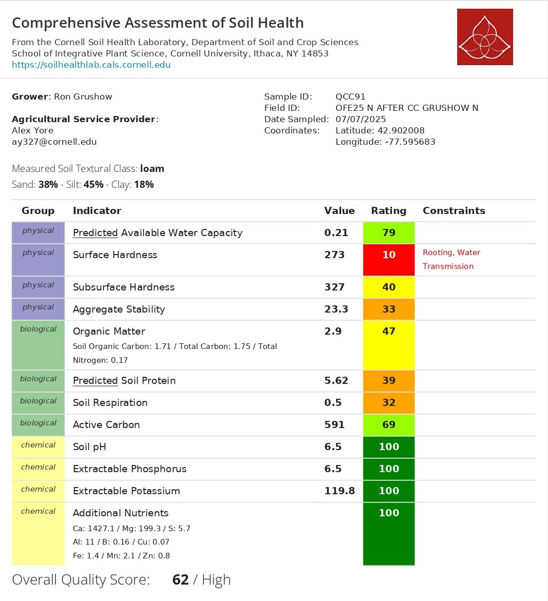

```{r setup, include=FALSE}
library(tidyverse)
library(plotly)
library(htmltools)

# ============================================================
#  📂 RUTA DE DATOS
# ============================================================
data_dir <- "data"

cn_file    <- "OFE2025_CN.csv"
nrate_file <- "OFE2025_NRates.csv"

# ============================================================
#  C:N — LECTURA Y LIMPIEZA
#  Columnas sin header: FarmField, Plot, SampleType, Date,
#                       TotalC_pct, TotalN_pct, Lon, Lat
# ============================================================
cn_raw <- read_csv(
  file.path(data_dir, cn_file),
  col_names = c("FarmField", "Plot", "SampleType", "Date",
                "TotalC_pct", "TotalN_pct", "Lon", "Lat"),
  show_col_types = FALSE
)

# ---- Gruschow North · Maize Biomass ----
gn_biomass <- cn_raw |>
  filter(FarmField == "gruschowNorth", SampleType == "MaizeBiomass") |>
  filter(!is.na(TotalC_pct), !is.na(TotalN_pct)) |>
  mutate(
    CN_ratio = TotalC_pct / TotalN_pct,
    Plot     = as.integer(Plot)
  )

# ---- Gruschow North · Cover Crop ----
gn_cover <- cn_raw |>
  filter(FarmField == "gruschowNorth", SampleType == "CoverCrop") |>
  filter(!is.na(TotalC_pct), !is.na(TotalN_pct)) |>
  mutate(
    CN_ratio = TotalC_pct / TotalN_pct,
    Plot     = as.integer(Plot)
  )

# ============================================================
#  RESUMEN ESTADÍSTICO — MAIZE BIOMASS
# ============================================================
bio_sum <- gn_biomass |>
  summarise(
    n       = n(),
    mean_N  = round(mean(TotalN_pct), 3),
    sd_N    = round(sd(TotalN_pct),   3),
    se_N    = round(sd(TotalN_pct) / sqrt(n()), 3),
    min_N   = round(min(TotalN_pct),  3),
    max_N   = round(max(TotalN_pct),  3),
    mean_C  = round(mean(TotalC_pct), 2),
    sd_C    = round(sd(TotalC_pct),   2),
    mean_CN = round(mean(CN_ratio),   2),
    sd_CN   = round(sd(CN_ratio),     2),
    se_CN   = round(sd(CN_ratio) / sqrt(n()), 2),
    min_CN  = round(min(CN_ratio),    2),
    max_CN  = round(max(CN_ratio),    2)
  )

# ============================================================
#  RESUMEN ESTADÍSTICO — COVER CROP
# ============================================================
cc_sum <- gn_cover |>
  summarise(
    n       = n(),
    mean_N  = round(mean(TotalN_pct), 3),
    sd_N    = round(sd(TotalN_pct),   3),
    se_N    = round(sd(TotalN_pct) / sqrt(n()), 3),
    min_N   = round(min(TotalN_pct),  3),
    max_N   = round(max(TotalN_pct),  3),
    mean_C  = round(mean(TotalC_pct), 2),
    sd_C    = round(sd(TotalC_pct),   2),
    mean_CN = round(mean(CN_ratio),   2),
    sd_CN   = round(sd(CN_ratio),     2),
    se_CN   = round(sd(CN_ratio) / sqrt(n()), 2),
    min_CN  = round(min(CN_ratio),    2),
    max_CN  = round(max(CN_ratio),    2)
  )

# ============================================================
#  N RATE — GRUSCHOW NORTH
# ============================================================
nrates       <- read_csv(file.path(data_dir, nrate_file), show_col_types = FALSE)
gn_nrate_val <- nrates |>
  filter(tolower(FarmName) == "gruschow",
         tolower(FieldName) == "north") |>
  pull(Nrate_lbAc) |>
  first()
gn_nrate_val <- if (is.na(gn_nrate_val) || length(gn_nrate_val) == 0) "N/A" else gn_nrate_val

# ============================================================
#  PALETA Y HELPERS
# ============================================================
col_bio   <- "#0d9488"   # teal  — maize biomass
col_cover <- "#7c3aed"   # violet — cover crop
col_pink  <- "#e879a0"

fmt      <- function(x) ifelse(x == round(x), as.character(round(x)), as.character(x))
sign_fmt <- function(x) ifelse(x >= 0, paste0("+", x), as.character(x))

# ---- Helper: stat card descriptivo ----
stat_card <- function(label, value, sub, border_color = "#0d9488") {
  HTML(paste0('
  <div style="background:#fff; border:1px solid #e5e7eb;
       border-top:4px solid ', border_color, '; border-radius:12px;
       padding:18px 20px; position:relative;">
    <div style="font-size:10px; font-weight:700; letter-spacing:1.3px;
         text-transform:uppercase; color:#9ca3af; margin-bottom:8px;">',
         label, '</div>
    <div style="font-size:2.2rem; font-weight:700; font-family:monospace; line-height:1;">',
         value, '</div>
    <div style="font-size:11px; color:#9ca3af; margin-top:6px;">',
         sub, '</div>
  </div>'))
}

# ---- Helper: fila de N cards ----
cards_row <- function(..., cols = 3) {
  items <- list(...)
  inner <- paste(sapply(items, as.character), collapse = "\n")
  HTML(paste0('
  <div style="display:grid; grid-template-columns: repeat(', cols, ',1fr);
       gap:12px; margin:16px 0 24px;">', inner, '</div>'))
}

# ---- Interpretación C:N cover crop ----
cn_interp <- function(cn) {
  if      (cn < 20) "very low C:N — rapid N release, high mineralization potential"
  else if (cn < 25) "low C:N — fast decomposition, good early-season N supply"
  else if (cn < 35) "moderate C:N — gradual N release through the season"
  else              "high C:N — slow decomposition, possible early-season N immobilization"
}
```

```{=html}
<div class="lab-topbar">
  <div class="lab-topbar__inner">
    <div class="lab-topbar__left">
      <div class="lab-topbar__logos">
        
        
      </div>
      <span class="lab-title">2025 Cropping Season</span>
      <span class="lab-subtitle">
        Field North &nbsp;|&nbsp; NRate `r gn_nrate_val` lb N/ac &nbsp;|&nbsp;
        <strong>Field monitoring report — single N rate, no treatment split</strong>
      </span>
    </div>
    <div class="lab-topbar__right">
      <a class="btn btn-download" href="index.pdf"
         title="Download PDF version"
         target="_blank" rel="noopener noreferrer">
        ⬇ Download PDF
      </a>
    </div>
  </div>
</div>
```

::: {.page-intro}
**Welcome to your 2025 farm report.**
This report summarizes field-season measurements for the **North** field. Because this field ran under a single nitrogen rate of 163 lb N/ac with no treatment or control strips, we're not comparing two systems here, instead, 
we're giving you a field-level picture of how the corn crop performed, what the cover crop residue looked like going into the season, and what the soil health assessment tells us about the foundation you're working with. Think of this as your baseline.
:::

```{=html}
<figure style="margin: 20px 0; text-align: center;">
  
  <figcaption style="font-size: 0.82rem; color: #6b7280; margin-top: 8px;">
    <strong>Figure 1.</strong> North field.
  </figcaption>
</figure>

<div style="margin: 16px 0 24px; text-align: center;">
  <a href="https://farmersdatalab.github.io/c4b8a12e-7d55-4f9b-b3a1-5e2d6c9f8a11/"
     target="_blank"
     rel="noopener noreferrer"
     style="display: inline-flex; align-items: center; gap: 8px;
            background: #0d9488; color: #fff; font-weight: 600;
            padding: 10px 20px; border-radius: 8px; text-decoration: none;
            font-size: 0.95rem; box-shadow: 0 2px 6px rgba(0,0,0,0.15);
            transition: opacity 0.2s;">
    🗺️ Open Interactive Map
  </a>
</div>
```

::: {.page-intro}
**Take-home message:**
The corn crop across this field showed solid and 
consistent nitrogen status mid-season, with tissue nitrogen averaging 2.76% across the sampled plots, a sign the crop was well-supplied at the 163 lb N/ac input rate. The cover crop residue had a C:N ratio of 22.6, low enough to release nitrogen relatively quickly early in the season, which is a good sign for future nitrogen credit potential. The main concern from the soil health assessment is surface compaction, scored 10/100, which is worth addressing before it limits rooting and water movement long-term. Chemistry is excellent across the board. A clean growing season with no drought stress during the critical window rounded out a solid year.
:::

---

## Results Summary {#summary}

```{r summary-table, echo=FALSE, message=FALSE, warning=FALSE}
summary_df <- tibble(
  Metric = c(
    "🌽 Maize Biomass - Mean %N",
    "🌽 Maize Biomass - C:N Ratio",
    "🌱 Cover Crop - Mean %N",
    "🌱 Cover Crop - C:N Ratio",
    "🌿 Soil Health Score"
  ),
  Value = c(
    paste0(bio_sum$mean_N, "%"),
    as.character(bio_sum$mean_CN),
    paste0(cc_sum$mean_N, "%"),
    as.character(cc_sum$mean_CN),
    "62 / 100"
  ),
  SD = c(
    paste0("± ", bio_sum$sd_N),
    paste0("± ", bio_sum$sd_CN),
    paste0("± ", cc_sum$sd_N),
    paste0("± ", cc_sum$sd_CN),
    "—"
  )
)

knitr::kable(summary_df, align = c("l", "c", "c"))
```

::: {style="font-size: 0.82rem; color: #9ca3af; margin-top: -8px;"}
This field did not have a treatment/control split. All statistics are descriptive
field-level observations. No statistical comparisons between groups are reported.
:::

---

## 🌽 C:N in Corn Biomass {#cn-biomass}

::: {.page-intro}
Corn biomass was collected from **`r bio_sum$n` plots** across the North field and sent to the laboratory for C:N analysis. This tells us how much nitrogen the plant had absorbed and incorporated into its tissue mid-season, a direct indicator of nitrogen sufficiency at the `r gn_nrate_val` lb N/ac input rate. Because there is no treatment split, we describe the **field-level
distribution and spatial variability** across plots.
:::

### Total Nitrogen in Biomass (%N)

::: {.panel-tabset}

## Bar Chart (%N by plot)

```{r bio-n-bar, echo=FALSE, message=FALSE, warning=FALSE}
p_n_bio <- ggplot(gn_biomass, aes(x = factor(Plot), y = TotalN_pct)) +
  geom_col(fill = col_bio, color = "black", alpha = 0.85, width = 0.65) +
  geom_hline(yintercept = bio_sum$mean_N, linetype = "dashed",
             color = col_pink, linewidth = 0.9) +
  annotate("text", x = 0.7, y = bio_sum$mean_N + 0.03,
           label = paste0("Mean: ", bio_sum$mean_N, "%"),
           color = col_pink, size = 3.5, hjust = 0) +
  scale_y_continuous(expand = expansion(mult = c(0, 0.15))) +
  labs(
    title    = "Total Nitrogen in Corn Biomass by Plot (%N)",
    subtitle = paste0("Mean = ", bio_sum$mean_N, "%  |  SD = ", bio_sum$sd_N,
                      "  |  n = ", bio_sum$n, " plots  |  Gruschow North, July 14 2025"),
    x = "Plot", y = "Total Nitrogen (%)",
    caption  = "Dashed line = field mean. Plot 5 excluded (NA in raw data)."
  ) +
  theme_minimal(base_size = 13) +
  theme(plot.title = element_text(face = "bold"),
        panel.grid.minor = element_blank(),
        panel.grid.major.x = element_blank())

ggplotly(p_n_bio) |> layout(showlegend = FALSE)
```

:::

---

### C:N Ratio — Biomass

```{r bio-cn-cards, echo=FALSE}
cards_row(
  stat_card("Mean C:N — Biomass",
            bio_sum$mean_CN,
            paste0("SD: ", bio_sum$sd_CN,
                   "  |  SE: ", bio_sum$se_CN),
            col_bio),
  cols = 1
)
```

::: {.panel-tabset}

## Bar Chart (C:N by plot)

```{r bio-cn-bar, echo=FALSE, message=FALSE, warning=FALSE}
p_cn_bio <- ggplot(gn_biomass, aes(x = factor(Plot), y = CN_ratio)) +
  geom_col(fill = col_bio, color = "black", alpha = 0.85, width = 0.65) +
  geom_hline(yintercept = bio_sum$mean_CN, linetype = "dashed",
             color = col_pink, linewidth = 0.9) +
  annotate("text", x = 0.7, y = bio_sum$mean_CN + 0.15,
           label = paste0("Mean: ", bio_sum$mean_CN),
           color = col_pink, size = 3.5, hjust = 0) +
  scale_y_continuous(expand = expansion(mult = c(0, 0.15))) +
  labs(
    title    = "C:N Ratio in Corn Biomass by Plot",
    subtitle = paste0("Mean C:N = ", bio_sum$mean_CN,
                      "  |  SD = ", bio_sum$sd_CN,
                      "  |  n = ", bio_sum$n, " plots"),
    x = "Plot", y = "C:N Ratio",
    caption  = "Lower C:N = more N-rich tissue. Dashed line = field mean."
  ) +
  theme_minimal(base_size = 13) +
  theme(plot.title = element_text(face = "bold"),
        panel.grid.minor = element_blank(),
        panel.grid.major.x = element_blank())

ggplotly(p_cn_bio) |> layout(showlegend = FALSE)
```

## Scatter %C vs %N

```{r bio-scatter, echo=FALSE, message=FALSE, warning=FALSE}
p_scatter <- ggplot(gn_biomass,
                    aes(x = TotalN_pct, y = TotalC_pct,
                        text = paste0("Plot: ", Plot,
                                      "<br>%N: ", TotalN_pct,
                                      "<br>%C: ", TotalC_pct,
                                      "<br>C:N: ", round(CN_ratio, 2)))) +
  geom_smooth(method = "lm", se = TRUE, color = col_pink,
              fill = col_pink, alpha = 0.15, linewidth = 0.8) +
  geom_point(size = 5, color = col_bio, alpha = 0.9) +
  labs(
    title    = "%C vs %N in Corn Biomass",
    subtitle = "Each point = one plot. Pink line = linear trend.",
    x = "Total Nitrogen (%)", y = "Total Carbon (%)"
  ) +
  theme_minimal(base_size = 13) +
  theme(plot.title = element_text(face = "bold"),
        panel.grid.minor = element_blank())

ggplotly(p_scatter, tooltip = "text") |> layout(showlegend = FALSE)
```

:::

---

## 🌱 Cover Crop C:N {#cn-covercrop}

::: {.page-intro}
**`r cc_sum$n` cover crop samples** were collected from Gruschow North and analyzed for C:N content. The C:N ratio of cover crop residue tells us how quickly it will break down and release its nitrogen to the following corn crop. A C:N below 25 means decomposition happens relatively fast, the nitrogen becomes available early in the season, right when the young corn plant is establishing its root system and building its nitrogen demand. The bar charts below show the %N and C:N ratio for each sample location.
:::

```{r cc-cards, echo=FALSE}
cards_row(
  stat_card("Mean %N — Cover Crop",
            paste0(cc_sum$mean_N, "%"),
            paste0("SD: ", cc_sum$sd_N,
                   "  |  n = ", cc_sum$n, " samples  |  ",
                   "Range: ", cc_sum$min_N, " – ", cc_sum$max_N, "%"),
            col_cover),
  stat_card("Mean C:N — Cover Crop",
            cc_sum$mean_CN,
            paste0("SD: ", cc_sum$sd_CN, "  |  ", cn_interp(cc_sum$mean_CN)),
            col_cover),
  cols = 2
)
```

::: {.panel-tabset}

### Total Nitrogen in Cover Crop (%N)

```{r cc-n-bar, echo=FALSE, message=FALSE, warning=FALSE}
p_cc_n <- ggplot(gn_cover, aes(x = factor(Plot), y = TotalN_pct)) +
  geom_col(fill = col_cover, color = "black", alpha = 0.85, width = 0.65) +
  geom_hline(yintercept = cc_sum$mean_N, linetype = "dashed",
             color = col_pink, linewidth = 0.9) +
  annotate("text", x = 0.9, y = cc_sum$mean_N + 0.03,
           label = paste0("Mean: ", cc_sum$mean_N, "%"),
           color = col_pink, size = 3.5, hjust = 0) +
  scale_y_continuous(expand = expansion(mult = c(0, 0.15))) +
  labs(
    title    = "Total Nitrogen in Cover Crop (%N)",
    subtitle = paste0("Mean = ", cc_sum$mean_N, "%  |  SD = ", cc_sum$sd_N,
                      "  |  n = ", cc_sum$n, " samples  |  Gruschow North"),
    x = "Sample", y = "Total Nitrogen (%)",
    caption  = "Dashed line = field mean."
  ) +
  theme_minimal(base_size = 13) +
  theme(plot.title = element_text(face = "bold"),
        panel.grid.minor = element_blank(),
        panel.grid.major.x = element_blank())

ggplotly(p_cc_n) |> layout(showlegend = FALSE)
```

### C:N Ratio — Cover Crop

```{r cc-cn-bar, echo=FALSE, message=FALSE, warning=FALSE}
p_cc_cn <- ggplot(gn_cover, aes(x = factor(Plot), y = CN_ratio)) +
  geom_col(fill = col_cover, color = "black", alpha = 0.85, width = 0.65) +
  
  labs(
    title    = "C:N Ratio in Cover Crop",
    subtitle = paste0("Mean C:N = ", cc_sum$mean_CN,
                      "  |  SD = ", cc_sum$sd_CN,
                      "  |  n = ", cc_sum$n, " samples"),
    x = "Sample", y = "C:N Ratio",
    caption  = "Lower C:N = faster N release. Dashed yellow = C:N 25 threshold."
  ) +
  theme_minimal(base_size = 13) +
  theme(plot.title = element_text(face = "bold"),
        panel.grid.minor = element_blank(),
        panel.grid.major.x = element_blank())

ggplotly(p_cc_cn) |> layout(showlegend = FALSE)
```

::: 

---

## 🌿 Soil Health Assessment {#soilhealth}

::: {.page-intro}
Soil health was assessed using the **Cornell Soil Health Test**. The overall quality score was **62/100 (High)**. Chemistry is in excellent shape across the board: pH at 6.5, phosphorus, potassium, and all additional nutrients all came back at 100. The area that needs attention is physical structure. Surface hardness scored 10/100, 
the only red indicator in the entire report, meaning the top layer of your soil is compacted enough to restrict root growth and slow water movement through the profile. Biological indicators are in the low-to-medium range: soil respiration, predicted soil protein, and aggregate 
stability all have room to improve. These are the indicators that respond best to reduced tillage and continuous cover cropping over time.
:::

```{r soil-cards, echo=FALSE}
HTML('
<div style="display:grid; grid-template-columns: repeat(3,1fr);
     gap:12px; margin:16px 0 24px;">

  <div style="background:#fff; border:1px solid #e5e7eb;
       border-top:4px solid #4CAF50; border-radius:12px; padding:18px 20px;">
    <div style="font-size:10px; font-weight:700; letter-spacing:1.3px;
         text-transform:uppercase; color:#9ca3af; margin-bottom:8px;">
         Overall Quality Score</div>
    <div style="font-size:2.2rem; font-weight:700; font-family:monospace;
         line-height:1;">62 / 100</div>
    <div style="font-size:11px; color:#9ca3af; margin-top:6px;">
         Rating: High &nbsp;|&nbsp; Cornell Soil Health Lab</div>
  </div>

  <div style="background:#fff; border:1px solid #e5e7eb;
       border-top:4px solid #ef4444; border-radius:12px; padding:18px 20px;">
    <div style="font-size:10px; font-weight:700; letter-spacing:1.3px;
         text-transform:uppercase; color:#9ca3af; margin-bottom:8px;">
         ⚠ Surface Hardness</div>
    <div style="font-size:2.2rem; font-weight:700; font-family:monospace;
         line-height:1;">10 / 100</div>
    <div style="font-size:11px; color:#ef4444; margin-top:6px;">
         Very Low - constraining rooting &amp; water transmission</div>
  </div>


</div>
')
```

```{=html}
<figure style="margin: 24px 0; text-align: center;">
  
  <figcaption style="font-size: 0.82rem; color: #6b7280; margin-top: 8px;">
    <strong>Figure 2.</strong> Cornell Assessment of Soil Healthreport - Gruschow North.
  </figcaption>
</figure>

<div style="margin: 0 0 24px;">
  <a href="data/gruschowNorth_soilhealth.pdf"
     target="_blank" rel="noopener noreferrer"
     style="display: inline-flex; align-items: center; gap: 8px;
            background: #4CAF50; color: #fff; font-weight: 600;
            padding: 10px 18px; border-radius: 8px; text-decoration: none;
            font-size: 0.95rem; box-shadow: 0 2px 6px rgba(0,0,0,0.12);">
    ↗ Open Full Soil Health Report (PDF)
  </a>
</div>
```

---

## 🌧️ Weather & Drought Conditions {#weather}

::: {.page-intro}
**Cumulative precipitation** at your field compared to the all-site average,alongside the weekly drought index from June through November 2025. A large single-day rain event hit in late June, around 65 mm, which pushed your cumulative total well above the all-site average heading into July. From there, rainfall stayed consistent and moderate through the summer, tracking closely with the network average. The drought index stayed at None all the way through September, no stress during vegetative growth or grain fill. Mild drought conditions appeared in October. One thing worth watching: given the low aggregate stability score (33/100), that heavy June rain event may have contributed to some surface crusting or 
runoff, something to monitor in future seasons.
:::

```{=html}
<figure style="margin: 0 0 24px; text-align: center;">
  
  <figcaption style="font-size: 0.82rem; color: #6b7280; margin-top: 8px;">
    <strong>Figure 3.</strong> Local vs all-site average precipitation (top) and
    weekly drought index (bottom), June – November 2025.
  </figcaption>
</figure>
```

---

## 📝 Conclusions {#conclusions}

```{r conclusions, echo=FALSE}
HTML(paste0('
<style>
  .conclusion-grid {
    display: grid;
    grid-template-columns: 1fr 1fr;
    gap: 14px;
    margin: 20px 0;
  }
  .conc-card {
    background: #fff;
    border: 1px solid #e5e7eb;
    border-left: 6px solid #4CAF50;
    border-radius: 8px;
    padding: 14px 16px;
    font-size: 0.93rem;
  }
  .conc-card.amber  { border-left-color: #F9C74F; }
  .conc-card.violet { border-left-color: #7c3aed; }
  .conc-card.pink   { border-left-color: #e879a0; }
  .conc-card.red    { border-left-color: #ef4444; }
  .conc-title {
    font-weight: 700; font-size: 0.85rem; text-transform: uppercase;
    letter-spacing: 0.8px; color: #6b7280; margin-bottom: 6px;
  }
  @media (max-width: 700px) { .conclusion-grid { grid-template-columns: 1fr; } }
</style>

<div class="conclusion-grid">

  <div class="conc-card">
    <div class="conc-title">🌽 Maize Biomass Nitrogen</div>
    Corn plants across the field averaged <strong>2.76% N</strong> in mid-season biomass, with a C:N ratio of <strong>16.3</strong>. Plot-to-plot variability was modest, the crop was consistently well-supplied with nitrogen across all 9 sampled locations at the 163 lb N/ac input rate.
  </div>

  <div class="conc-card violet">
    <div class="conc-title">🌱 Cover Crop N Contribution</div>
    The cover crop came in at a mean C:N of <strong>22.6</strong> and tissue N of <strong>2.02%</strong>, low enough to decompose relatively quickly and supply nitrogen. 
  </div>

  <div class="conc-card red">
    <div class="conc-title">⚠ Surface Compaction — Priority Constraint</div>
   Surface hardness scored <strong>10/100 </strong>. This level of compaction is restricting root growth and slowing water movement through the surface layer. Soil respiration (32), predicted soil protein (39), and aggregate stability (33) all came back in the Low range. The microbial community is working below its potential. Reducing tillage intensity, keeping the soil covered as long as possible, and adding fresh organic matter are the primary ways to move these numbers up over time.
  </div>

 </div>
'))
```

---

::: {style="font-size: 0.82rem; color: #9ca3af; text-align: center; margin-top: 32px; border-top: 1px solid #e5e7eb; padding-top: 16px;"}
Report generated by <strong><a href="https://www.farmersdatalab.org/" target="_blank">Farmers DataLab</a></strong> - Cornell University ·