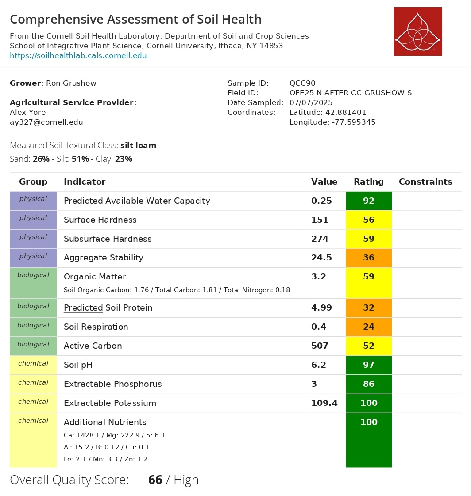
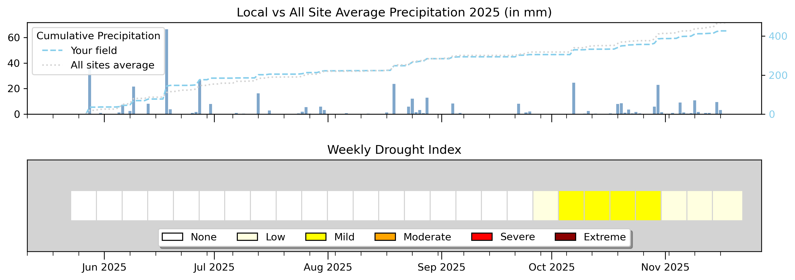

```{r setup, include=FALSE}
library(tidyverse)
library(plotly)
library(htmltools)

# ============================================================
#  📂 RUTA DE DATOS
# ============================================================
data_dir <- "data"

cn_file    <- "OFE2025_CN.csv"
nrate_file <- "OFE2025_NRates.csv"

# ============================================================
#  C:N — LECTURA Y LIMPIEZA
#  Columnas sin header: FarmField, Plot, SampleType, Date,
#                       TotalC_pct, TotalN_pct, Lon, Lat
# ============================================================
cn_raw <- read_csv(
  file.path(data_dir, cn_file),
  col_names = c("FarmField", "Plot", "SampleType", "Date",
                "TotalC_pct", "TotalN_pct", "Lon", "Lat"),
  show_col_types = FALSE
)

# ---- Gruschow South · Maize Biomass ----
gs_biomass <- cn_raw |>
  filter(FarmField == "gruschowSouth", SampleType == "MaizeBiomass") |>
  filter(!is.na(TotalC_pct), !is.na(TotalN_pct)) |>
  mutate(
    CN_ratio = TotalC_pct / TotalN_pct,
    Plot     = as.integer(Plot)
  )

# ---- Gruschow South · Cover Crop ----
gs_cover <- cn_raw |>
  filter(FarmField == "gruschowSouth", SampleType == "CoverCrop") |>
  filter(!is.na(TotalC_pct), !is.na(TotalN_pct)) |>
  mutate(
    CN_ratio = TotalC_pct / TotalN_pct,
    Plot     = as.integer(Plot)
  )

# ============================================================
#  RESUMEN ESTADÍSTICO — MAIZE BIOMASS
# ============================================================
bio_sum <- gs_biomass |>
  summarise(
    n       = n(),
    mean_N  = round(mean(TotalN_pct), 3),
    sd_N    = round(sd(TotalN_pct),   3),
    se_N    = round(sd(TotalN_pct) / sqrt(n()), 3),
    min_N   = round(min(TotalN_pct),  3),
    max_N   = round(max(TotalN_pct),  3),
    mean_C  = round(mean(TotalC_pct), 2),
    sd_C    = round(sd(TotalC_pct),   2),
    mean_CN = round(mean(CN_ratio),   2),
    sd_CN   = round(sd(CN_ratio),     2),
    se_CN   = round(sd(CN_ratio) / sqrt(n()), 2),
    min_CN  = round(min(CN_ratio),    2),
    max_CN  = round(max(CN_ratio),    2)
  )

# ============================================================
#  RESUMEN ESTADÍSTICO — COVER CROP
# ============================================================
cc_sum <- gs_cover |>
  summarise(
    n       = n(),
    mean_N  = round(mean(TotalN_pct), 3),
    sd_N    = round(sd(TotalN_pct),   3),
    se_N    = round(sd(TotalN_pct) / sqrt(n()), 3),
    min_N   = round(min(TotalN_pct),  3),
    max_N   = round(max(TotalN_pct),  3),
    mean_C  = round(mean(TotalC_pct), 2),
    sd_C    = round(sd(TotalC_pct),   2),
    mean_CN = round(mean(CN_ratio),   2),
    sd_CN   = round(sd(CN_ratio),     2),
    se_CN   = round(sd(CN_ratio) / sqrt(n()), 2),
    min_CN  = round(min(CN_ratio),    2),
    max_CN  = round(max(CN_ratio),    2)
  )

# ============================================================
#  N RATE — GRUSCHOW SOUTH
# ============================================================
nrates       <- read_csv(file.path(data_dir, nrate_file), show_col_types = FALSE)
gs_nrate_val <- nrates |>
  filter(tolower(FarmName) == "gruschow",
         tolower(FieldName) == "south") |>
  pull(Nrate_lbAc) |>
  first()
gs_nrate_val <- if (is.na(gs_nrate_val) || length(gs_nrate_val) == 0) "N/A" else gs_nrate_val

# ============================================================
#  PALETA Y HELPERS
# ============================================================
col_bio   <- "#0d9488"   # teal  — maize biomass
col_cover <- "#7c3aed"   # violet — cover crop
col_pink  <- "#e879a0"

fmt      <- function(x) ifelse(x == round(x), as.character(round(x)), as.character(x))
sign_fmt <- function(x) ifelse(x >= 0, paste0("+", x), as.character(x))

# ---- Helper: stat card descriptivo ----
stat_card <- function(label, value, sub, border_color = "#0d9488") {
  HTML(paste0('
  <div style="background:#fff; border:1px solid #e5e7eb;
       border-top:4px solid ', border_color, '; border-radius:12px;
       padding:18px 20px; position:relative;">
    <div style="font-size:10px; font-weight:700; letter-spacing:1.3px;
         text-transform:uppercase; color:#9ca3af; margin-bottom:8px;">',
         label, '</div>
    <div style="font-size:2.2rem; font-weight:700; font-family:monospace; line-height:1;">',
         value, '</div>
    <div style="font-size:11px; color:#9ca3af; margin-top:6px;">',
         sub, '</div>
  </div>'))
}

# ---- Helper: fila de N cards ----
cards_row <- function(..., cols = 3) {
  items <- list(...)
  inner <- paste(sapply(items, as.character), collapse = "\n")
  HTML(paste0('
  <div style="display:grid; grid-template-columns: repeat(', cols, ',1fr);
       gap:12px; margin:16px 0 24px;">', inner, '</div>'))
}

# ---- Interpretación C:N cover crop ----
cn_interp <- function(cn) {
  if      (cn < 20) "very low C:N — rapid N release, high mineralization potential"
  else if (cn < 25) "low C:N — fast decomposition, good early-season N supply"
  else if (cn < 35) "moderate C:N — gradual N release through the season"
  else              "high C:N — slow decomposition, possible early-season N immobilization"
}
```

```{=html}
<div class="lab-topbar">
  <div class="lab-topbar__inner">
    <div class="lab-topbar__left">
      <div class="lab-topbar__logos">
        
        
      </div>
      <span class="lab-title">2025 Cropping Season</span>
      <span class="lab-subtitle">
        Field M4F2S2 &nbsp;|&nbsp; NRate `r gs_nrate_val` lb N/ac &nbsp;|&nbsp;
        <strong>Field monitoring report — single N rate, no treatment split</strong>
      </span>
    </div>
    <div class="lab-topbar__right">
      <a class="btn btn-download" href="index.pdf"
         title="Download PDF version"
         target="_blank" rel="noopener noreferrer">
        ⬇ Download PDF
      </a>
    </div>
  </div>
</div>
```

::: {.page-intro}
**Welcome to your 2025 farm report.**
This report summarizes field-season measurements for the **M4F2S2** field. Because this field ran under a single nitrogen rate of 163 lb N/ac with no treatment or control strips, we're not comparing two systems here, instead, 
we're giving you a field-level picture of how the corn crop performed, what the cover crop residue looked like going into the season, and what the soil health assessment tells us about the foundation you're working with. Think of this as your baseline.
:::

```{=html}
<figure style="margin: 20px 0; text-align: center;">
  
  <figcaption style="font-size: 0.82rem; color: #6b7280; margin-top: 8px;">
    <strong>Figure 1.</strong> M4F2S2 field.
  </figcaption>
</figure>

<div style="margin: 16px 0 24px; text-align: center;">
  <a href=""https://farmersdatalab.github.io/91e3d7b4-2a6f-4c0a-8e1d-3f7b5c9a6d88/"
     target="_blank"
     rel="noopener noreferrer"
     style="display: inline-flex; align-items: center; gap: 8px;
            background: #0d9488; color: #fff; font-weight: 600;
            padding: 10px 20px; border-radius: 8px; text-decoration: none;
            font-size: 0.95rem; box-shadow: 0 2px 6px rgba(0,0,0,0.15);
            transition: opacity 0.2s;">
    🗺️ Open Interactive NDVI Map
  </a>
</div>
```

::: {.page-intro}
**Take-home message:**
The corn crop across this field showed high and consistent nitrogen status mid-season, with tissue nitrogen averaging `r bio_sum$mean_N`% across the sampled points, reflecting strong crop nitrogen uptake at the `r gs_nrate_val` lb N/ac input rate. The cover crop residue had a C:N ratio of `r cc_sum$mean_CN`, placing it in the moderate range, decomposition will be gradual, with nitrogen releasing steadily through the season rather than all at once. The soil health assessment returned an overall score of **66/100 (High)**. Chemical indicators are excellent across the board. The main areas to watch are biological and physical structure: soil respiration (24), predicted soil protein (32), and aggregate stability (36) are all in the Low range, and surface and subsurface hardness are at medium functioning. These are the indicators that improve most with reduced tillage and continuous cover cropping over time.
:::

---

## Results Summary {#summary}

```{r summary-table, echo=FALSE, message=FALSE, warning=FALSE}
summary_df <- tibble(
  Metric = c(
    "🌽 Maize Biomass - Mean %N",
    "🌽 Maize Biomass - C:N Ratio",
    "🌱 Cover Crop - Mean %N",
    "🌱 Cover Crop - C:N Ratio",
    "🌿 Soil Health Score"
  ),
  Value = c(
    paste0(bio_sum$mean_N, "%"),
    as.character(bio_sum$mean_CN),
    paste0(cc_sum$mean_N, "%"),
    as.character(cc_sum$mean_CN),
    "66 / 100"
  ),
  SD = c(
    paste0("± ", bio_sum$sd_N),
    paste0("± ", bio_sum$sd_CN),
    paste0("± ", cc_sum$sd_N),
    paste0("± ", cc_sum$sd_CN),
    "—"
  )
)

knitr::kable(summary_df, align = c("l", "c", "c"))
```

::: {style="font-size: 0.82rem; color: #9ca3af; margin-top: -8px;"}
This field did not have a treatment/control split. All statistics are descriptive
field-level observations. No statistical comparisons between groups are reported.
:::

---

## 🌽 C:N in Corn Biomass {#cn-biomass}

::: {.page-intro}
Corn biomass was collected from **`r bio_sum$n` points** across the South field and sent to the laboratory for C:N analysis. This tells us how much nitrogen the plant had absorbed and incorporated into its tissue mid-season, a direct indicator of nitrogen sufficiency at the `r gs_nrate_val` lb N/ac input rate. Because there is no treatment split, we describe the **field-level
distribution and spatial variability** across points.
:::

### Total Nitrogen in Biomass (%N)

::: {.panel-tabset}

## Bar Chart (%N by plot)

```{r bio-n-bar, echo=FALSE, message=FALSE, warning=FALSE}
p_n_bio <- ggplot(gs_biomass, aes(x = factor(Plot), y = TotalN_pct)) +
  geom_col(fill = col_bio, color = "black", alpha = 0.85, width = 0.65) +
  geom_hline(yintercept = bio_sum$mean_N, linetype = "dashed",
             color = col_pink, linewidth = 0.9) +
  annotate("text", x = 4.5, y = bio_sum$mean_N + 0.1,
           label = paste0("Mean: ", bio_sum$mean_N, "%"),
           color = col_pink, size = 3.5, hjust = 0) +
  scale_y_continuous(expand = expansion(mult = c(0, 0.15))) +
  labs(
    title    = "Total Nitrogen in Corn Biomass by Plot (%N)",
    subtitle = paste0("Mean = ", bio_sum$mean_N, "%  |  SD = ", bio_sum$sd_N,
                      "  |  n = ", bio_sum$n, " plots  |  Gruschow South, July 14 2025"),
    x = "Plot", y = "Total Nitrogen (%)",
    caption  = "Dashed line = field mean. Plots 5 and 8 excluded (NA in raw data)."
  ) +
  theme_minimal(base_size = 13) +
  theme(plot.title = element_text(face = "bold"),
        panel.grid.minor = element_blank(),
        panel.grid.major.x = element_blank())

ggplotly(p_n_bio) |> layout(showlegend = FALSE)
```

:::

---

### C:N Ratio — Biomass

```{r bio-cn-cards, echo=FALSE}
cards_row(
  stat_card("Mean C:N — Biomass",
            bio_sum$mean_CN,
            paste0("SD: ", bio_sum$sd_CN,
                   "  |  SE: ", bio_sum$se_CN),
            col_bio),
  cols = 1
)
```

::: {.panel-tabset}

## Bar Chart (C:N by plot)

```{r bio-cn-bar, echo=FALSE, message=FALSE, warning=FALSE}
p_cn_bio <- ggplot(gs_biomass, aes(x = factor(Plot), y = CN_ratio)) +
  geom_col(fill = col_bio, color = "black", alpha = 0.85, width = 0.65) +
  geom_hline(yintercept = bio_sum$mean_CN, linetype = "dashed",
             color = col_pink, linewidth = 0.9) +
  annotate("text", x = 1.7, y = bio_sum$mean_CN + 0.35,
           label = paste0("Mean: ", bio_sum$mean_CN),
           color = col_pink, size = 3.5, hjust = 0) +
  scale_y_continuous(expand = expansion(mult = c(0, 0.15))) +
  labs(
    title    = "C:N Ratio in Corn Biomass by Plot",
    subtitle = paste0("Mean C:N = ", bio_sum$mean_CN,
                      "  |  SD = ", bio_sum$sd_CN,
                      "  |  n = ", bio_sum$n, " plots"),
    x = "Plot", y = "C:N Ratio",
    caption  = "Lower C:N = more N-rich tissue. Dashed line = field mean."
  ) +
  theme_minimal(base_size = 13) +
  theme(plot.title = element_text(face = "bold"),
        panel.grid.minor = element_blank(),
        panel.grid.major.x = element_blank())

ggplotly(p_cn_bio) |> layout(showlegend = FALSE)
```

## Scatter %C vs %N

```{r bio-scatter, echo=FALSE, message=FALSE, warning=FALSE}
p_scatter <- ggplot(gs_biomass,
                    aes(x = TotalN_pct, y = TotalC_pct,
                        text = paste0("Plot: ", Plot,
                                      "<br>%N: ", TotalN_pct,
                                      "<br>%C: ", TotalC_pct,
                                      "<br>C:N: ", round(CN_ratio, 2)))) +
  geom_smooth(method = "lm", se = TRUE, color = col_pink,
              fill = col_pink, alpha = 0.15, linewidth = 0.8) +
  geom_point(size = 5, color = col_bio, alpha = 0.9) +
  labs(
    title    = "%C vs %N in Corn Biomass",
    subtitle = "Each point = one plot. Pink line = linear trend.",
    x = "Total Nitrogen (%)", y = "Total Carbon (%)"
  ) +
  theme_minimal(base_size = 13) +
  theme(plot.title = element_text(face = "bold"),
        panel.grid.minor = element_blank())

ggplotly(p_scatter, tooltip = "text") |> layout(showlegend = FALSE)
```

:::

---

## 🌱 Cover Crop C:N {#cn-covercrop}

::: {.page-intro}
**`r cc_sum$n` cover crop samples** were collected from field M4F2S2 and analyzed for C:N content. The C:N ratio of cover crop residue tells us how quickly it will break down and release its nitrogen to the following corn crop. A C:N below 25 means decomposition happens relatively fast, the nitrogen becomes available early in the season, right when the young corn plant is establishing its root system and building its nitrogen demand. The bar charts below show the %N and C:N ratio for each sample location.
:::

```{r cc-cards, echo=FALSE}
cards_row(
  stat_card("Mean %N — Cover Crop",
            paste0(cc_sum$mean_N, "%"),
            paste0("SD: ", cc_sum$sd_N,
                   "  |  n = ", cc_sum$n, " samples  |  ",
                   "Range: ", cc_sum$min_N, " – ", cc_sum$max_N, "%"),
            col_cover),
  stat_card("Mean C:N — Cover Crop",
            cc_sum$mean_CN,
            paste0("SD: ", cc_sum$sd_CN, "  |  ", cn_interp(cc_sum$mean_CN)),
            col_cover),
  cols = 2
)
```

::: {.panel-tabset}

### Total Nitrogen in Cover Crop (%N)

```{r cc-n-bar, echo=FALSE, message=FALSE, warning=FALSE}
p_cc_n <- ggplot(gs_cover, aes(x = factor(Plot), y = TotalN_pct)) +
  geom_col(fill = col_cover, color = "black", alpha = 0.85, width = 0.65) +
  geom_hline(yintercept = cc_sum$mean_N, linetype = "dashed",
             color = col_pink, linewidth = 0.9) +
  annotate("text", x = 3.2, y = cc_sum$mean_N + 0.09,
           label = paste0("Mean: ", cc_sum$mean_N, "%"),
           color = col_pink, size = 3.5, hjust = 0) +
  scale_y_continuous(expand = expansion(mult = c(0, 0.15))) +
  labs(
    title    = "Total Nitrogen in Cover Crop (%N)",
    subtitle = paste0("Mean = ", cc_sum$mean_N, "%  |  SD = ", cc_sum$sd_N,
                      "  |  n = ", cc_sum$n, " samples  |  Gruschow South"),
    x = "Sample", y = "Total Nitrogen (%)",
    caption  = "Dashed line = field mean."
  ) +
  theme_minimal(base_size = 13) +
  theme(plot.title = element_text(face = "bold"),
        panel.grid.minor = element_blank(),
        panel.grid.major.x = element_blank())

ggplotly(p_cc_n) |> layout(showlegend = FALSE)
```

### C:N Ratio — Cover Crop

```{r cc-cn-bar, echo=FALSE, message=FALSE, warning=FALSE}
p_cc_cn <- ggplot(gs_cover, aes(x = factor(Plot), y = CN_ratio)) +
  geom_col(fill = col_cover, color = "black", alpha = 0.85, width = 0.65) +
  
  labs(
    title    = "C:N Ratio in Cover Crop",
    subtitle = paste0("Mean C:N = ", cc_sum$mean_CN,
                      "  |  SD = ", cc_sum$sd_CN,
                      "  |  n = ", cc_sum$n, " samples"),
    x = "Sample", y = "C:N Ratio",
    caption  = "Lower C:N = faster N release. Dashed yellow = C:N 25 threshold."
  ) +
  theme_minimal(base_size = 13) +
  theme(plot.title = element_text(face = "bold"),
        panel.grid.minor = element_blank(),
        panel.grid.major.x = element_blank())

ggplotly(p_cc_cn) |> layout(showlegend = FALSE)
```

::: 

---

## 🌿 Soil Health Assessment {#soilhealth}

::: {.page-intro}
Soil health was assessed using the **Cornell Soil Health Test**. The overall quality score was **66/100 (High)**. Chemistry is in excellent shape across the board: pH at 6.2 (score 97), extractable phosphorus (86), potassium (100), and all additional nutrients (100). The biological indicators are the main area that needs attention: soil respiration scored 24/100, predicted soil protein 32/100, and aggregate stability 36/100, all in the Low range. These reflect a microbial community that is working below its potential and soil structure that is somewhat fragile under rainfall stress. Surface hardness (56) and subsurface hardness (59) are both in the medium range, indicating moderate compaction worth monitoring. These biological and physical indicators respond best to reduced tillage and continuous cover cropping over time.
:::

```{r soil-cards, echo=FALSE}
HTML('
<div style="display:grid; grid-template-columns: repeat(3,1fr);
     gap:12px; margin:16px 0 24px;">

  <div style="background:#fff; border:1px solid #e5e7eb;
       border-top:4px solid #4CAF50; border-radius:12px; padding:18px 20px;">
    <div style="font-size:10px; font-weight:700; letter-spacing:1.3px;
         text-transform:uppercase; color:#9ca3af; margin-bottom:8px;">
         Overall Quality Score</div>
    <div style="font-size:2.2rem; font-weight:700; font-family:monospace;
         line-height:1;">66 / 100</div>
    <div style="font-size:11px; color:#9ca3af; margin-top:6px;">
         Rating: High &nbsp;|&nbsp; Cornell Soil Health Lab</div>
  </div>

  <div style="background:#fff; border:1px solid #e5e7eb;
       border-top:4px solid #F97316; border-radius:12px; padding:18px 20px;">
    <div style="font-size:10px; font-weight:700; letter-spacing:1.3px;
         text-transform:uppercase; color:#9ca3af; margin-bottom:8px;">
         ⚠ Soil Respiration</div>
    <div style="font-size:2.2rem; font-weight:700; font-family:monospace;
         line-height:1;">24 / 100</div>
    <div style="font-size:11px; color:#F97316; margin-top:6px;">
         Low — microbial activity below potential</div>
  </div>

  <div style="background:#fff; border:1px solid #e5e7eb;
       border-top:4px solid #F97316; border-radius:12px; padding:18px 20px;">
    <div style="font-size:10px; font-weight:700; letter-spacing:1.3px;
         text-transform:uppercase; color:#9ca3af; margin-bottom:8px;">
         ⚠ Predicted Soil Protein</div>
    <div style="font-size:2.2rem; font-weight:700; font-family:monospace;
         line-height:1;">32 / 100</div>
    <div style="font-size:11px; color:#F97316; margin-top:6px;">
         Low — N mineralization capacity limited</div>
  </div>

</div>
')
```

```{=html}
<figure style="margin: 24px 0; text-align: center;">
  
  <figcaption style="font-size: 0.82rem; color: #6b7280; margin-top: 8px;">
    <strong>Figure 2.</strong> Cornell Assessment of Soil Health report - M4F2S2.
  </figcaption>
</figure>

<div style="margin: 0 0 24px;">
  <a href="data/gruschowSouth_soilhealth.pdf"
     target="_blank" rel="noopener noreferrer"
     style="display: inline-flex; align-items: center; gap: 8px;
            background: #4CAF50; color: #fff; font-weight: 600;
            padding: 10px 18px; border-radius: 8px; text-decoration: none;
            font-size: 0.95rem; box-shadow: 0 2px 6px rgba(0,0,0,0.12);">
    ↗ Open Full Soil Health Report (PDF)
  </a>
</div>
```

---

## 🌧️ Weather & Drought Conditions {#weather}

::: {.page-intro}
**Cumulative precipitation** at your field compared to the all-site average, alongside the weekly drought index from June through November 2025. A large single-day rain event hit in late June, around 65 mm, which pushed your cumulative total well above the all-site average heading into July. From there, rainfall stayed consistent and moderate through the summer, tracking closely with the network average. The drought index stayed at None all the way through September. Mild drought conditions appeared in October. One thing worth watching: given the low aggregate stability score (36/100), that heavy June rain event may have contributed to some surface crusting or runoff, something to monitor in future seasons, particularly given the silt loam texture of this field.
:::

```{=html}
<figure style="margin: 0 0 24px; text-align: center;">
  
  <figcaption style="font-size: 0.82rem; color: #6b7280; margin-top: 8px;">
    <strong>Figure 3.</strong> Local vs all-site average precipitation (top) and
    weekly drought index (bottom), June – November 2025.
  </figcaption>
</figure>
```

---

## 📝 Conclusions {#conclusions}

```{r conclusions, echo=FALSE}
HTML(paste0('
<style>
  .conclusion-grid {
    display: grid;
    grid-template-columns: 1fr 1fr;
    gap: 14px;
    margin: 20px 0;
  }
  .conc-card {
    background: #fff;
    border: 1px solid #e5e7eb;
    border-left: 6px solid #4CAF50;
    border-radius: 8px;
    padding: 14px 16px;
    font-size: 0.93rem;
  }
  .conc-card.amber  { border-left-color: #F9C74F; }
  .conc-card.violet { border-left-color: #7c3aed; }
  .conc-card.pink   { border-left-color: #e879a0; }
  .conc-card.red    { border-left-color: #ef4444; }
  .conc-card.orange { border-left-color: #F97316; }
  .conc-title {
    font-weight: 700; font-size: 0.85rem; text-transform: uppercase;
    letter-spacing: 0.8px; color: #6b7280; margin-bottom: 6px;
  }
  @media (max-width: 700px) { .conclusion-grid { grid-template-columns: 1fr; } }
</style>

<div class="conclusion-grid">

  <div class="conc-card">
    <div class="conc-title">🌽 Maize Biomass Nitrogen</div>
    Corn plants across the field averaged <strong>', bio_sum$mean_N, '% N</strong> in mid-season biomass, with a C:N ratio of <strong>', bio_sum$mean_CN, '</strong>. Tissue nitrogen was notably higher than the M5F2S2 field, reflecting strong crop nitrogen uptake across the ', bio_sum$n, ' sampled locations at the 163 lb N/ac input rate.
  </div>

  <div class="conc-card violet">
    <div class="conc-title">🌱 Cover Crop N Contribution</div>
    The cover crop came in at a mean C:N of <strong>', cc_sum$mean_CN, '</strong> and tissue N of <strong>', cc_sum$mean_N, '%</strong>, a moderate C:N ratio indicating gradual nitrogen release through the season rather than a fast early flush. This is still useful for building season-long N supply.
  </div>

  <div class="conc-card orange">
    <div class="conc-title">⚠ Biological Activity and aggregate stability— Priority Constraints</div>
    Soil respiration scored <strong>24/100</strong> and predicted soil protein <strong>32/100</strong>, both in the Low range. Aggregate stability (36/100) is also low, meaning soil structure is somewhat vulnerable to rainfall-driven disruption. The microbial community is working below its potential. Maintaining plant cover, adding fresh organic matter, and reducing tillage intensity are the primary levers to move these numbers up over time.
  </div>
  
 </div>
'))
```

---

::: {style="font-size: 0.82rem; color: #9ca3af; text-align: center; margin-top: 32px; border-top: 1px solid #e5e7eb; padding-top: 16px;"}
Report generated by <strong><a href="https://www.farmersdatalab.org/" target="_blank">Farmers DataLab</a></strong> - Cornell University ·
:::
