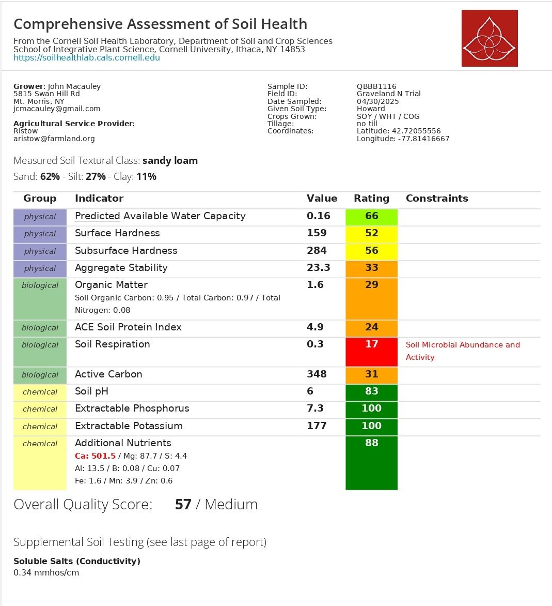

```{r setup, include=FALSE}
library(tidyverse)
library(plotly)
library(htmltools)
library(emmeans)
library(multcomp)
library(multcompView)
library(dplyr)      

# ============================================================
#  RUTA DE DATOS
# ============================================================
data_dir <- "data"

# ============================================================
#  ARCHIVOS
# ============================================================
dualex_file <- "macauley_dualex_survey.csv"
cn_file     <- "OFE2025_CN.csv"
csnt_file   <- "OFE2025_CSNT.csv"
nrates_file <- "OFE2025_NRates.csv"
yield_file  <- "OFE2025_Yield_Strips.csv"

# ============================================================
#  N RATES — Field, NRate, Treatment, SampleID
# ============================================================
nrates_raw <- read.csv(file.path(data_dir, nrates_file),
                       stringsAsFactors = FALSE, strip.white = TRUE)
nrates_raw <- nrates_raw[nrates_raw$Field == "macauley", ]
nrates <- data.frame(
  PlotName = trimws(nrates_raw$SampleID),
  Nrate    = as.numeric(nrates_raw$NRate),
  NGroup   = factor(trimws(nrates_raw$Treatment),
                    levels = c("Zero", "Low", "Farmer", "High")),
  stringsAsFactors = FALSE
)

# ============================================================
#  YIELD — LECTURA Y PARSE DESDE PlotName (mac_BLK{b}_{t})
#  TrtNum: 1=Zero(0), 2=Low(30), 3=Farmer(90), 4=High(150)
# ============================================================
yield_raw <- read_csv(file.path(data_dir, yield_file), show_col_types = FALSE)

mac_yield <- yield_raw |>
  filter(FarmName == "macauley") |>
  mutate(
    Block  = factor(str_extract(PlotName, "BLK[0-9]+")),
    TrtNum = as.integer(str_extract(PlotName, "[0-9]+$")),
    NGroup = factor(case_when(
      TrtNum == 1 ~ "Zero",
      TrtNum == 2 ~ "Low",
      TrtNum == 3 ~ "Farmer",
      TrtNum == 4 ~ "High"
    ), levels = c("Zero", "Low", "Farmer", "High")),
    Nrate  = case_when(
      TrtNum == 1 ~   0,
      TrtNum == 2 ~  30,
      TrtNum == 3 ~  90,
      TrtNum == 4 ~ 150
    )
  ) |>
  filter(!is.na(NGroup), !is.na(Yield_buAc))

# Summary by NGroup
yield_summary <- mac_yield |>
  group_by(NGroup, Nrate) |>
  summarise(
    n          = n(),
    mean_yield = round(mean(Yield_buAc, na.rm = TRUE), 1),
    sd_yield   = round(sd(Yield_buAc,   na.rm = TRUE), 1),
    se_yield   = round(sd(Yield_buAc,   na.rm = TRUE) / sqrt(n()), 1),
    .groups    = "drop"
  )

# ANOVA RCBD: Yield ~ NGroup + Block
aov_yield  <- aov(Yield_buAc ~ NGroup + Block, data = mac_yield)
emm_yield  <- emmeans(aov_yield, ~ NGroup)
cld_yield  <- cld(emm_yield, Letters = letters, adjust = "tukey") |>
  as_tibble() |>
  mutate(
    NGroup = factor(NGroup, levels = c("Zero", "Low", "Farmer", "High")),
    letter = str_trim(.group)
  )

p_anova_yield <- summary(aov_yield)[[1]][["Pr(>F)"]][1]
p_lab_yield   <- ifelse(p_anova_yield < 0.001, "p < 0.001",
                        paste0("p = ", signif(p_anova_yield, 3)))

# Linear regression: Yield ~ Nrate
lm_yield       <- lm(Yield_buAc ~ Nrate, data = mac_yield)
r2_yield       <- round(summary(lm_yield)$r.squared, 3)
p_lm_yield     <- round(summary(lm_yield)$coefficients[2, 4], 4)
p_lm_yield_lab <- ifelse(p_lm_yield < 0.001, "p < 0.001",
                         paste0("p = ", signif(p_lm_yield, 3)))

# ============================================================
#  DUALEX — LECTURA Y LIMPIEZA
#  Cols: date, field, treatment, group, meas, leaf, chl, flav, anth, nbi
# ============================================================
df_raw <- read_csv(file.path(data_dir, dualex_file), show_col_types = FALSE)

df_clean <- df_raw |>
  mutate(
    treatment = str_squish(treatment),
    treatment = factor(treatment, levels = c("Zero", "Low", "Farmer", "High"))
  ) |>
  filter(!is.na(chl)) |>
  arrange(group, meas) |>
  group_by(group) |>
  mutate(plant_id = ceiling(row_number() / 2)) |>
  ungroup()

df_avg <- df_clean |>
  group_by(date, field, treatment, group, plant_id) |>
  summarise(
    chl  = mean(chl,  na.rm = TRUE),
    flav = mean(flav, na.rm = TRUE),
    anth = mean(anth, na.rm = TRUE),
    nbi  = mean(nbi,  na.rm = TRUE),
    .groups = "drop"
  )

# ============================================================
#  DUALEX — ANOVA + TUKEY (NBI y CHL)
# ============================================================
aov_nbi <- aov(nbi ~ treatment + group, data = df_avg)
emm_nbi <- emmeans(aov_nbi, ~ treatment)
cld_nbi <- cld(emm_nbi, Letters = letters, adjust = "tukey") |>
  as_tibble() |>
  mutate(
    treatment = factor(treatment, levels = c("Zero","Low","Farmer","High")),
    letter    = str_trim(.group)
  )
p_anova_nbi <- summary(aov_nbi)[[1]][["Pr(>F)"]][1]
p_lab_nbi   <- ifelse(p_anova_nbi < 0.001, "p < 0.001",
                      paste0("p = ", signif(p_anova_nbi, 3)))

aov_chl <- aov(chl ~ treatment + group, data = df_avg)
emm_chl <- emmeans(aov_chl, ~ treatment)
cld_chl <- cld(emm_chl, Letters = letters, adjust = "tukey") |>
  as_tibble() |>
  mutate(
    treatment = factor(treatment, levels = c("Zero","Low","Farmer","High")),
    letter    = str_trim(.group)
  )
p_anova_chl <- summary(aov_chl)[[1]][["Pr(>F)"]][1]
p_lab_chl   <- ifelse(p_anova_chl < 0.001, "p < 0.001",
                      paste0("p = ", signif(p_anova_chl, 3)))

# ============================================================
#  C:N BIOMASA — Field, SampleID, SampleType, SampleDate_CN,
#                TotalC_pct, TotalN_pct, Treatment
# ============================================================
cn_raw <- read.csv(file.path(data_dir, cn_file),
                   stringsAsFactors = FALSE, strip.white = TRUE)

mac_cn <- cn_raw[cn_raw$Field == "macauley" &
                   cn_raw$SampleType == "MaizeBiomass" &
                   !is.na(cn_raw$TotalN_pct), ]
mac_cn <- merge(mac_cn, nrates[, c("PlotName","Nrate")],
                by.x = "SampleID", by.y = "PlotName", all.x = TRUE)
mac_cn$CN_ratio <- mac_cn$TotalC_pct / mac_cn$TotalN_pct
mac_cn$NGroup   <- factor(trimws(mac_cn$Treatment),
                           levels = c("Zero","Low","Farmer","High"))

mac_cn$Block <- factor(
  stringr::str_extract(mac_cn$SampleID, "BLK[0-9]+"))

mac_cn_plot <- mac_cn |>
  group_by(SampleID, Block, NGroup, Nrate) |>
  summarise(
	TotalN_pct = mean(TotalN_pct, na.rm = TRUE),
	CN_ratio   = mean(CN_ratio,   na.rm = TRUE),
	.groups = "drop")

cn_summary <- mac_cn_plot |>
  group_by(NGroup, Nrate) |>
  summarise(
	n   	= n(),
	mean_N  = round(mean(TotalN_pct, na.rm = TRUE), 3),
	sd_N	= round(sd(TotalN_pct,   na.rm = TRUE), 3),
	se_N	= round(sd_N / sqrt(n), 3),
	mean_CN = round(mean(CN_ratio,   na.rm = TRUE), 2),
	sd_CN   = round(sd(CN_ratio, 	na.rm = TRUE), 2),
	se_CN   = round(sd_CN / sqrt(n), 2),
	.groups = "drop")

aov_cn <- aov(TotalN_pct ~ NGroup + Block, data = mac_cn_plot)
emm_cn  <- emmeans(aov_cn, ~ NGroup)
cld_cn  <- cld(emm_cn, Letters = letters, adjust = "tukey") |>
  as_tibble() |>
  mutate(
    NGroup = factor(NGroup, levels = c("Zero","Low","Farmer","High")),
    letter = str_trim(.group)
  )
p_anova_cn <- summary(aov_cn)[[1]][["Pr(>F)"]][1]
p_lab_cn   <- ifelse(p_anova_cn < 0.001, "p < 0.001",
                     paste0("p = ", signif(p_anova_cn, 3)))

lm_cn    <- lm(TotalN_pct ~ Nrate, data = mac_cn)
r2_cn    <- round(summary(lm_cn)$r.squared, 3)
p_lm_cn  <- round(summary(lm_cn)$coefficients[2, 4], 4)
p_lm_lab <- ifelse(p_lm_cn < 0.001, "p < 0.001",
                   paste0("p = ", signif(p_lm_cn, 3)))


# ============================================================
#  CSNT — Field, CSNT_ppm, SampleID, Treatment
# ============================================================

csnt_raw <- read.csv(file.path(data_dir, csnt_file),
                     stringsAsFactors = FALSE, strip.white = TRUE)

mac_csnt <- csnt_raw[csnt_raw$Field == "macauley", ]
mac_csnt <- merge(mac_csnt, nrates[, c("PlotName","Nrate")],
                  by.x = "SampleID", by.y = "PlotName", all.x = TRUE)

mac_csnt$NGroup <- factor(trimws(mac_csnt$Treatment),
                           levels = c("Zero","Low","Farmer","High"))

mac_csnt <- mac_csnt[!is.na(mac_csnt$NGroup) & !is.na(mac_csnt$CSNT_ppm), ]

# ✅ Crear BLOQUE
mac_csnt$Block <- factor(
  stringr::str_extract(mac_csnt$SampleID, "BLK[0-9]+")
)

# ✅ Promediar por PARCELA (esto VA PRIMERO)
mac_csnt_plot <- mac_csnt |>
  group_by(SampleID, Block, NGroup, Nrate) |>
  summarise(
    CSNT_ppm = mean(CSNT_ppm, na.rm = TRUE),
    .groups = "drop"
  )

# ✅ Ahora sí: summary consistente con RCBD
csnt_summary <- mac_csnt_plot |>
  group_by(NGroup, Nrate) |>
  summarise(
    n         = n(),
    mean_csnt = round(mean(CSNT_ppm, na.rm = TRUE), 0),
    sd_csnt   = round(sd(CSNT_ppm,   na.rm = TRUE), 0),
    se_csnt   = round(sd_csnt / sqrt(n), 0),
    .groups   = "drop"
  )

# ✅ ANOVA RCBD
aov_csnt <- aov(CSNT_ppm ~ NGroup + Block, data = mac_csnt_plot)

emm_csnt <- emmeans(aov_csnt, ~ NGroup)

cld_csnt <- cld(emm_csnt, Letters = letters, adjust = "tukey") |>
  as_tibble() |>
  mutate(
    NGroup = factor(NGroup, levels = c("Zero","Low","Farmer","High")),
    letter = str_trim(.group)
  )

p_anova_csnt <- summary(aov_csnt)[[1]][["Pr(>F)"]][1]
p_lab_csnt <- ifelse(
  p_anova_csnt < 0.001,
  "p < 0.001",
  paste0("p = ", signif(p_anova_csnt, 3))
)


# ============================================================
#  PALETA — 4 niveles de N
# ============================================================
pal4 <- c("Zero"   = "#d1e5f0",
          "Low"    = "#74add1",
          "Farmer" = "#4dac26",
          "High"   = "#1a6136")

# ============================================================
#  FUNCIÓN: summary cards para ANOVA (4 tratamientos)
# ============================================================
anova_cards <- function(p_val, val_zero, val_high, units = "", note = "") {
  sig <- grepl("<", p_val) ||
         (!grepl("<", p_val) && as.numeric(gsub("p = ", "", p_val)) < 0.05)
  pct <- round((val_high - val_zero) / abs(val_zero) * 100, 1)
  arrow <- ifelse(pct >= 0, "&#8593;", "&#8595;")
  pct_lab <- paste0(arrow, " ", ifelse(pct >= 0, "+", ""), pct, "%")
  HTML(paste0('
  <style>
    .sc-row { display: grid; grid-template-columns: 1fr 1fr;
              gap: 12px; margin: 16px 0 24px; }
    .sc { background:#fff; border:1px solid #e5e7eb; border-radius:12px;
          padding:18px 20px; }
    .sc-label { font-size:10px; font-weight:700; letter-spacing:1.3px;
                text-transform:uppercase; color:#9ca3af; margin-bottom:8px; }
    .sc-main  { display:flex; align-items:baseline; gap:10px; flex-wrap:wrap; }
    .sc-val   { font-size:2.4rem; font-weight:700; font-family:monospace; line-height:1; }
    .sc-delta { font-size:1rem; font-weight:600; color:#0d9488; }
    .sc-sub   { font-size:11px; color:#9ca3af; margin-top:6px; }
    .sc-p     { font-size:12px; font-weight:600; color:#e879a0; margin-top:5px; }
    @media (max-width:600px) { .sc-row { grid-template-columns:1fr; } }
  </style>
  <div class="sc-row">
    <div class="sc" style="border-top:4px solid #1a6136">
      <div class="sc-label">Zero vs High (150 lb N/ac)</div>
      <div class="sc-main">
        <span class="sc-val">', round(val_zero, 1), '</span>
        <span class="sc-delta">', pct_lab, ' to ', round(val_high, 1), ' ', units, '</span>
      </div>
      <div class="sc-sub">from 0 to 150 lb N/ac applied</div>
    </div>
    <div class="sc" style="border-top:4px solid #e879a0">
      <div class="sc-label">ANOVA p-value</div>
      <div class="sc-main">
        <span class="sc-val" style="font-size:1.6rem">', p_val, '</span>
      </div>
      <div class="sc-sub">', note, '</div>
      <div class="sc-p">', ifelse(sig, "&#10003; Significant difference among treatments",
                                      "&#8212; No significant difference detected"), '</div>
    </div>
  </div>'))
}
```

```{=html}
<div class="lab-topbar">
  <div class="lab-topbar__inner">
    <div class="lab-topbar__left">
      <div class="lab-topbar__logos">
        
        
      </div>
      <span class="lab-title">2025 Cropping Season</span>
      <span class="lab-subtitle">
        Field Ntrials &nbsp;|&nbsp; N rates: 0, 30, 90, 150 lb N/ac &nbsp;|&nbsp;
        <strong>Research question:</strong> Can applying cover crops reduce the amount of nitrogen required to maximize grain yields?
      </span>
    </div>
    <div class="lab-topbar__right">
      <a class="btn btn-download" href="index.pdf">⬇ Download PDF</a>
    </div>
  </div>
</div>
```

::: {.page-intro}
**Welcome to your 2025 farm report.**
This report summarizes the on-farm nitrogen rate trial conducted in the Ntrials field. Four nitrogen rates were tested: 0 (Zero), 30 (Low), 90 (Farmer rate), and 150 (High) lb N/ac, in a randomized complete block design with 4 blocks. Statistical comparisons use one-way ANOVA with Tukey post-hoc tests. Letters in the figures indicate treatment groups that are significantly different from each other (p < 0.05).
:::

```{=html}
<figure style="margin: 20px 0; text-align: center;">
  
  <figcaption style="font-size:0.82rem; color:#6b7280; margin-top:8px;">
    <strong>Figure 1.</strong> N rate treatment layout.
  </figcaption>
</figure>
```

::: {.page-intro}
**Take-home message:** Yield data from the N-rate strips is now included alongside the nitrogen indicators. Together, these results address the core research question: whether applying cover crops allows a reduction in nitrogen fertilizer without sacrificing grain yield. Results from the ANOVA and dose-response regression are summarized below.
:::

---

## Results Summary {#summary}

```{r summary-table, echo=FALSE, message=FALSE, warning=FALSE}
# Helper: 1 decimal unless value is integer
fmt1 <- function(x) {
  ifelse(x == round(x, 0), as.character(as.integer(round(x, 0))),
         as.character(round(x, 1)))
}

summary_df <- tibble(
  Metric = c(
    "🌾 Corn Yield (bu/ac)",
    "🌿 NBI (Nitrogen Balance Index)",
    "🍃 Chlorophyll Index",
    "🧪 Biomass %N (C:N analysis)",
    "🌽 CSNT (Cornstalk Nitrate)"
  ),
  `ANOVA p-value` = c(p_lab_yield, p_lab_nbi, p_lab_chl, p_lab_cn, p_lab_csnt),
  `Zero (0 lb N)` = c(
    fmt1(round(filter(yield_summary, NGroup == "Zero")$mean_yield, 1)),
    fmt1(round(filter(cld_nbi,     treatment == "Zero")$emmean, 1)),
    fmt1(round(filter(cld_chl,     treatment == "Zero")$emmean, 1)),
    fmt1(round(filter(cn_summary,  NGroup    == "Zero")$mean_N, 1)),
    fmt1(round(filter(csnt_summary,NGroup    == "Zero")$mean_csnt, 0))
  ),
  `Low (30 lb N)` = c(
    fmt1(round(filter(yield_summary, NGroup == "Low")$mean_yield, 1)),
    fmt1(round(filter(cld_nbi,     treatment == "Low")$emmean, 1)),
    fmt1(round(filter(cld_chl,     treatment == "Low")$emmean, 1)),
    fmt1(round(filter(cn_summary,  NGroup    == "Low")$mean_N, 1)),
    fmt1(round(filter(csnt_summary,NGroup    == "Low")$mean_csnt, 0))
  ),
  `Farmer (90 lb N)` = c(
    fmt1(round(filter(yield_summary, NGroup == "Farmer")$mean_yield, 1)),
    fmt1(round(filter(cld_nbi,     treatment == "Farmer")$emmean, 1)),
    fmt1(round(filter(cld_chl,     treatment == "Farmer")$emmean, 1)),
    fmt1(round(filter(cn_summary,  NGroup    == "Farmer")$mean_N, 1)),
    fmt1(round(filter(csnt_summary,NGroup    == "Farmer")$mean_csnt, 0))
  ),
  `High (150 lb N)` = c(
    fmt1(round(filter(yield_summary, NGroup == "High")$mean_yield, 1)),
    fmt1(round(filter(cld_nbi,     treatment == "High")$emmean, 1)),
    fmt1(round(filter(cld_chl,     treatment == "High")$emmean, 1)),
    fmt1(round(filter(cn_summary,  NGroup    == "High")$mean_N, 1)),
    fmt1(round(filter(csnt_summary,NGroup    == "High")$mean_csnt, 0))
  )
)

knitr::kable(summary_df, align = c("l","c","c","c","c","c"))
```

::: {style="font-size:0.82rem; color:#9ca3af; margin-top:-8px;"}
Means shown. Letters from Tukey HSD test shown in individual section figures. ANOVA: one-way, 4 blocks × 4 treatments (RCBD).
:::


## 🌾 Corn Yield {#yield}

::: {.page-intro}
Corn yield was measured across all strips and joined to the N-rate treatment assignments. Results are compared across the four N-rate levels (Zero, Low, Farmer, High) using one-way ANOVA in a randomized complete block design. **Letters above bars indicate groups that differ significantly (Tukey HSD, p < 0.05).** A linear regression (yield ~ N rate) tests for a dose-response trend.
:::

```{r yield-cards, echo=FALSE}
anova_cards(p_lab_yield,
            val_zero = filter(yield_summary, NGroup == "Zero")$mean_yield,
            val_high = filter(yield_summary, NGroup == "High")$mean_yield,
            units = "bu/ac",
            note  = paste0("Linear regression R² = ", r2_yield, " · ", p_lm_yield_lab))
```

::: {.panel-tabset}

## Mean ± SE + Tukey

```{r yield-bar, echo=FALSE, message=FALSE, warning=FALSE, fig.height=3.5}
cld_yield_plot <- cld_yield |>
  left_join(yield_summary |> dplyr::select(NGroup, mean_yield, se_yield), by = "NGroup")

p <- ggplot(cld_yield_plot, aes(x = NGroup, y = mean_yield, fill = NGroup)) +
  geom_col(width = 0.6, color = "black", alpha = 0.9) +
  geom_errorbar(aes(ymin = mean_yield - se_yield, ymax = mean_yield + se_yield),
                width = 0.15, linewidth = 0.9) +
  geom_text(aes(label = letter, y = mean_yield + se_yield + 3),
            size = 5, fontface = "bold") +
  scale_fill_manual(values = pal4) +
  scale_y_continuous(expand = expansion(mult = c(0, 0.2))) +
  labs(
    title    = "Corn Yield — Mean ± SE by N Rate",
    subtitle = paste0("ANOVA ", p_lab_yield, " · Letters = Tukey HSD groups"),
    x = "N Rate Treatment", y = "Yield (bu/ac)",
    caption = "Error bars = ±SE. Same letter = no significant difference."
  ) +
  theme_minimal(base_size = 13) +
  theme(legend.position = "none", plot.title = element_text(face = "bold"),
        panel.grid.minor = element_blank())

ggplotly(p) |> config(displaylogo = FALSE) |> layout(showlegend = FALSE)
```


## Raw data by strip

```{r yield-raw, echo=FALSE, message=FALSE, warning=FALSE, fig.height=3.5}
p <- ggplot(mac_yield, aes(x = NGroup, y = Yield_buAc,
                                  color = NGroup, fill = NGroup)) +
  geom_jitter(width = 0.15, size = 3, alpha = 0.7) +
  stat_summary(fun = mean, geom = "crossbar", width = 0.4,
               linewidth = 0.8, fatten = 2, color = "black") +
  scale_color_manual(values = pal4) +
  scale_fill_manual(values  = pal4) +
  labs(title = "Individual Strip Yields by N Rate",
       subtitle = "Horizontal bar = group mean",
       x = "N Rate Treatment", y = "Yield (bu/ac)") +
  theme_minimal(base_size = 13) +
  theme(legend.position = "none", plot.title = element_text(face = "bold"),
        panel.grid.minor = element_blank())

ggplotly(p) |> config(displaylogo = FALSE) |> layout(showlegend = FALSE)
```

:::

---

## 🌿 Nitrogen Balance Index (NBI) {#nbi-details}

::: {.page-intro}
The **Nitrogen Balance Index (NBI)** is measured with the Dualex sensor and reflects the ratio of chlorophyll to flavonoids in the leaf. A higher NBI indicates better nitrogen status. Two leaves per plant were measured and averaged. Results are compared across the four N rate levels using one-way ANOVA. **Letters above bars indicate groups that differ significantly (Tukey HSD, p < 0.05).**
:::

```{r nbi-cards, echo=FALSE}
anova_cards(p_lab_nbi,
            val_zero = filter(cld_nbi, treatment == "Zero")$emmean,
            val_high = filter(cld_nbi, treatment == "High")$emmean,
            units = "",
            note = "One-way ANOVA across Zero, Low, Farmer, High")
```

::: {.panel-tabset}

## Density

```{r nbi-density, echo=FALSE, message=FALSE, warning=FALSE, fig.height=4}
p <- ggplot(df_avg, aes(x = nbi, fill = treatment, color = treatment)) +
  geom_density(alpha = 0.3, linewidth = 0.8) +
  scale_fill_manual(values  = pal4) +
  scale_color_manual(values = pal4) +
  labs(title    = "NBI Distribution by N Rate",
       subtitle = paste0("ANOVA ", p_lab_nbi),
       x = "Nitrogen Balance Index (Dualex)", y = "Density",
       fill = "N Rate", color = "N Rate") +
  theme_minimal(base_size = 13) +
  theme(plot.title = element_text(face = "bold"), legend.position = "bottom",
        panel.grid.minor = element_blank())


ggplotly(p) |>
  config(displaylogo = FALSE) |>
  layout(
    legend = list(
      orientation = "h",
      x = 0.5,
      xanchor = "center",
      y = -0.25,
      yanchor = "top"
    )
  )

```

## Mean ± SE + Tukey

```{r nbi-bar, echo=FALSE, message=FALSE, warning=FALSE, fig.height=3.5}
p <- ggplot(cld_nbi, aes(x = treatment, y = emmean, fill = treatment)) +
  geom_col(width = 0.6, color = "black", alpha = 0.9) +
  geom_errorbar(aes(ymin = emmean - SE, ymax = emmean + SE),
                width = 0.15, linewidth = 0.9) +
  geom_text(aes(label = letter, y = emmean + SE + 8),
            size = 5, fontface = "bold") +
  scale_fill_manual(values = pal4) +
  scale_y_continuous(expand = expansion(mult = c(0, 0.2))) +
  labs(
    title    = "NBI — Estimated Marginal Means",
    subtitle = paste0("ANOVA ", p_lab_nbi, " · Letters = Tukey HSD groups"),
    x = "N Rate Treatment", y = "NBI (Dualex)",
    caption = "Error bars = ±SE. Same letter = no significant difference."
  ) +
  theme_minimal(base_size = 13) +
  theme(legend.position = "none", plot.title = element_text(face = "bold"),
        panel.grid.minor = element_blank())

ggplotly(p) |> config(displaylogo = FALSE) |> layout(showlegend = FALSE)
```

## Boxplot (raw data)

```{r nbi-boxplot, echo=FALSE, message=FALSE, warning=FALSE, fig.height=3.5}
p <- ggplot(df_avg, aes(x = treatment, y = nbi, fill = treatment, color = treatment)) +
  geom_boxplot(alpha = 0.35, outlier.shape = NA, linewidth = 0.8, width = 0.5) +
  geom_jitter(width = 0.15, alpha = 0.5, size = 1.8) +
  scale_fill_manual(values  = pal4) +
  scale_color_manual(values = pal4) +
  labs(title = "NBI — Raw Plant Data",
       subtitle = paste0("ANOVA ", p_lab_nbi),
       x = "N Rate Treatment", y = "Nitrogen Balance Index (Dualex)") +
  theme_minimal(base_size = 13) +
  theme(legend.position = "none", plot.title = element_text(face = "bold"),
        panel.grid.minor = element_blank())

ggplotly(p) |> config(displaylogo = FALSE) |> layout(showlegend = FALSE)
```

:::

---

## 🍃 Chlorophyll (Chl) {#chl-details}

::: {.page-intro}
The **Chlorophyll Index (Chl)** estimates chlorophyll content in the leaf — a reliable proxy for nitrogen sufficiency. As with NBI, two leaves per plant were averaged. Compared across four N rate levels using one-way ANOVA + Tukey HSD.
:::

```{r chl-cards, echo=FALSE}
anova_cards(p_lab_chl,
            val_zero = filter(cld_chl, treatment == "Zero")$emmean,
            val_high = filter(cld_chl, treatment == "High")$emmean,
            units = "",
            note = "One-way ANOVA across Zero, Low, Farmer, High")
```

::: {.panel-tabset}

## Density

```{r chl-density, echo=FALSE, message=FALSE, warning=FALSE, fig.height=4}
p <- ggplot(df_avg, aes(x = chl, fill = treatment, color = treatment)) +
  geom_density(alpha = 0.3, linewidth = 0.8) +
  scale_fill_manual(values  = pal4) +
  scale_color_manual(values = pal4) +
  labs(title    = "Chlorophyll Distribution by N Rate",
       subtitle = paste0("ANOVA ", p_lab_chl),
       x = "Chlorophyll Index (Dualex)", y = "Density",
       fill = "N Rate", color = "N Rate") +
  theme_minimal(base_size = 13) +
  theme(plot.title = element_text(face = "bold"), legend.position = "bottom",
        panel.grid.minor = element_blank())


ggplotly(p) |>
  config(displaylogo = FALSE) |>
  layout(
    legend = list(
      orientation = "h",
      x = 0.5,
      xanchor = "center",
      y = -0.25,
      yanchor = "top"
    )
  )

```

## Mean ± SE + Tukey

```{r chl-bar, echo=FALSE, message=FALSE, warning=FALSE, fig.height=3.5}
p <- ggplot(cld_chl, aes(x = treatment, y = emmean, fill = treatment)) +
  geom_col(width = 0.6, color = "black", alpha = 0.9) +
  geom_errorbar(aes(ymin = emmean - SE, ymax = emmean + SE),
                width = 0.15, linewidth = 0.9) +
  geom_text(aes(label = letter, y = emmean + SE + 1.5),
            size = 5, fontface = "bold") +
  scale_fill_manual(values = pal4) +
  scale_y_continuous(expand = expansion(mult = c(0, 0.2))) +
  labs(
    title    = "Chl — Estimated Marginal Means",
    subtitle = paste0("ANOVA ", p_lab_chl, " · Letters = Tukey HSD groups"),
    x = "N Rate Treatment", y = "Chlorophyll Index (Dualex)",
    caption = "Error bars = ±SE. Same letter = no significant difference."
  ) +
  theme_minimal(base_size = 13) +
  theme(legend.position = "none", plot.title = element_text(face = "bold"),
        panel.grid.minor = element_blank())

ggplotly(p) |> config(displaylogo = FALSE) |> layout(showlegend = FALSE)
```

## Boxplot (raw data)

```{r chl-boxplot, echo=FALSE, message=FALSE, warning=FALSE, fig.height=3.5}
p <- ggplot(df_avg, aes(x = treatment, y = chl, fill = treatment, color = treatment)) +
  geom_boxplot(alpha = 0.35, outlier.shape = NA, linewidth = 0.8, width = 0.5) +
  geom_jitter(width = 0.15, alpha = 0.5, size = 1.8) +
  scale_fill_manual(values  = pal4) +
  scale_color_manual(values = pal4) +
  labs(title = "Chl Index — Raw Plant Data",
       subtitle = paste0("ANOVA ", p_lab_chl),
       x = "N Rate Treatment", y = "Chlorophyll Index (Dualex)") +
  theme_minimal(base_size = 13) +
  theme(legend.position = "none", plot.title = element_text(face = "bold"),
        panel.grid.minor = element_blank())

ggplotly(p) |> config(displaylogo = FALSE) |> layout(showlegend = FALSE)
```

:::

---

## 🧪 C:N in Corn Biomass {#cn-details}

::: {.page-intro}
Corn biomass was collected at the V6 stage and analyzed for total nitrogen content. Each plot had two sub-samples (A and B), giving **`r nrow(mac_cn)` observations** across the 16 plots (4 blocks × 4 N rates). One-way ANOVA tests whether %N in biomass differs by N rate, and a **linear regression** (% N ~ N rate lb/ac) tests for a dose-response trend. R² and p-value from the regression are shown in the scatter plot.
:::

```{r cn-cards, echo=FALSE}
anova_cards(p_lab_cn,
            val_zero = filter(cn_summary, NGroup == "Zero")$mean_N,
            val_high = filter(cn_summary, NGroup == "High")$mean_N,
            units = "%N",
            note = paste0("Linear regression R² = ", r2_cn, " · ", p_lm_lab))
```

::: {.panel-tabset}

## Mean ± SE + Tukey

```{r cn-bar, echo=FALSE, message=FALSE, warning=FALSE, fig.height=3.5}
cld_cn_plot <- cld_cn |>
  left_join(cn_summary |> dplyr::select(NGroup, mean_N, se_N), by = "NGroup")

p <- ggplot(cld_cn_plot, aes(x = NGroup, y = mean_N, fill = NGroup)) +
  geom_col(width = 0.6, color = "black", alpha = 0.9) +
  geom_errorbar(aes(ymin = mean_N - se_N, ymax = mean_N + se_N),
                width = 0.15, linewidth = 0.9) +
  geom_text(aes(label = letter, y = mean_N + se_N + 0.15),
            size = 5, fontface = "bold") +
  scale_fill_manual(values = pal4) +
  scale_y_continuous(expand = expansion(mult = c(0, 0.25))) +
  labs(
    title    = "Nitrogen in Corn Biomass (Mean %N ± SE)",
    subtitle = paste0("ANOVA ", p_lab_cn, " · Letters = Tukey HSD groups"),
    x = "N Rate Treatment", y = "Total Nitrogen (%)",
    caption = "Error bars = ±SE. Same letter = no significant difference."
  ) +
  theme_minimal(base_size = 13) +
  theme(legend.position = "none", plot.title = element_text(face = "bold"),
        panel.grid.minor = element_blank())

ggplotly(p) |> config(displaylogo = FALSE) |> layout(showlegend = FALSE)
```


## Raw data points

```{r cn-raw, echo=FALSE, message=FALSE, warning=FALSE, fig.height=3.5}
p <- ggplot(mac_cn, aes(x = NGroup, y = TotalN_pct, color = NGroup, fill = NGroup)) +
  geom_jitter(width = 0.12, size = 3.5, alpha = 0.7) +
  stat_summary(fun = mean, geom = "crossbar", width = 0.4,
               linewidth = 0.8, fatten = 2, color = "black") +
  scale_color_manual(values = pal4) +
  scale_fill_manual(values  = pal4) +
  labs(title = "Individual Sample Values — Biomass %N",
       subtitle = "Horizontal bar = group mean",
       x = "N Rate Treatment", y = "Total Nitrogen (%)") +
  theme_minimal(base_size = 13) +
  theme(legend.position = "none", plot.title = element_text(face = "bold"),
        panel.grid.minor = element_blank())

ggplotly(p) |> config(displaylogo = FALSE) |> layout(showlegend = FALSE)
```

:::

---

## 🌽 Cornstalk Nitrate Test (CSNT) {#csnt-details}

::: {.page-intro}
The **Cornstalk Nitrate Test (CSNT)** measures residual nitrate in the lower stalk at season end. Values **above 250 ppm** indicate adequate nitrogen supply; values **below 250 ppm** suggest N was limiting. Each plot had two samples (E and W positions), giving **`r nrow(mac_csnt)` observations** across the 16 plots. The dashed line marks the 250 ppm sufficiency threshold.
:::

```{r csnt-cards, echo=FALSE}
anova_cards(p_lab_csnt,
            val_zero = filter(csnt_summary, NGroup == "Zero")$mean_csnt,
            val_high = filter(csnt_summary, NGroup == "High")$mean_csnt,
            units = "ppm",
            note = "One-way ANOVA — E and W samples pooled per plot")
```

::: {.panel-tabset}

## Mean ± SE + Tukey

```{r csnt-bar, echo=FALSE, message=FALSE, warning=FALSE, fig.height=3.5}
cld_csnt_plot <- cld_csnt |>
  left_join(csnt_summary |> dplyr::select(NGroup, mean_csnt, se_csnt), by = "NGroup")

p <- ggplot(cld_csnt_plot, aes(x = NGroup, y = mean_csnt, fill = NGroup)) +
  geom_col(width = 0.6, color = "black", alpha = 0.9) +
  geom_errorbar(aes(ymin = mean_csnt - se_csnt, ymax = mean_csnt + se_csnt),
                width = 0.15, linewidth = 0.9) +
  geom_text(aes(label = letter, y = mean_csnt + se_csnt + 500),
            size = 5, fontface = "bold") +
  geom_hline(yintercept = 250, linetype = "dashed", color = "gray40", linewidth = 0.8) +
  annotate("text", x = 0.55, y = 350, label = "Sufficient N: 250 ppm",
           hjust = 0, size = 3.5, color = "gray40") +
  scale_fill_manual(values = pal4) +
  scale_y_continuous(expand = expansion(mult = c(0, 0.25))) +
  labs(
    title    = "Cornstalk Nitrate (CSNT) — Mean ± SE by N Rate",
    subtitle = paste0("ANOVA ", p_lab_csnt, " · Letters = Tukey HSD groups"),
    x = "N Rate Treatment", y = "CSNT (ppm)",
    caption = "Error bars = ±SE. Dashed line = 250 ppm sufficiency threshold."
  ) +
  theme_minimal(base_size = 13) +
  theme(legend.position = "none", plot.title = element_text(face = "bold"),
        panel.grid.minor = element_blank())

ggplotly(p) |> config(displaylogo = FALSE) |> layout(showlegend = FALSE)
```

## Raw data by plot

```{r csnt-raw, echo=FALSE, message=FALSE, warning=FALSE, fig.height=3.5}
p <- ggplot(mac_csnt, aes(x = NGroup, y = CSNT_ppm, color = NGroup, fill = NGroup)) +
  geom_jitter(width = 0.15, size = 3, alpha = 0.7) +
  stat_summary(fun = mean, geom = "crossbar", width = 0.4,
               linewidth = 0.8, fatten = 2, color = "black") +
  geom_hline(yintercept = 250, linetype = "dashed", color = "gray40") +
  scale_color_manual(values = pal4) +
  scale_fill_manual(values  = pal4) +
  labs(title = "Individual CSNT Values by N Rate",
       subtitle = "Horizontal bar = group mean · Dashed = 250 ppm threshold",
       x = "N Rate Treatment", y = "CSNT (ppm)") +
  theme_minimal(base_size = 13) +
  theme(legend.position = "none", plot.title = element_text(face = "bold"),
        panel.grid.minor = element_blank())

ggplotly(p) |> config(displaylogo = FALSE) |> layout(showlegend = FALSE)
```

:::

---

## 🌱 Soil Health Assessment {#soilhealth}

::: {.page-intro}
Soil health was assessed using the **Cornell Soil Health Test** (sampled 04/30/2025, Ntrials field). The overall quality score was **57/100 (Medium)**. Key constraints are **Soil Respiration** (score 17 — Very Low, constraining), **Organic Matter** (score 29 — Low), **Active Carbon** (score 31 — Low), and **ACE Soil Protein Index** (score 24 — Low). These biological indicators suggest that microbial activity and organic matter are limiting soil function, which is directly relevant to the question of whether the soil can supply nitrogen from internal sources.
:::

```{=html}
<figure style="margin: 20px 0; text-align: center;">
  
</figure>

<div style="margin: 16px 0 24px;">
  <a href="data/macauley_soilhealth.pdf"
     target="_blank" rel="noopener noreferrer"
     style="display:inline-flex; align-items:center; gap:8px; background:#4CAF50;
            color:#fff; font-weight:600; padding:10px 18px; border-radius:8px;
            text-decoration:none; font-size:0.95rem; box-shadow:0 2px 6px rgba(0,0,0,0.12);">
    ↗ Open Full Soil Health Report (PDF)
  </a>
</div>
```

---

## 📝 Conclusion {#conclusion}

```{r conclusion, echo=FALSE}
# Pull key values for narrative
nbi_zero   <- round(filter(cld_nbi, treatment == "Zero")$emmean, 1)
nbi_farmer <- round(filter(cld_nbi, treatment == "Farmer")$emmean, 1)
nbi_high   <- round(filter(cld_nbi, treatment == "High")$emmean, 1)

chl_zero   <- round(filter(cld_chl, treatment == "Zero")$emmean, 1)
chl_farmer <- round(filter(cld_chl, treatment == "Farmer")$emmean, 1)
chl_high   <- round(filter(cld_chl, treatment == "High")$emmean, 1)

cn_zero    <- round(filter(cn_summary, NGroup == "Zero")$mean_N, 3)
cn_farmer  <- round(filter(cn_summary, NGroup == "Farmer")$mean_N, 3)
cn_high    <- round(filter(cn_summary, NGroup == "High")$mean_N, 3)

csnt_zero   <- round(filter(csnt_summary, NGroup == "Zero")$mean_csnt, 0)
csnt_farmer <- round(filter(csnt_summary, NGroup == "Farmer")$mean_csnt, 0)
csnt_high   <- round(filter(csnt_summary, NGroup == "High")$mean_csnt, 0)

HTML(paste0('
<style>
  .conclusion-grid { display:grid; grid-template-columns:1fr 1fr; gap:14px; margin:20px 0; }
  .conc-card { background:#fff; border:1px solid #e5e7eb; border-left:6px solid #4CAF50;
               border-radius:8px; padding:14px 16px; font-size:0.93rem; }
  .conc-card.amber { border-left-color:#F9C74F; }
  .conc-card.teal  { border-left-color:#0d9488; }
  .conc-card.pink  { border-left-color:#e879a0; }
  .conc-title { font-weight:700; font-size:0.85rem; text-transform:uppercase;
                letter-spacing:0.8px; color:#6b7280; margin-bottom:6px; }
  @media (max-width:700px) { .conclusion-grid { grid-template-columns:1fr; } }
</style>

<div class="conclusion-grid">

  <div class="conc-card teal">
    <div class="conc-title">🌾 Corn Yield (', p_lab_yield, ')</div>
    Mean yield ranged from <strong>', round(filter(yield_summary, NGroup=="Zero")$mean_yield,1), ' bu/ac</strong> (Zero)
    to <strong>', round(filter(yield_summary, NGroup=="High")$mean_yield,1), ' bu/ac</strong> (High),
    with the Farmer rate at <strong>', round(filter(yield_summary, NGroup=="Farmer")$mean_yield,1), ' bu/ac</strong>.
    The linear regression showed R² = ', r2_yield, ' (', p_lm_yield_lab, ').
    ', ifelse(p_anova_yield < 0.05,
      "Significant yield differences among N rates were detected — higher N rates produced meaningfully more grain.",
      "No significant yield differences were detected among N rates, suggesting the cover crop may be supplying sufficient N even at lower application rates."), '
  </div>

  <div class="conc-card teal">
    <div class="conc-title">🌿 NBI (', p_lab_nbi, ')</div>
    NBI ranged from <strong>', nbi_zero, '</strong> (Zero) to <strong>', nbi_high, '</strong> (High),
    with the Farmer rate at <strong>', nbi_farmer, '</strong>.
    ', ifelse(p_anova_nbi < 0.05,
      "The ANOVA detected a significant effect of N rate — higher N doses led to measurably better leaf nitrogen status.",
      "The ANOVA did not detect a significant difference among N rates for NBI."), '
  </div>

  <div class="conc-card">
    <div class="conc-title">🍃 Chlorophyll (', p_lab_chl, ')</div>
    Chlorophyll values were ', chl_zero, ' (Zero), ', chl_farmer, ' (Farmer), and ', chl_high, ' (High).
    ', ifelse(p_anova_chl < 0.05,
      "Significant differences were detected — consistent with NBI results showing N rate effects on leaf greenness.",
      "No significant differences were detected among N rates for chlorophyll."), '
  </div>

  <div class="conc-card amber">
    <div class="conc-title">🧪 Biomass %N (', p_lab_cn, ')</div>
    
The linear regression between %N and N rate showed R² = ', r2_cn, ' (', p_lm_lab, '),
  ', ifelse(as.numeric(gsub("p = |p < ", "", p_lm_lab)) < 0.05 || grepl("<", p_lm_lab),
    "indicating a weak but significant relationship between applied N rate and tissue N concentration.",
    "suggesting no clear dose–response relationship between N rate and tissue N concentration."), '

  Spatial variability across field strips (block effect) contributed significantly to differences in biomass %N.
</div>


  <div class="conc-card pink">
    <div class="conc-title">🌽 CSNT (', p_lab_csnt, ')</div>
    End-of-season stalk nitrate averaged ', csnt_zero, ' ppm (Zero), ', csnt_farmer, ' ppm (Farmer),
    and ', csnt_high, ' ppm (High). The 250 ppm sufficiency threshold was
    ', ifelse(csnt_zero >= 250, "met even at Zero N", "not met at Zero N"), '.
    ', ifelse(p_anova_csnt < 0.05,
      "Significant differences among N rates were detected in CSNT.",
      "No significant differences among N rates were detected in CSNT."), '
  </div>

</div>
'))
```


