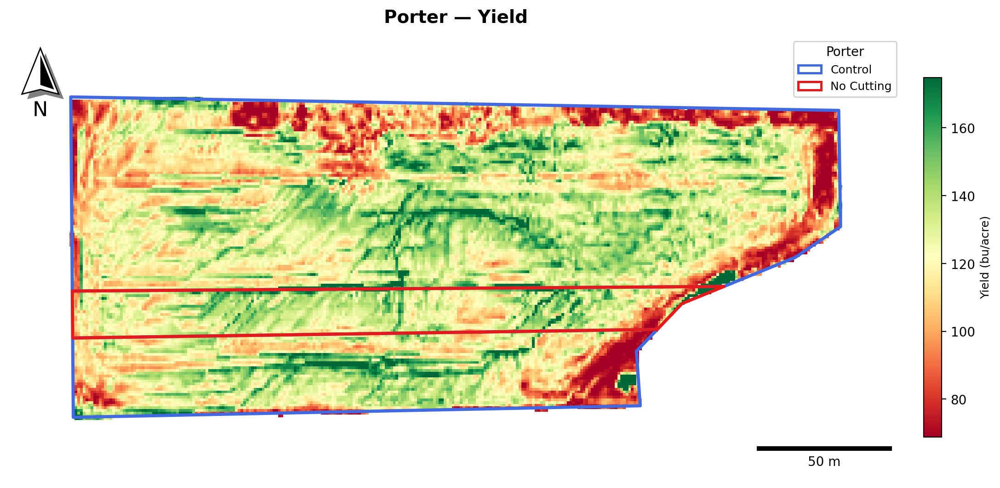
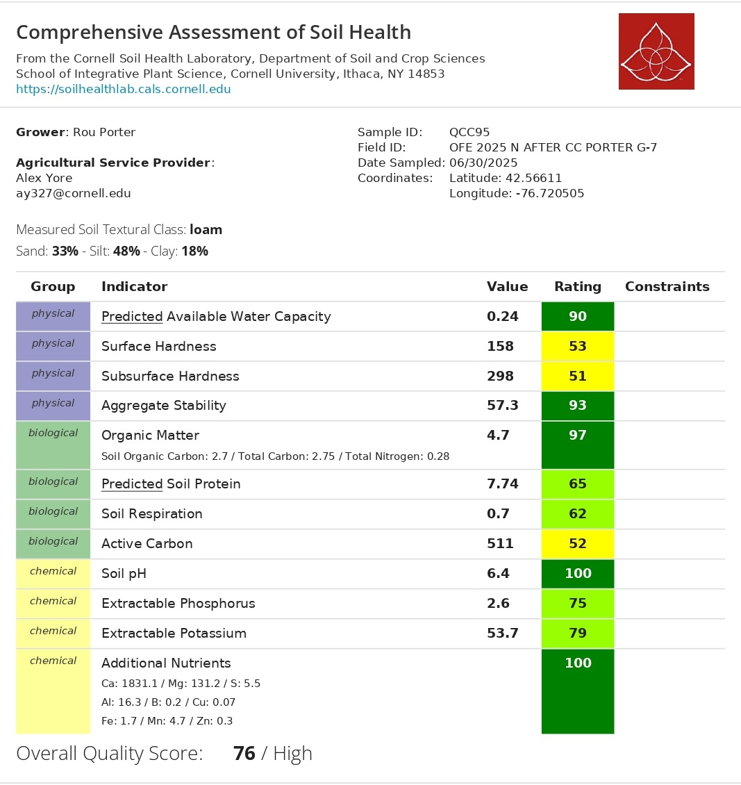
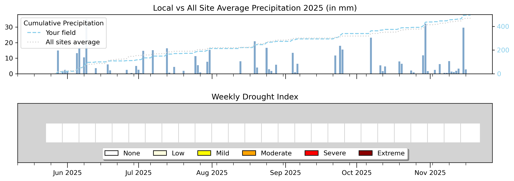

```{r setup, include=FALSE}
library(tidyverse)
library(plotly)
library(htmltools)
library(effectsize)
library(pwr)

# ============================================================
#  📂 RUTA DE DATOS
# ============================================================
data_dir <- "data"

# ============================================================
#  ARCHIVOS CSV
# ============================================================
dualex_file <- "porter_dualex_survey.csv"
cn_file     <- "OFE2025_CN.csv"
csnt_file   <- "OFE2025_CSNT.csv"
yield_file  <- "porter_yield.csv"

# ============================================================
#  DUALEX — LECTURA Y LIMPIEZA
# ============================================================
df_raw <- read_csv(file.path(data_dir, dualex_file), show_col_types = FALSE)

df_clean <- df_raw |>
  mutate(
    treatment = str_squish(treatment),
    treatment = case_when(
      str_to_lower(treatment) == "control"   ~ "control",
      str_to_lower(treatment) == "treatment" ~ "treatment",
      TRUE ~ str_to_lower(treatment)
    )
  ) |>
  filter(!is.na(chl)) |>
  arrange(group, meas) |>
  group_by(group) |>
  mutate(plant_id = ceiling(row_number() / 2)) |>
  ungroup()

df_avg <- df_clean |>
  group_by(date, field, treatment, group, plant_id) |>
  summarise(
    chl  = mean(chl,  na.rm = TRUE),
    flav = mean(flav, na.rm = TRUE),
    anth = mean(anth, na.rm = TRUE),
    nbi  = mean(nbi,  na.rm = TRUE),
    .groups = "drop"
  ) |>
  mutate(treatment = factor(treatment, levels = c("control", "treatment")))

# ============================================================
#  DUALEX — ESTADÍSTICAS NBI + CHL
# ============================================================
stats_nbi <- df_avg |>
  group_by(treatment) |>
  summarise(n=n(), mean=round(mean(nbi,na.rm=TRUE),1),
            sd=round(sd(nbi,na.rm=TRUE),1), .groups="drop")

stats_chl <- df_avg |>
  group_by(treatment) |>
  summarise(n=n(), mean=round(mean(chl,na.rm=TRUE),1),
            sd=round(sd(chl,na.rm=TRUE),1), .groups="drop")

tt_nbi <- t.test(nbi ~ treatment, data = df_avg)
tt_chl <- t.test(chl ~ treatment, data = df_avg)

m_ctrl_nbi  <- stats_nbi |> filter(treatment=="control")   |> pull(mean)
m_cover_nbi <- stats_nbi |> filter(treatment=="treatment") |> pull(mean)
m_ctrl_chl  <- stats_chl |> filter(treatment=="control")   |> pull(mean)
m_cover_chl <- stats_chl |> filter(treatment=="treatment") |> pull(mean)

delta_nbi <- round(m_cover_nbi - m_ctrl_nbi, 2)
pct_nbi   <- round(100 * delta_nbi / m_ctrl_nbi, 1)
p_nbi     <- ifelse(tt_nbi$p.value < 0.001, "p < 0.001",
                    paste0("p = ", signif(tt_nbi$p.value, 3)))

delta_chl <- round(m_cover_chl - m_ctrl_chl, 2)
pct_chl   <- round(100 * delta_chl / m_ctrl_chl, 1)
p_chl     <- ifelse(tt_chl$p.value < 0.001, "p < 0.001",
                    paste0("p = ", signif(tt_chl$p.value, 3)))

# ============================================================
#  C:N BIOMASA — LECTURA Y CÁLCULO (solo MaizeBiomass, excluye NoCutNoCorn)
# ============================================================
cn_all <- read_csv(file.path(data_dir, cn_file), show_col_types = FALSE)

vill_cn <- cn_all |>
  filter(FarmName == "porter", SampleType == "MaizeBiomass") |>
  mutate(
    CN_ratio  = TotalC_pct / TotalN_pct,
    Treatment = factor(Treatment, levels = c("Control", "Treatment"))
  )

cn_summary <- vill_cn |>
  group_by(Treatment) |>
  summarise(
    n       = n(),
    mean_N  = round(mean(TotalN_pct, na.rm=TRUE), 3),
    sd_N    = round(sd(TotalN_pct,   na.rm=TRUE), 3),
    se_N    = round(sd(TotalN_pct,   na.rm=TRUE) / sqrt(n()), 3),
    mean_CN = round(mean(CN_ratio,   na.rm=TRUE), 2),
    sd_CN   = round(sd(CN_ratio,     na.rm=TRUE), 2),
    .groups = "drop"
  )

mean_cover_N   <- cn_summary |> filter(Treatment == "Treatment") |> pull(mean_N)
mean_nocover_N <- cn_summary |> filter(Treatment == "Control")   |> pull(mean_N)
perc_N         <- round((mean_cover_N - mean_nocover_N) / mean_nocover_N * 100, 1)

mean_cover_CN   <- cn_summary |> filter(Treatment == "Treatment") |> pull(mean_CN)
mean_nocover_CN <- cn_summary |> filter(Treatment == "Control")   |> pull(mean_CN)
delta_CN        <- round(mean_cover_CN - mean_nocover_CN, 2)
pct_CN          <- round((mean_cover_CN - mean_nocover_CN) / mean_nocover_CN * 100, 1)

d_N_cn  <- cohens_d(TotalN_pct ~ Treatment, data = vill_cn)
d_CN_cn <- cohens_d(CN_ratio   ~ Treatment, data = vill_cn)

n_cover_cn   <- vill_cn |> filter(Treatment == "Treatment") |> nrow()
n_nocover_cn <- vill_cn |> filter(Treatment == "Control")   |> nrow()

# ============================================================
#  CSNT — LECTURA Y FILTRO PORTER
# ============================================================
csnt_all <- read_csv(file.path(data_dir, csnt_file), show_col_types = FALSE)

vill_csnt <- csnt_all |>
  filter(FarmName == "porter") |>
  mutate(Treatment = factor(SampleID, levels = c("Control", "Treatment")))

csnt_ctrl      <- vill_csnt |> filter(Treatment == "Control")   |> pull(CSNT_ppm)
csnt_cover     <- vill_csnt |> filter(Treatment == "Treatment") |> pull(CSNT_ppm)
csnt_ctrl_lab  <- paste0(csnt_ctrl,  " ppm")
csnt_cover_lab <- paste0(csnt_cover, " ppm")

# ============================================================
#  YIELD — LECTURA Y ANÁLISIS
# ============================================================
df_yield <- read_csv(file.path(data_dir, yield_file), show_col_types = FALSE) |>
  rename(yield = Yield, treatment = Treatment) |>
  mutate(treatment = case_when(
    treatment == "Mow"       ~ "control",
    treatment == "No-mowing" ~ "treatment",
    TRUE ~ treatment
  ),
  treatment = factor(treatment, levels = c("control", "treatment")))

yield_stats <- df_yield |>
  group_by(treatment) |>
  summarise(
    n    = n(),
    mean = round(mean(yield, na.rm = TRUE), 3),
    sd   = round(sd(yield,   na.rm = TRUE), 3),
    se   = round(sd(yield,   na.rm = TRUE) / sqrt(n()), 4),
    med  = round(median(yield, na.rm = TRUE), 3),
    .groups = "drop"
  )

tt_yield <- t.test(yield ~ treatment, data = df_yield)

m_ctrl_yield  <- yield_stats |> filter(treatment == "control")   |> pull(mean)
m_cover_yield <- yield_stats |> filter(treatment == "treatment") |> pull(mean)
n_ctrl_yield  <- yield_stats |> filter(treatment == "control")   |> pull(n)
n_cover_yield <- yield_stats |> filter(treatment == "treatment") |> pull(n)

delta_yield <- round(m_cover_yield - m_ctrl_yield, 3)
pct_yield   <- round(100 * delta_yield / m_ctrl_yield, 2)
p_yield     <- ifelse(tt_yield$p.value < 0.001, "p < 0.001",
                      paste0("p = ", signif(tt_yield$p.value, 3)))

# ============================================================
#  PALETAS Y HELPERS
# ============================================================
pal    <- c("control" = "#e879a0", "treatment" = "#0d9488")
pal_cn <- c("Control" = "#e879a0", "Treatment" = "#0d9488")

fmt <- function(x) ifelse(x == round(x), as.character(round(x)), as.character(x))

# ============================================================
#  FUNCIÓN: 2 cards por sección
# ============================================================
section_cards <- function(mean_cover, mean_ctrl, delta, pct, p_val,
                           color_cover, color_fx) {
  HTML(paste0('
  <style>
    .sc-row {
      display: grid;
      grid-template-columns: 1fr 1fr;
      gap: 12px;
      margin: 16px 0 24px;
    }
    .sc {
      background: #fff;
      border: 1px solid #e5e7eb;
      border-radius: 12px;
      padding: 18px 20px;
      position: relative;
      overflow: hidden;
    }
    .sc-label { font-size: 10px; font-weight: 700; letter-spacing: 1.3px;
                text-transform: uppercase; color: #9ca3af; margin-bottom: 8px; }
    .sc-main  { display: flex; align-items: baseline; gap: 10px; flex-wrap: wrap; }
    .sc-val   { font-size: 2.4rem; font-weight: 700; font-family: monospace; line-height: 1; }
    .sc-delta { font-size: 1rem; font-weight: 600; color: #0d9488; }
    .sc-sub   { font-size: 11px; color: #9ca3af; margin-top: 6px; }
    .sc-p     { font-size: 12px; font-weight: 600; color: #e879a0; margin-top: 5px; }
    @media (max-width: 600px) { .sc-row { grid-template-columns: 1fr; } }
  </style>
  <div class="sc-row">
    <div class="sc" style="border-top: 4px solid ', color_cover, '">
      <div class="sc-label">Treatment</div>
      <div class="sc-main">
        <span class="sc-val">', fmt(mean_cover), '</span>
        <span class="sc-delta">', ifelse(delta >= 0, "&#8593; +", "&#8595; "), delta, ' vs Control (', pct, '%)</span>
      </div>
      <div class="sc-sub">Control mean: ', fmt(mean_ctrl), '</div>
    </div>
    <div class="sc" style="border-top: 4px solid ', color_fx, '">
      <div class="sc-label">Effect Size</div>
      <div class="sc-main">
        <span class="sc-val">', pct, '%</span>
      </div>
      <div class="sc-sub">relative difference Treatment vs Control</div>
      <div class="sc-p">', p_val, ' &#10003;</div>
    </div>
  </div>
  '))
}

# ============================================================
#  FUNCIÓN: cards C:N (sin t-test)
# ============================================================
cn_cards <- function(mean_cover, mean_nocover, pct_inc, cohen_d, label_metric, note) {
  HTML(paste0('
  <div class="sc-row">
    <div class="sc" style="border-top: 4px solid #0d9488">
      <div class="sc-label">Treatment — ', label_metric, '</div>
      <div class="sc-main">
        <span class="sc-val">', mean_cover, '</span>
        <span class="sc-delta">', ifelse(pct_inc >= 0, "&#8593; +", "&#8595; "), pct_inc, '% vs Control</span>
      </div>
      <div class="sc-sub">Control mean: ', mean_nocover, '</div>
    </div>
    <div class="sc" style="border-top: 4px solid #F9C74F">
      <div class="sc-label">Cohen\'s d (effect size)</div>
      <div class="sc-main">
        <span class="sc-val">', round(cohen_d, 2), '</span>
      </div>
      <div class="sc-sub">', note, '</div>
    </div>
  </div>
  '))
}
```

```{=html}
<div class="lab-topbar">
  <div class="lab-topbar__inner">
    <div class="lab-topbar__left">
      <div class="lab-topbar__logos">
        
        
      </div>
      <span class="lab-title">2025 Cropping Season</span>
      <span class="lab-subtitle">
        Field G7 &nbsp;|&nbsp;
        <strong>Research question:</strong> Is corn yield different in areas with legume sod plowed under before first cutting vs. after cutting once?
      </span>
    </div>
    <div class="lab-topbar__right">
      <a class="btn btn-download" href="index.pdf" title="Download PDF version" target="_blank" rel="noopener noreferrer">
  ⬇ Download PDF
</a>
    </div>
  </div>
</div>
```

::: {.page-intro}
**Welcome to your 2025 farm report.**
This report summarizes the on-farm nitrogen experiment conducted in Field G7, where plots with legume sod plowed under before first cutting (Treatment) were compared against plots plowed under after cutting once (Control).
:::

```{=html}
<figure style="margin: 20px 0; text-align: center;">
  
  <div id="field-placeholder-porter" style="display:none; background:#f3f4f6; border-radius:8px;
       padding:40px; color:#9ca3af; font-size:0.9rem; border:1px dashed #d1d5db;">
    📍 Field map — place <code>porter_field.png</code> in the <code>images/</code> folder
  </div>
  <figcaption style="font-size: 0.82rem; color: #6b7280; margin-top: 8px;">
    <strong>Figure 1.</strong> Field G7 — treatment layout.
    <span style="background:#0d9488; color:#fff; border-radius:4px; padding:1px 7px; font-size:0.78rem; margin-left:4px;">■ Treatment</span>
    <span style="background:#e879a0; color:#fff; border-radius:4px; padding:1px 7px; font-size:0.78rem; margin-left:4px;">■ Control</span>
  </figcaption>
</figure>
```

::: {.page-intro}
**Take-home message:** Plowing the sod earlier (Treatment) did produce greener, higher-chlorophyll leaves, a sign of better early-season vigor. Though the in-season plant nitrogen was slightly lower in the treatment, end of season nitrate was slightly higher. Final yield also appeared slightly higher in the unmowed treatement area, relative to the control. Both systems kept the crop adequately supplied with nitrogen, Control CSNT came in just below the optimal threshold, Treatment just above it. Your soil is in good shape overall, and this is a question worth revisiting with another season of data.
:::

---

## Results Summary {#summary}

```{r summary-table, echo=FALSE, message=FALSE, warning=FALSE}
summary_df <- tibble(
  Metric = c(
    "🌿 NBI (Nitrogen Balance Index)",
    "🍃 Chlorophyll Index",
    "🧪 Biomass %N (C:N analysis)",
    "🌽 CSNT (Cornstalk Nitrate)",
    "🌾 Corn Yield (bu/ac)"
  ),
  `Control` = c(
    paste0(m_ctrl_nbi),
    paste0(m_ctrl_chl),
    paste0(mean_nocover_N, "%"),
    paste0(csnt_ctrl, " ppm"),
    paste0(m_ctrl_yield)
  ),
  `Treatment` = c(
    paste0(m_cover_nbi),
    paste0(m_cover_chl),
    paste0(mean_cover_N, "%"),
    paste0(csnt_cover, " ppm"),
    paste0(m_cover_yield)
  ),
  `Difference` = c(
    paste0(ifelse(delta_nbi >= 0, "+", ""), delta_nbi, " (", pct_nbi, "%)"),
    paste0(ifelse(delta_chl >= 0, "+", ""), delta_chl, " (", pct_chl, "%)"),
    paste0(ifelse(perc_N >= 0, "+", ""), perc_N, "%"),
    paste0(ifelse(csnt_cover - csnt_ctrl >= 0, "+", ""), csnt_cover - csnt_ctrl, " ppm"),
    paste0(ifelse(delta_yield >= 0, "+", ""), delta_yield, " (", pct_yield, "%)")
  ),
  `p-value` = c(p_nbi, p_chl, "n too small*", "n = 1", p_yield)
)

knitr::kable(summary_df, align = c("l","c","c","c","c"))
```

::: {style="font-size: 0.82rem; color: #9ca3af; margin-top: -8px;"}
\* C:N sample sizes are too small for reliable hypothesis testing (n = `r n_nocover_cn` Control, n = `r n_cover_cn` Treatment). Effect sizes are reported instead.
:::

---

## 🌾 Corn Yield {#yield}

::: {.page-intro}
The map below shows the **corn yield spatial distribution** across Field G7, displayed in bushels per acre. The blue line marks the field boundary and the red lines separate the treatment strips.
:::

```{=html}
<figure style="margin: 20px 0; text-align: center;">
  
  <figcaption style="font-size: 0.82rem; color: #6b7280; margin-top: 8px;">
    <strong>Figure 2.</strong> Corn yield map.
  </figcaption>
</figure>
<div style="margin: 16px 0 24px; text-align: center;">
  <a href="https://farmersdatalab.github.io/5c9e1a7d-8f44-4b2a-9d3c-6e7a1f2b0c55/"
     target="_blank"
     rel="noopener noreferrer"
     style="display: inline-flex; align-items: center; gap: 8px;
            background: #0d9488; color: #fff; font-weight: 600;
            padding: 10px 20px; border-radius: 8px; text-decoration: none;
            font-size: 0.95rem; box-shadow: 0 2px 6px rgba(0,0,0,0.15);
            transition: opacity 0.2s;">
    🗺️ Open Interactive Map
  </a>
</div>
```

```{r yield-cards, echo=FALSE}
section_cards(m_cover_yield, m_ctrl_yield, delta_yield, pct_yield, p_yield,
              "#0d9488", "#e879a0")
```


::: {.panel-tabset}

## Density

```{r yield-density, echo=FALSE, message=FALSE, warning=FALSE}
p <- ggplot(df_yield, aes(x = yield, fill = treatment, color = treatment)) +
  geom_density(alpha = 0.35, linewidth = 0.8) +
  scale_fill_manual(values  = pal, labels = c("control" = "Control", "treatment" = "Treatment")) +
  scale_color_manual(values = pal, labels = c("Control" = "Control", "Treatment" = "Treatment")) +
  labs(
    title    = "Corn Yield",
    subtitle = paste0("Treatment − Control = ", delta_yield, " bu/ac (", pct_yield, "%) · ", p_yield,
                      " · n = ", n_ctrl_yield, " (Control), ", n_cover_yield, " (Treatment)"),
    x = "Yield (bu/ac)", y = "Density",
    fill = NULL, color = NULL
  ) +
  theme_minimal(base_size = 13) +
  theme(plot.title = element_text(face = "bold"), legend.position = "bottom",
        panel.grid.minor = element_blank())

ggplotly(p) |> layout(legend = list(orientation = "h", y = -0.2))
```


## Boxplot

```{r yield-boxplot, echo=FALSE, message=FALSE, warning=FALSE}
p <- ggplot(df_yield, aes(x = treatment, y = yield, fill = treatment, color = treatment)) +
  geom_boxplot(alpha = 0.35, outlier.shape = NA, linewidth = 0.8, width = 0.4) +
  scale_fill_manual(values  = pal, labels = c("control" = "control", "treatment" = "treatment")) +
  scale_color_manual(values = pal, labels = c("control" = "control", "treatment" = "treatment")) +
  scale_x_discrete(labels = c("control" = "control", "treatment" = "treatment")) +
  labs(title = "Corn Yield", subtitle = p_yield,
       x = "Treatment", y = "Yield (bu/ac)") +
  theme_minimal(base_size = 13) +
  theme(plot.title = element_text(face = "bold"), legend.position = "none",
        panel.grid.minor = element_blank())

ggplotly(p) |> layout(showlegend = FALSE)
```

## Bar Chart (Mean ± SE)

```{r yield-bar, echo=FALSE, message=FALSE, warning=FALSE}
p <- ggplot(yield_stats, aes(x = treatment, y = mean, fill = treatment)) +
  geom_col(width = 0.55, color = "black", alpha = 0.9) +
  geom_errorbar(aes(ymin = mean - se, ymax = mean + se),
                width = 0.15, linewidth = 1) +
  scale_fill_manual(values = pal) +
  scale_x_discrete(labels = c("control" = "control", "treatment" = "treatment")) +
  scale_y_continuous(expand = expansion(mult = c(0, 0.15))) +
  labs(
    title    = "Mean Corn Yield ± SE",
    subtitle = paste0("Difference: ", ifelse(delta_yield >= 0, "+", ""), delta_yield,
                      " bu/ac (", pct_yield, "%) · ", p_yield),
    x = "Treatment", y = "Yield (bu/ac)"
  ) +
  theme_minimal(base_size = 13) +
  theme(legend.position = "none", plot.title = element_text(face = "bold"),
        panel.grid.minor = element_blank())

ggplotly(p) |> layout(showlegend = FALSE)
```


:::

::: {style="font-size: 0.82rem; color: #9ca3af; margin-top: -8px;"}
n = `r n_ctrl_yield` Control pixels · n = `r n_cover_yield` Treatment pixels. Two-sample Welch t-test; large n makes p-values very sensitive — interpret effect size (% difference) alongside significance.
:::


---

## 🌿 Nitrogen Balance Index (NBI) {#nbi-details}

::: {.page-intro}
The **Nitrogen Balance Index (NBI)** is measured with a handheld Dualex sensor and gives us a real-time snapshot of how well the plant is supplied with nitrogen 
during the season. It works by comparing how much chlorophyll the leaf has built relative to stress compounds (flavonoids), so a higher NBI means the plant is using nitrogen efficiently and not showing signs of stress. We took two leaf readings per plant and averaged them, then compared Treatment vs Control strips with a statistical test (two-sample t-test) to see if there was a real difference.
:::

```{r nbi-cards, echo=FALSE}
section_cards(m_cover_nbi, m_ctrl_nbi, delta_nbi, pct_nbi, p_nbi,
              "#0d9488", "#e879a0")
```

::: {.panel-tabset}

## Density

```{r nbi-density, echo=FALSE, message=FALSE, warning=FALSE}
p <- ggplot(df_avg, aes(x = nbi, fill = treatment, color = treatment)) +
  geom_density(alpha = 0.35, linewidth = 0.8) +
  scale_fill_manual(values  = pal, labels = c("control"="Control","treatment"="Treatment")) +
  scale_color_manual(values = pal, labels = c("control"="Control","treatment"="Treatment")) +
  labs(
    title    = "Nitrogen Balance Index (NBI) — Plant Average",
    subtitle = paste0("Treatment − Control = ", delta_nbi, " (", pct_nbi, "%) · ", p_nbi),
    x = "Nitrogen Balance Index (Dualex)", y = "Density",
    fill = NULL, color = NULL
  ) +
  theme_minimal(base_size = 13) +
  theme(plot.title = element_text(face="bold"), legend.position = "bottom",
        panel.grid.minor = element_blank())

ggplotly(p) |> layout(legend = list(orientation="h", y=-0.2))
```

## Boxplot

```{r nbi-boxplot, echo=FALSE, message=FALSE, warning=FALSE}
p <- ggplot(df_avg, aes(x=treatment, y=nbi, fill=treatment, color=treatment)) +
  geom_boxplot(alpha=0.35, outlier.shape=NA, linewidth=0.8, width=0.4) +
  geom_jitter(width=0.15, alpha=0.5, size=1.8) +
  scale_fill_manual(values  = pal, labels = c("control"="Control","treatment"="Treatment")) +
  scale_color_manual(values = pal, labels = c("control"="Control","treatment"="Treatment")) +
  scale_x_discrete(labels = c("control"="Control","treatment"="Treatment")) +
  labs(title="Nitrogen Balance Index (NBI) by Treatment", subtitle=p_nbi,
       x="Treatment", y="Nitrogen Balance Index (Dualex)") +
  theme_minimal(base_size=13) +
  theme(plot.title=element_text(face="bold"), legend.position="none",
        panel.grid.minor=element_blank())

ggplotly(p) |> layout(showlegend=FALSE)
```

:::

---

## 🍃 Chlorophyll (Chl) {#chl-details}

::: {.page-intro}
The **Chlorophyll Index (Chl)** is also measured with the Dualex sensor and estimates the amount of chlorophyll in the leaf. Chlorophyll is directly linked to the plant's capacity for photosynthesis and is a reliable proxy for nitrogen sufficiency. Higher values indicate greener, more nitrogen-sufficient leaves. As with NBI, two leaves per plant were averaged and treatments compared with a t-test.
:::

```{r chl-cards, echo=FALSE}
section_cards(m_cover_chl, m_ctrl_chl, delta_chl, pct_chl, p_chl,
              "#4CAF50", "#F9C74F")
```

::: {.panel-tabset}

## Density

```{r chl-density, echo=FALSE, message=FALSE, warning=FALSE}
p <- ggplot(df_avg, aes(x=chl, fill=treatment, color=treatment)) +
  geom_density(alpha=0.35, linewidth=0.8) +
  scale_fill_manual(values  = pal, labels = c("control"="Control","treatment"="Treatment")) +
  scale_color_manual(values = pal, labels = c("control"="Control","treatment"="Treatment")) +
  labs(
    title    = "Chlorophyll (Chl) — Plant Average",
    subtitle = paste0("Treatment − Control = ", delta_chl, " (", pct_chl, "%) · ", p_chl),
    x = "Chlorophyll Index (Dualex)", y = "Density",
    fill = NULL, color = NULL
  ) +
  theme_minimal(base_size=13) +
  theme(plot.title=element_text(face="bold"), legend.position="bottom",
        panel.grid.minor=element_blank())

ggplotly(p) |> layout(legend=list(orientation="h", y=-0.2))
```

## Boxplot

```{r chl-boxplot, echo=FALSE, message=FALSE, warning=FALSE}
p <- ggplot(df_avg, aes(x=treatment, y=chl, fill=treatment, color=treatment)) +
  geom_boxplot(alpha=0.35, outlier.shape=NA, linewidth=0.8, width=0.4) +
  geom_jitter(width=0.15, alpha=0.5, size=1.8) +
  scale_fill_manual(values  = pal, labels = c("control"="Control","treatment"="Treatment")) +
  scale_color_manual(values = pal, labels = c("control"="Control","treatment"="Treatment")) +
  scale_x_discrete(labels = c("control"="Control","treatment"="Treatment")) +
  labs(title="Chlorophyll (Chl) by Treatment", subtitle=p_chl,
       x="Treatment", y="Chlorophyll Index (Dualex)") +
  theme_minimal(base_size=13) +
  theme(plot.title=element_text(face="bold"), legend.position="none",
        panel.grid.minor=element_blank())

ggplotly(p) |> layout(showlegend=FALSE)
```

:::

---

## 🧪 C:N in Corn Biomass {#cn-details}

::: {.page-intro}
we collected corn plant samples from both Treatment and 
Control strips and sent them to the lab for nitrogen analysis. This tells us exactly how much nitrogen ended up inside the plant — not just what was in the soil or available in theory, but what the crop actually took up. Because the number of samples is small, we can't run a standard statistical test, but we report the effect size (Cohen's d) to give you a sense of how meaningful the difference is in practical terms.
:::

### Total Nitrogen in Biomass (%N)
::: {.page-intro}
This measures what percentage of the plant tissue is nitrogen. A higher %N means the plant had good access to nitrogen at the time of sampling. In this case, the Control actually came in slightly higher than the Treatment, a small but noteworthy reversal compared to what the chlorophyll data suggested. It's a reminder that mid-season leaf readings and actual tissue nitrogen don't always tell the same story.

:::

```{r cn-n-cards, echo=FALSE}
cn_cards(
  mean_cover   = mean_cover_N,
  mean_nocover = mean_nocover_N,
  pct_inc      = perc_N,
  cohen_d      = d_N_cn$Cohens_d,
  label_metric = "Mean %N",
  note         = paste0("n = ", n_nocover_cn, " Control · n = ", n_cover_cn, " Treatment")
)
```

::: {.panel-tabset}

## Bar Chart (%N)

```{r cn-n-bar, echo=FALSE, message=FALSE, warning=FALSE}
mean_data_N <- cn_summary |> select(Treatment, mean_N, se_N)

increase_label_N <- paste0(
  "Treatment = +", perc_N, "% N  |  Cohen's d = ", round(d_N_cn$Cohens_d, 2),
  "  |  n = ", n_nocover_cn, " vs ", n_cover_cn
)

p_n <- ggplot(mean_data_N, aes(x = Treatment, y = mean_N, fill = Treatment)) +
  geom_col(width = 0.55, color = "black", alpha = 0.9) +
  geom_errorbar(aes(ymin = mean_N - se_N, ymax = mean_N + se_N),
                width = 0.15, linewidth = 1) +
  scale_fill_manual(values = pal_cn) +
  scale_y_continuous(expand = expansion(mult = c(0, 0.2))) +
  labs(
    title    = "Nitrogen in Corn Biomass (Mean %N ± SE)",
    subtitle = increase_label_N,
    x = "Treatment", y = "Nitrogen (%)",
    caption  = "Note: small sample size — results are descriptive only."
  ) +
  theme_minimal(base_size = 13) +
  theme(legend.position = "none", plot.title = element_text(face = "bold"),
        panel.grid.minor = element_blank())

ggplotly(p_n) |> layout(showlegend = FALSE)
```

## Raw Data (%N)

```{r cn-n-raw, echo=FALSE, message=FALSE, warning=FALSE}
p_raw_N <- ggplot(vill_cn, aes(x = Treatment, y = TotalN_pct,
                                color = Treatment, fill = Treatment)) +
  geom_jitter(width = 0.12, size = 3.5, alpha = 0.7) +
  stat_summary(fun = mean, geom = "crossbar", width = 0.35,
               linewidth = 0.8, fatten = 2) +
  scale_color_manual(values = pal_cn) +
  scale_fill_manual(values  = pal_cn) +
  labs(title = "Individual Sample Values — Biomass %N",
       subtitle = "Horizontal bar = group mean",
       x = "Treatment", y = "Total Nitrogen (%)") +
  theme_minimal(base_size = 13) +
  theme(legend.position = "none", plot.title = element_text(face = "bold"),
        panel.grid.minor = element_blank())

ggplotly(p_raw_N) |> layout(showlegend = FALSE)
```

:::

### C:N Ratio

::: {.page-intro}

The C:N ratio flips the perspective: a lower number means the tissue is more nitrogen-rich relative to its carbon content. If the Treatment had incorporated more nitrogen from the legume sod early on, we'd expect a lower C:N ratio in those plants. The values across both treatments were fairly close, which is consistent with the %N results, both systems delivered similar amounts of 
nitrogen to the plant at this growth stage.
:::


```{r cn-ratio-cards, echo=FALSE}
cn_cards(
  mean_cover   = mean_cover_CN,
  mean_nocover = mean_nocover_CN,
  pct_inc      = pct_CN,
  cohen_d      = d_CN_cn$Cohens_d,
  label_metric = "Mean C:N Ratio",
  note         = "Lower C:N = more nitrogen-rich tissue"
)
```

::: {.panel-tabset}

## Bar Chart (C:N)

```{r cn-ratio-bar, echo=FALSE, message=FALSE, warning=FALSE}
mean_data_CN <- cn_summary |>
  select(Treatment, mean_CN, sd_CN, n) |>
  mutate(se_CN = round(sd_CN / sqrt(n), 2))

p_cn <- ggplot(mean_data_CN, aes(x = Treatment, y = mean_CN, fill = Treatment)) +
  geom_col(width = 0.55, color = "black", alpha = 0.9) +
  geom_errorbar(aes(ymin = mean_CN - se_CN, ymax = mean_CN + se_CN),
                width = 0.15, linewidth = 1) +
  scale_fill_manual(values = pal_cn) +
  scale_y_continuous(expand = expansion(mult = c(0, 0.2))) +
  labs(
    title    = "C:N Ratio in Corn Biomass (Mean ± SE)",
    subtitle = paste0("Treatment C:N = ", mean_cover_CN,
                      " vs Control = ", mean_nocover_CN,
                      "  |  Cohen's d = ", round(d_CN_cn$Cohens_d, 2)),
    x = "Treatment", y = "C:N Ratio",
    caption = "Lower C:N ratio = more nitrogen-rich plant tissue."
  ) +
  theme_minimal(base_size = 13) +
  theme(legend.position = "none", plot.title = element_text(face = "bold"),
        panel.grid.minor = element_blank())

ggplotly(p_cn) |> layout(showlegend = FALSE)
```

## Raw Data (C:N)

```{r cn-ratio-raw, echo=FALSE, message=FALSE, warning=FALSE}
p_raw_CN <- ggplot(vill_cn, aes(x = Treatment, y = CN_ratio,
                                 color = Treatment, fill = Treatment)) +
  geom_jitter(width = 0.12, size = 3.5, alpha = 0.7) +
  stat_summary(fun = mean, geom = "crossbar", width = 0.35,
               linewidth = 0.8, fatten = 2) +
  scale_color_manual(values = pal_cn) +
  scale_fill_manual(values  = pal_cn) +
  labs(title = "Individual Sample Values — C:N Ratio",
       subtitle = "Horizontal bar = group mean",
       x = "Treatment", y = "C:N Ratio") +
  theme_minimal(base_size = 13) +
  theme(legend.position = "none", plot.title = element_text(face = "bold"),
        panel.grid.minor = element_blank())

ggplotly(p_raw_CN) |> layout(showlegend = FALSE)
```

:::

---

## 🌽 Cornstalk Nitrate Test (CSNT) {#csnt-details}

::: {.page-intro}
The Cornstalk Nitrate Test (CSNT) measures nitrate concentration in the lower cornstalk at the end of the season. It is a post-harvest diagnostic tool: values **below 250 ppm indicate insufficient nitrogen**, while the **optimal range is between 750 and 2000 ppm**. Because we only had one sample per treatment, this is a field-level observation rather than a statistical comparison.
:::

```{r csnt-card, echo=FALSE}
HTML(paste0('
<div class="sc-row">
  <div class="sc" style="border-top: 4px solid #e879a0">
    <div class="sc-label">Control — CSNT</div>
    <div class="sc-main">
      <span class="sc-val">', csnt_ctrl_lab, '</span>
    </div>
    <div class="sc-sub">Threshold for sufficient N: 250 ppm</div>
  </div>
  <div class="sc" style="border-top: 4px solid #0d9488">
    <div class="sc-label">Treatment — CSNT</div>
    <div class="sc-main">
      <span class="sc-val">', csnt_cover_lab, '</span>
    </div>
    <div class="sc-sub">n = 1 per treatment — descriptive only</div>
  </div>
</div>
'))
```

```{r csnt-plot, echo=FALSE, message=FALSE, warning=FALSE}
p_csnt <- ggplot(vill_csnt, aes(x = Treatment, y = CSNT_ppm, fill = Treatment)) +
  geom_col(width = 0.5, color = "black", alpha = 0.9) +
      geom_hline(yintercept = 250, linetype = "dashed", color = "#e57373", linewidth = 0.8) +
  geom_hline(yintercept = 750, linetype = "dashed", color = "#66bb6a", linewidth = 0.8) +
  scale_fill_manual(values = c("Control" = "#e879a0", "Treatment" = "#0d9488")) +
  scale_y_continuous(expand = expansion(mult = c(0, 0.2))) +
  labs(
    title   = "Cornstalk Nitrate Test (CSNT)",
    x = "Treatment", y = "CSNT (ppm)",
    caption = "Single measurement per treatment — field-level observation only."
  ) +
  theme_minimal(base_size = 13) +
  theme(legend.position = "none", plot.title = element_text(face = "bold"),
        panel.grid.minor = element_blank())

ggplotly(p_csnt) |> layout(showlegend = FALSE)
```

---

## 🌱 Soil Health Assessment {#soilhealth}

::: {.page-intro}
Soil health was assessed using the **Cornell Soil Health Test**. The overall quality score was **76/100 (High)**. Most indicators came back in the High to Very High range, which reflects years of good management. The areas to keep an eye on are surface and subsurface hardness (both Medium), which may indicate some compaction developing in the field, and active carbon (Medium), which reflects the level of readily available food for soil microbes. These are manageable, and continued cover cropping or diverse 
rotations can help move those numbers up over time.
:::

```{=html}
<figure style="margin: 20px 0; text-align: center;">
  
</figure>

<div style="margin: 16px 0 24px;">
  <a href="data/porter_soilhealth.pdf"
     target="_blank"
     rel="noopener noreferrer"
     style="display: inline-flex; align-items: center; gap: 8px;
            background: #4CAF50; color: #fff; font-weight: 600;
            padding: 10px 18px; border-radius: 8px; text-decoration: none;
            font-size: 0.95rem; box-shadow: 0 2px 6px rgba(0,0,0,0.12);">
    ↗ Open Full Soil Health Report (PDF)
  </a>
</div>
```
---

## 🌧️Weather & Drought Conditions {#weatherDrought}

::: {.page-intro}
**Cumulative precipitation** at your field compared to the all-site average, alongside the weekly drought index from June through November 2025. Your field had a very consistent and well-distributed rainfall season in 2025. 
Precipitation tracked closely with the all-site average from June through October, finishing near 400 mm cumulative. There were no major drought episodes: the drought index stayed at None for the entire growing season, from planting through harvest. Moisture was not a 
limiting factor for your crop this year, which means the differences we see between Treatment and Control strips are more likely driven by management and soil factors than by weather. 
:::
```{=html}
<figure style="margin: 0 0 24px; text-align: center;">
  
</figure>
```
---

## 📝 Conclusions {#conclusions}

```{r conclusion-callouts, echo=FALSE}
HTML('
<style>
  .conclusion-grid {
    display: grid;
    grid-template-columns: 1fr 1fr;
    gap: 14px;
    margin: 20px 0;
  }
  .conc-card {
    background: #fff;
    border: 1px solid #e5e7eb;
    border-left: 6px solid #4CAF50;
    border-radius: 8px;
    padding: 14px 16px;
    font-size: 0.93rem;
  }
  .conc-card.amber { border-left-color: #F9C74F; }
  .conc-card.teal  { border-left-color: #0d9488; }
  .conc-card.pink  { border-left-color: #e879a0; }
  .conc-title { font-weight: 700; font-size: 0.85rem; text-transform: uppercase;
                letter-spacing: 0.8px; color: #6b7280; margin-bottom: 6px; }
  @media (max-width: 700px) { .conclusion-grid { grid-template-columns: 1fr; } }
</style>

<div class="conclusion-grid">

  <div class="conc-card teal">
    <div class="conc-title">🌿 Leaf Nitrogen Status (NBI)</div>
    NBI was nearly identical between the two systems — Treatment at <strong>59.9</strong> 
vs Control at <strong>59.5</strong>, a difference of less than 1%. Plowing the sod earlier did not change how much nitrogen the plant had available mid-season, at least as far as the NBI reading could detect. Both strips were in a similar range.
  </div>

  <div class="conc-card">
    <div class="conc-title">🍃 Chlorophyll Index (Chl)</div>
    Chlorophyll was <strong>9.1% higher</strong> in the Treatment strips, a statistically significant difference. The leaves in the earlier-plowed strips were noticeably greener, suggesting a stronger early-season start. However, this did not translate into a higher NBI or better tissue nitrogen, so the early vigor advantage did not persist through the full season.
  </div>

  <div class="conc-card amber">
    <div class="conc-title">🧪 Biomass Nitrogen (%N)</div>
    Lab analysis showed Treatment plants had slightly <strong>less nitrogen in 
their tissue</strong> than Control (3.775% vs 3.92%, a difference of -3.7%). 
The effect size was small, and the sample size is too limited for a firm 
conclusion, but the direction is worth noting, as it runs counter to what 
the chlorophyll result suggested.
  </div>

  <div class="conc-card pink">
    <div class="conc-title">🌽 End-of-Season CSNT</div>
    The stalk nitrate test showed Control at <strong>661 ppm</strong>, just 
below the 750 ppm optimal threshold, and Treatment at <strong>771 ppm</strong>, 
just inside the optimal range. Both crops finished the season reasonably 
well-supplied with nitrogen. With one sample per treatment, this is an 
observation to carry forward into next seasons analysis.
  </div>

  <div class="conc-card teal">
    <div class="conc-title">🌾 Corn Yield</div>
    <strong>Treatment plots yielded 123.8 bu/ac vs 131.6 bu/ac in Control</strong> (-5.89%). The difference is statistically significant. However, with a large number of pixels, even small differences become significant, the <strong>5.89% absolute difference</strong> is the more meaningful indicator.
  </div>

</div>
')
```

::: {style="font-size: 0.82rem; color: #9ca3af; text-align: center; margin-top: 32px; border-top: 1px solid #e5e7eb; padding-top: 16px;"}
Report generated by <strong><a href="https://www.farmersdatalab.org/" target="_blank">Farmers DataLab</a></strong> - Cornell University ·
:::
