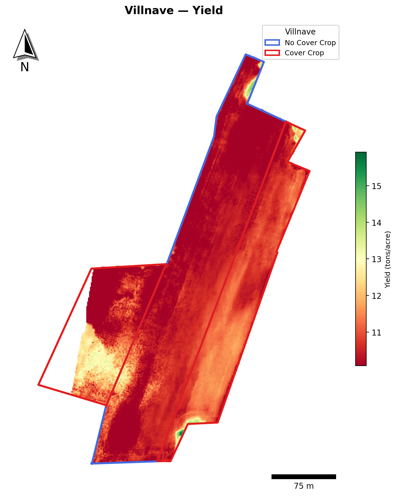
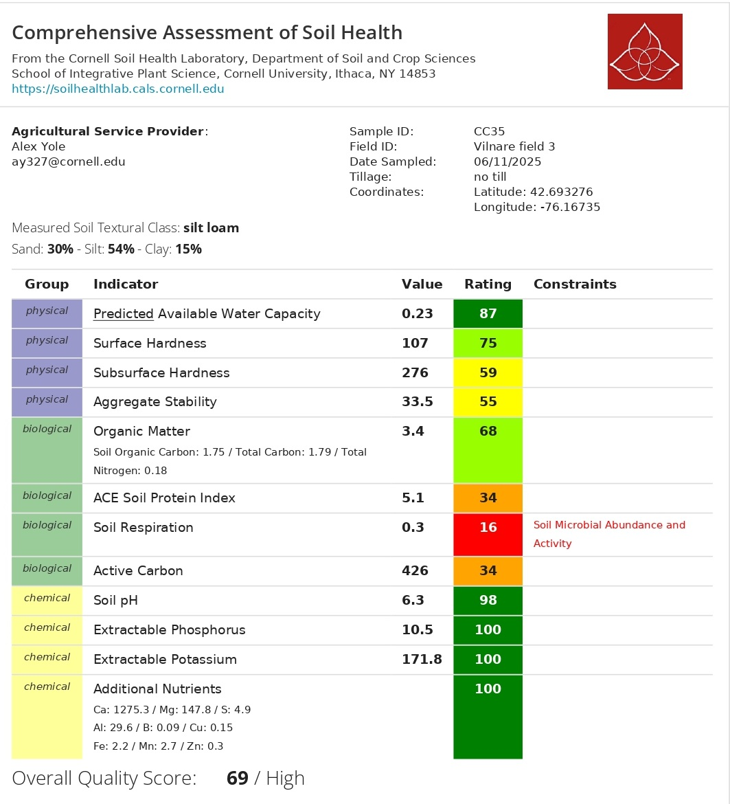
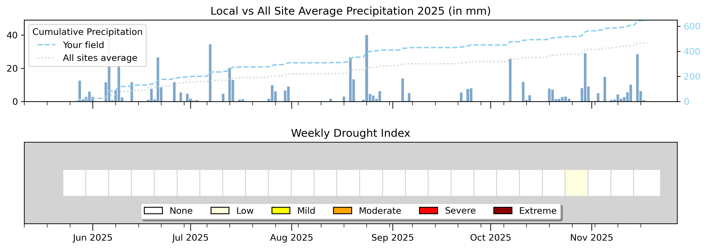

```{r setup, include=FALSE}
library(tidyverse)
library(plotly)
library(htmltools)
library(effectsize)
library(pwr)

# ============================================================
#  📂 RUTA DE DATOS — MODIFICAR AQUÍ
# ============================================================
data_dir <- "data"

# ============================================================
#  ARCHIVOS CSV
# ============================================================
dualex_file <- "villnave_dualex_survey.csv"
cn_file     <- "OFE2025_CN.csv"
csnt_file   <- "OFE2025_CSNT.csv"

# ============================================================
#  DUALEX — LECTURA Y LIMPIEZA
# ============================================================
df_raw <- read_csv(file.path(data_dir, dualex_file), show_col_types = FALSE)

df_clean <- df_raw |>
  mutate(
    treatment = str_squish(treatment),
    treatment = case_when(
      str_to_lower(treatment) == "control"   ~ "control",
      str_to_lower(treatment) == "treatment" ~ "treatment",
      TRUE ~ str_to_lower(treatment)
    )
  ) |>
  filter(!is.na(chl)) |>
  arrange(group, meas) |>
  group_by(group) |>
  mutate(plant_id = ceiling(row_number() / 2)) |>
  ungroup()

df_avg <- df_clean |>
  group_by(date, field, treatment, group, plant_id) |>
  summarise(
    chl  = mean(chl,  na.rm = TRUE),
    flav = mean(flav, na.rm = TRUE),
    anth = mean(anth, na.rm = TRUE),
    nbi  = mean(nbi,  na.rm = TRUE),
    .groups = "drop"
  ) |>
  mutate(treatment = factor(treatment, levels = c("control", "treatment")))

# ============================================================
#  DUALEX — ESTADÍSTICAS NBI + CHL
# ============================================================
stats_nbi <- df_avg |>
  group_by(treatment) |>
  summarise(n=n(), mean=round(mean(nbi,na.rm=TRUE),1),
            sd=round(sd(nbi,na.rm=TRUE),1), .groups="drop")

stats_chl <- df_avg |>
  group_by(treatment) |>
  summarise(n=n(), mean=round(mean(chl,na.rm=TRUE),1),
            sd=round(sd(chl,na.rm=TRUE),1), .groups="drop")

tt_nbi <- t.test(nbi ~ treatment, data = df_avg)
tt_chl <- t.test(chl ~ treatment, data = df_avg)

m_ctrl_nbi  <- stats_nbi |> filter(treatment=="control")   |> pull(mean)
m_cover_nbi <- stats_nbi |> filter(treatment=="treatment") |> pull(mean)
m_ctrl_chl  <- stats_chl |> filter(treatment=="control")   |> pull(mean)
m_cover_chl <- stats_chl |> filter(treatment=="treatment") |> pull(mean)

delta_nbi <- round(m_cover_nbi - m_ctrl_nbi, 2)
pct_nbi   <- round(100 * delta_nbi / m_ctrl_nbi, 1)
p_nbi     <- ifelse(tt_nbi$p.value < 0.001, "p < 0.001",
                    paste0("p = ", signif(tt_nbi$p.value, 3)))

delta_chl <- round(m_cover_chl - m_ctrl_chl, 2)
pct_chl   <- round(100 * delta_chl / m_ctrl_chl, 1)
p_chl     <- ifelse(tt_chl$p.value < 0.001, "p < 0.001",
                    paste0("p = ", signif(tt_chl$p.value, 3)))

# ============================================================
#  C:N BIOMASA — LECTURA Y CÁLCULO
# ============================================================
cn_all <- read_csv(file.path(data_dir, cn_file), show_col_types = FALSE)

vill_cn <- cn_all |>
  filter(FarmName == "Villnave") |>
  mutate(
    CN_ratio  = TotalC_pct / TotalN_pct,
    Treatment = factor(Treatment, levels = c("Control", "Treatment"))
  )

cn_summary <- vill_cn |>
  group_by(Treatment) |>
  summarise(
    n       = n(),
    mean_N  = round(mean(TotalN_pct), 3),
    sd_N    = round(sd(TotalN_pct),   3),
    se_N    = round(sd(TotalN_pct) / sqrt(n()), 3),
    mean_CN = round(mean(CN_ratio),   2),
    sd_CN   = round(sd(CN_ratio),     2),
    .groups = "drop"
  )

mean_cover_N   <- cn_summary |> filter(Treatment == "Treatment") |> pull(mean_N)
mean_nocover_N <- cn_summary |> filter(Treatment == "Control")   |> pull(mean_N)
perc_N         <- round((mean_cover_N - mean_nocover_N) / mean_nocover_N * 100, 1)

mean_cover_CN   <- cn_summary |> filter(Treatment == "Treatment") |> pull(mean_CN)
mean_nocover_CN <- cn_summary |> filter(Treatment == "Control")   |> pull(mean_CN)
delta_CN        <- round(mean_cover_CN - mean_nocover_CN, 2)
pct_CN          <- round((mean_cover_CN - mean_nocover_CN) / mean_nocover_CN * 100, 1)

d_N_cn  <- cohens_d(TotalN_pct ~ Treatment, data = vill_cn)
d_CN_cn <- cohens_d(CN_ratio   ~ Treatment, data = vill_cn)

n_cover_cn   <- vill_cn |> filter(Treatment == "Treatment") |> nrow()
n_nocover_cn <- vill_cn |> filter(Treatment == "Control")   |> nrow()

# ============================================================
#  CSNT — LECTURA Y FILTRO VILLNAVE
# ============================================================
csnt_all <- read_csv(file.path(data_dir, csnt_file), show_col_types = FALSE)

vill_csnt <- csnt_all |>
  filter(FarmName == "villnave") |>
  mutate(Treatment = factor(SampleID, levels = c("Control", "Treatment")))

csnt_ctrl      <- vill_csnt |> filter(Treatment == "Control")   |> pull(CSNT_ppm)
csnt_cover     <- vill_csnt |> filter(Treatment == "Treatment") |> pull(CSNT_ppm)
csnt_ctrl_lab  <- paste0(csnt_ctrl,  " ppm")
csnt_cover_lab <- paste0(csnt_cover, " ppm")

# ============================================================
#  PALETAS Y HELPERS
# ============================================================
pal     <- c("control" = "#e879a0", "treatment" = "#0d9488")
pal_cn  <- c("Control" = "#e879a0", "Treatment" = "#0d9488")

fmt <- function(x) ifelse(x == round(x), as.character(round(x)), as.character(x))

# ============================================================
#  FUNCIÓN: 2 cards por sección
# ============================================================
section_cards <- function(mean_cover, mean_ctrl, delta, pct, p_val,
                           color_cover, color_fx) {
  HTML(paste0('
  <style>
    .sc-row {
      display: grid;
      grid-template-columns: 1fr 1fr;
      gap: 12px;
      margin: 16px 0 24px;
    }
    .sc {
      background: #fff;
      border: 1px solid #e5e7eb;
      border-radius: 12px;
      padding: 18px 20px;
      position: relative;
      overflow: hidden;
    }
    .sc-label { font-size: 10px; font-weight: 700; letter-spacing: 1.3px;
                text-transform: uppercase; color: #9ca3af; margin-bottom: 8px; }
    .sc-main  { display: flex; align-items: baseline; gap: 10px; flex-wrap: wrap; }
    .sc-val   { font-size: 2.4rem; font-weight: 700; font-family: monospace; line-height: 1; }
    .sc-delta { font-size: 1rem; font-weight: 600; color: #0d9488; }
    .sc-sub   { font-size: 11px; color: #9ca3af; margin-top: 6px; }
    .sc-p     { font-size: 12px; font-weight: 600; color: #e879a0; margin-top: 5px; }
    @media (max-width: 600px) { .sc-row { grid-template-columns: 1fr; } }
  </style>

  <div class="sc-row">
    <div class="sc" style="border-top: 4px solid ', color_cover, '">
      <div class="sc-label">Treatment</div>
      <div class="sc-main">
        <span class="sc-val">', fmt(mean_cover), '</span>
        <span class="sc-delta">&#8593; +', delta, ' vs control (', pct, '%)</span>
      </div>
      <div class="sc-sub">Control mean: ', fmt(mean_ctrl), '</div>
    </div>
    <div class="sc" style="border-top: 4px solid ', color_fx, '">
      <div class="sc-label">Effect Size</div>
      <div class="sc-main">
        <span class="sc-val">', pct, '%</span>
      </div>
      <div class="sc-sub">relative difference treatment vs control</div>
      <div class="sc-p">', p_val, ' &#10003;</div>
    </div>
  </div>
  '))
}

# ============================================================
#  FUNCIÓN: summary card simple (para C:N — sin t-test confiable)
# ============================================================
cn_cards <- function(mean_cover, mean_nocover, pct_inc, cohen_d, label_metric, note) {
  HTML(paste0('
  <div class="sc-row">
    <div class="sc" style="border-top: 4px solid #0d9488">
      <div class="sc-label">Treatment — ', label_metric, '</div>
      <div class="sc-main">
        <span class="sc-val">', mean_cover, '</span>
        <span class="sc-delta">&#8593; +', pct_inc, '% vs Control</span>
      </div>
      <div class="sc-sub">Control mean: ', mean_nocover, '</div>
    </div>
    <div class="sc" style="border-top: 4px solid #F9C74F">
      <div class="sc-label">Cohen\'s d (effect size)</div>
      <div class="sc-main">
        <span class="sc-val">', round(cohen_d, 2), '</span>
      </div>
      <div class="sc-sub">', note, '</div>
    </div>
  </div>
  '))
}
```

```{=html}
<div class="lab-topbar">
  <div class="lab-topbar__inner">
    <div class="lab-topbar__left">
      <div class="lab-topbar__logos">
        
        
      </div>
      <span class="lab-title">2025 Cropping Season</span>
      <span class="lab-subtitle">
        Field 3 &nbsp;|&nbsp; NRate 57 lb N/ac &nbsp;|&nbsp;
        <strong>Research question:</strong> Does a cover crop increase corn nitrogen status and biomass nitrogen concentration?
      </span>
    </div>
    <div class="lab-topbar__right">
      <a class="btn btn-download" href="index.pdf" title="Download PDF version">
        ⬇ Download PDF
      </a>
    </div>
  </div>
</div>
```

::: {.page-intro}
**Welcome to your 2025 farm report.**
This report summarizes the on-farm nitrogen experiment conducted in your field, where cover crop strips (treatment) were compared against no-cover-crop controls.
:::

```{=html}
<figure style="margin: 20px 0; text-align: center;">
  
  <div id="field-placeholder" style="display:none; background:#f3f4f6; border-radius:8px;
       padding:40px; color:#9ca3af; font-size:0.9rem; border:1px dashed #d1d5db;">
    📍 Field map — place <code>villnave_field.png</code> in the <code>images/</code> folder
  </div>
  <figcaption style="font-size: 0.82rem; color: #6b7280; margin-top: 8px;">
    <strong>Figure 1.</strong> Villnave Field 3 — treatment layout.
    <span style="background:#0d9488; color:#fff; border-radius:4px; padding:1px 7px; font-size:0.78rem; margin-left:4px;">■ Treatment</span>
    <span style="background:#e879a0; color:#fff; border-radius:4px; padding:1px 7px; font-size:0.78rem; margin-left:4px;">■ Control</span>
    &nbsp;·&nbsp; Cover crop species: <em>[species TBD]</em>
  </figcaption>
</figure>
```

::: {.page-intro}
**Take-home message:** Across all four nitrogen indicators — NBI, Chlorophyll, Biomass %N, and CSNT — corn plants in the cover crop strips consistently showed higher nitrogen status than control plots. With 57 lb N/ac applied to the entire field, the cover crop appears to have contributed additional plant-available nitrogen, either through residue decomposition or improved soil nitrogen cycling. While sample sizes for the biomass analysis are small, the direction of the effect is consistent across all measurements. This is a promising signal worth tracking in future seasons with larger sample numbers.
:::

---

## Results Summary {#summary}

```{r summary-table, echo=FALSE, message=FALSE, warning=FALSE}
summary_df <- tibble(
  Metric = c(
    "🌿 NBI (Nitrogen Balance Index)",
    "🍃 Chlorophyll Index",
    "🧪 Biomass %N (C:N analysis)",
    "🌽 CSNT (Cornstalk Nitrate)"
  ),
  `Control` = c(
    paste0(m_ctrl_nbi),
    paste0(m_ctrl_chl),
    paste0(mean_nocover_N, "%"),
    paste0(csnt_ctrl, " ppm")
  ),
  `Treatment` = c(
    paste0(m_cover_nbi),
    paste0(m_cover_chl),
    paste0(mean_cover_N, "%"),
    paste0(csnt_cover, " ppm")
  ),
  `Difference` = c(
    paste0("+", delta_nbi, " (", pct_nbi, "%)"),
    paste0("+", delta_chl, " (", pct_chl, "%)"),
    paste0("+", perc_N, "%"),
    paste0("+", csnt_cover - csnt_ctrl, " ppm")
  ),
  `p-value` = c(p_nbi, p_chl, "n too small*", "n = 1")
)

knitr::kable(summary_df, align = c("l","c","c","c","c"))
```

::: {style="font-size: 0.82rem; color: #9ca3af; margin-top: -8px;"}
\* C:N sample sizes are too small for reliable hypothesis testing (n = `r n_nocover_cn` Control, n = `r n_cover_cn` Treatment). Effect sizes are reported instead.
:::

---

## 🌾 Corn Yield {#yield}

::: {.page-intro}
The map below shows the **corn yield spatial distribution** across Field 3, displayed in quantiles. The blue line marks the field boundary and the dashed line separates the two sub-fields.
:::

```{=html}
<figure style="margin: 20px 0; text-align: center;">
  
  <figcaption style="font-size: 0.82rem; color: #6b7280; margin-top: 8px;">
    <strong>Figure 2.</strong> Corn yield map.
  </figcaption>
</figure>

<div style="margin: 16px 0 24px; text-align: center;">
  <a href="https://farmersdatalab.github.io/d2f7b8c1-6a3e-4d9f-a5b2-9c1e7a3d4f66/"
     target="_blank"
     rel="noopener noreferrer"
     style="display: inline-flex; align-items: center; gap: 8px;
            background: #0d9488; color: #fff; font-weight: 600;
            padding: 10px 20px; border-radius: 8px; text-decoration: none;
            font-size: 0.95rem; box-shadow: 0 2px 6px rgba(0,0,0,0.15);
            transition: opacity 0.2s;">
    🗺️ Open Interactive NDVI Map
  </a>
</div>
```

---

## 🌿 Nitrogen Balance Index (NBI) {#nbi-details}

::: {.page-intro}
The **Nitrogen Balance Index (NBI)** is measured with the Dualex sensor and reflects the ratio of chlorophyll to flavonoids in the leaf. A higher NBI indicates better nitrogen status, the plant has enough N to build chlorophyll without accumulating excess flavonoids as a stress response. Two leaves per plant were measured and averaged. Results are compared between Control and Treatment strips using a two-sample t-test.
:::

```{r nbi-cards, echo=FALSE}
section_cards(m_cover_nbi, m_ctrl_nbi, delta_nbi, pct_nbi, p_nbi,
              "#0d9488", "#e879a0")
```

::: {.panel-tabset}

## Density

```{r nbi-density, echo=FALSE, message=FALSE, warning=FALSE}
p <- ggplot(df_avg, aes(x = nbi, fill = treatment, color = treatment)) +
  geom_density(alpha = 0.35, linewidth = 0.8) +
  scale_fill_manual(values  = pal, labels = c("control"="Control","treatment"="Treatment")) +
  scale_color_manual(values = pal, labels = c("control"="Control","treatment"="Treatment")) +
  labs(
    title    = "Nitrogen Balance Index (NBI) — Plant Average",
    subtitle = paste0("Cover − Control = ", delta_nbi, " (", pct_nbi, "%) · ", p_nbi),
    x = "Nitrogen Balance Index (Dualex)", y = "Density",
    fill = NULL, color = NULL
  ) +
  theme_minimal(base_size = 13) +
  theme(plot.title = element_text(face="bold"), legend.position = "bottom",
        panel.grid.minor = element_blank())

ggplotly(p) |> layout(legend = list(orientation="h", y=-0.2))
```

## Boxplot

```{r nbi-boxplot, echo=FALSE, message=FALSE, warning=FALSE}
p <- ggplot(df_avg, aes(x=treatment, y=nbi, fill=treatment, color=treatment)) +
  geom_boxplot(alpha=0.35, outlier.shape=NA, linewidth=0.8, width=0.4) +
  geom_jitter(width=0.15, alpha=0.5, size=1.8) +
  scale_fill_manual(values  = pal, labels = c("control"="Control","treatment"="Treatment")) +
  scale_color_manual(values = pal, labels = c("control"="Control","treatment"="Treatment")) +
  scale_x_discrete(labels = c("control"="Control","treatment"="Treatment")) +
  labs(title="Nitrogen Balance Index (NBI) by Treatment", subtitle=p_nbi,
       x="Treatment", y="Nitrogen Balance Index (Dualex)") +
  theme_minimal(base_size=13) +
  theme(plot.title=element_text(face="bold"), legend.position="none",
        panel.grid.minor=element_blank())

ggplotly(p) |> layout(showlegend=FALSE)
```

:::

---

## 🍃 Chlorophyll (Chl) {#chl-details}

::: {.page-intro}
The **Chlorophyll Index (Chl)** is also measured with the Dualex sensor and estimates the amount of chlorophyll in the leaf. Chlorophyll is directly linked to the plant's capacity for photosynthesis and is a reliable proxy for nitrogen sufficiency. Higher values indicate greener, more nitrogen-sufficient leaves. As with NBI, two leaves per plant were averaged and treatments compared with a t-test.
:::

```{r chl-cards, echo=FALSE}
section_cards(m_cover_chl, m_ctrl_chl, delta_chl, pct_chl, p_chl,
              "#4CAF50", "#F9C74F")
```

::: {.panel-tabset}

## Density

```{r chl-density, echo=FALSE, message=FALSE, warning=FALSE}
p <- ggplot(df_avg, aes(x=chl, fill=treatment, color=treatment)) +
  geom_density(alpha=0.35, linewidth=0.8) +
  scale_fill_manual(values  = pal, labels = c("control"="Control","treatment"="Treatment")) +
  scale_color_manual(values = pal, labels = c("control"="Control","treatment"="Treatment")) +
  labs(
    title    = "Chlorophyll (Chl) — Plant Average",
    subtitle = paste0("Cover − Control = ", delta_chl, " (", pct_chl, "%) · ", p_chl),
    x = "Chlorophyll Index (Dualex)", y = "Density",
    fill = NULL, color = NULL
  ) +
  theme_minimal(base_size=13) +
  theme(plot.title=element_text(face="bold"), legend.position="bottom",
        panel.grid.minor=element_blank())

ggplotly(p) |> layout(legend=list(orientation="h", y=-0.2))
```

## Boxplot

```{r chl-boxplot, echo=FALSE, message=FALSE, warning=FALSE}
p <- ggplot(df_avg, aes(x=treatment, y=chl, fill=treatment, color=treatment)) +
  geom_boxplot(alpha=0.35, outlier.shape=NA, linewidth=0.8, width=0.4) +
  geom_jitter(width=0.15, alpha=0.5, size=1.8) +
  scale_fill_manual(values  = pal, labels = c("control"="Control","treatment"="Treatment")) +
  scale_color_manual(values = pal, labels = c("control"="Control","treatment"="Treatment")) +
  scale_x_discrete(labels = c("control"="Control","treatment"="Treatment")) +
  labs(title="Chlorophyll (Chl) by Treatment", subtitle=p_chl,
       x="Treatment", y="Chlorophyll Index (Dualex)") +
  theme_minimal(base_size=13) +
  theme(plot.title=element_text(face="bold"), legend.position="none",
        panel.grid.minor=element_blank())

ggplotly(p) |> layout(showlegend=FALSE)
```

:::

---

## 🧪 C:N in Corn Biomass {#cn-details}

::: {.page-intro}
Corn biomass was collected at the V6 stage and sent for laboratory C:N analysis. This measures the actual nitrogen concentration in the plant tissue, a direct indicator of how much N the plant was able to take up. **Note:** sample sizes are small (n = `r n_nocover_cn` Control, n = `r n_cover_cn` Treatment), so results are descriptive. Effect sizes (Cohen's d) are reported instead of p-values.
:::

### Total Nitrogen in Biomass (%N)

```{r cn-n-cards, echo=FALSE}
cn_cards(
  mean_cover   = mean_cover_N,
  mean_nocover = mean_nocover_N,
  pct_inc      = perc_N,
  cohen_d      = d_N_cn$Cohens_d,
  label_metric = "Mean %N",
  note         = paste0("n = ", n_nocover_cn, " Control · n = ", n_cover_cn, " Treatment")
)
```

::: {.panel-tabset}

## Bar Chart (%N)

```{r cn-n-bar, echo=FALSE, message=FALSE, warning=FALSE}
mean_data_N <- cn_summary |>
  select(Treatment, mean_N, se_N)

increase_label_N <- paste0(
  "Treatment = +", perc_N, "% N  |  Cohen's d = ", round(d_N_cn$Cohens_d, 2),
  "  |  n = ", n_nocover_cn, " vs ", n_cover_cn
)

p_n <- ggplot(mean_data_N, aes(x = Treatment, y = mean_N, fill = Treatment)) +
  geom_col(width = 0.55, color = "black", alpha = 0.9) +
  geom_errorbar(aes(ymin = mean_N - se_N, ymax = mean_N + se_N),
                width = 0.15, linewidth = 1) +
  scale_fill_manual(values = pal_cn) +
  scale_y_continuous(expand = expansion(mult = c(0, 0.2))) +
  labs(
    title    = "Nitrogen in Corn Biomass (Mean %N ± SE)",
    subtitle = increase_label_N,
    x = "Treatment", y = "Nitrogen (%)",
    caption  = "Note: small sample size — results are descriptive only."
  ) +
  theme_minimal(base_size = 13) +
  theme(legend.position = "none", plot.title = element_text(face = "bold"),
        panel.grid.minor = element_blank())

ggplotly(p_n) |> layout(showlegend = FALSE)
```

## Raw Data (%N)

```{r cn-n-raw, echo=FALSE, message=FALSE, warning=FALSE}
p_raw_N <- ggplot(vill_cn, aes(x = Treatment, y = TotalN_pct,
                                color = Treatment, fill = Treatment)) +
  geom_jitter(width = 0.12, size = 3.5, alpha = 0.7) +
  stat_summary(fun = mean, geom = "crossbar", width = 0.35,
               linewidth = 0.8, fatten = 2) +
  scale_color_manual(values = pal_cn) +
  scale_fill_manual(values  = pal_cn) +
  labs(title = "Individual Sample Values — Biomass %N",
       subtitle = "Horizontal bar = group mean",
       x = "Treatment", y = "Total Nitrogen (%)") +
  theme_minimal(base_size = 13) +
  theme(legend.position = "none", plot.title = element_text(face = "bold"),
        panel.grid.minor = element_blank())

ggplotly(p_raw_N) |> layout(showlegend = FALSE)
```

:::

### C:N Ratio

```{r cn-ratio-cards, echo=FALSE}
# For C:N, lower ratio in cover is better (more N relative to C)
# delta is negative (cover has lower C:N = more N-rich tissue)
cn_cards(
  mean_cover   = mean_cover_CN,
  mean_nocover = mean_nocover_CN,
  pct_inc      = pct_CN,
  cohen_d      = d_CN_cn$Cohens_d,
  label_metric = "Mean C:N Ratio",
  note         = "Lower C:N = more nitrogen-rich tissue"
)
```

::: {.panel-tabset}

## Bar Chart (C:N)

```{r cn-ratio-bar, echo=FALSE, message=FALSE, warning=FALSE}
mean_data_CN <- cn_summary |>
  select(Treatment, mean_CN, sd_CN, n) |>
  mutate(se_CN = round(sd_CN / sqrt(n), 2))

p_cn <- ggplot(mean_data_CN, aes(x = Treatment, y = mean_CN, fill = Treatment)) +
  geom_col(width = 0.55, color = "black", alpha = 0.9) +
  geom_errorbar(aes(ymin = mean_CN - se_CN, ymax = mean_CN + se_CN),
                width = 0.15, linewidth = 1) +
  scale_fill_manual(values = pal_cn) +
  scale_y_continuous(expand = expansion(mult = c(0, 0.2))) +
  labs(
    title    = "C:N Ratio in Corn Biomass (Mean ± SE)",
    subtitle = paste0("Treatment C:N = ", mean_cover_CN,
                      " vs Control = ", mean_nocover_CN,
                      "  |  Cohen's d = ", round(d_CN_cn$Cohens_d, 2)),
    x = "Treatment", y = "C:N Ratio",
    caption = "Lower C:N ratio = more nitrogen-rich plant tissue."
  ) +
  theme_minimal(base_size = 13) +
  theme(legend.position = "none", plot.title = element_text(face = "bold"),
        panel.grid.minor = element_blank())

ggplotly(p_cn) |> layout(showlegend = FALSE)
```

## Raw Data (C:N)

```{r cn-ratio-raw, echo=FALSE, message=FALSE, warning=FALSE}
p_raw_CN <- ggplot(vill_cn, aes(x = Treatment, y = CN_ratio,
                                 color = Treatment, fill = Treatment)) +
  geom_jitter(width = 0.12, size = 3.5, alpha = 0.7) +
  stat_summary(fun = mean, geom = "crossbar", width = 0.35,
               linewidth = 0.8, fatten = 2) +
  scale_color_manual(values = pal_cn) +
  scale_fill_manual(values  = pal_cn) +
  labs(title = "Individual Sample Values — C:N Ratio",
       subtitle = "Horizontal bar = group mean",
       x = "Treatment", y = "C:N Ratio") +
  theme_minimal(base_size = 13) +
  theme(legend.position = "none", plot.title = element_text(face = "bold"),
        panel.grid.minor = element_blank())

ggplotly(p_raw_CN) |> layout(showlegend = FALSE)
```

:::

---

## 🌽 Cornstalk Nitrate Test (CSNT) {#csnt-details}

::: {.page-intro}
The Cornstalk Nitrate Test (CSNT) measures nitrate concentration in the lower cornstalk at the end of the season. It is a post-harvest diagnostic tool: values **above 250 ppm** suggest the crop had sufficient nitrogen; values **below 250 ppm** suggest nitrogen was limiting. Because only **one sample per treatment** was collected, no statistical comparison is possible — this is a field-level observation.
:::

```{r csnt-card, echo=FALSE}
HTML(paste0('
<div class="sc-row">
  <div class="sc" style="border-top: 4px solid #e879a0">
    <div class="sc-label">Control — CSNT</div>
    <div class="sc-main">
      <span class="sc-val">', csnt_ctrl_lab, '</span>
    </div>
    <div class="sc-sub">Threshold for sufficient N: 250 ppm</div>
  </div>
  <div class="sc" style="border-top: 4px solid #0d9488">
    <div class="sc-label">Treatment — CSNT</div>
    <div class="sc-main">
      <span class="sc-val">', csnt_cover_lab, '</span>
    </div>
    <div class="sc-sub">n = 1 per treatment — descriptive only</div>
  </div>
</div>
'))
```

```{r csnt-plot, echo=FALSE, message=FALSE, warning=FALSE}
p_csnt <- ggplot(vill_csnt, aes(x = Treatment, y = CSNT_ppm, fill = Treatment)) +
  geom_col(width = 0.5, color = "black", alpha = 0.9) +
  geom_hline(yintercept = 250, linetype = "dashed", color = "gray40", linewidth = 0.8) +
  annotate("text", x = 0.55, y = 290, label = "Sufficient N threshold: 250 ppm",
           hjust = 0, size = 3.5, color = "gray40") +
  scale_fill_manual(values = c("Control" = "#e879a0", "Treatment" = "#0d9488")) +
  scale_y_continuous(expand = expansion(mult = c(0, 0.2))) +
  labs(
    title   = "Cornstalk Nitrate Test (CSNT)",
    x = "Treatment", y = "CSNT (ppm)",
    caption = "Single measurement per treatment — field-level observation only."
  ) +
  theme_minimal(base_size = 13) +
  theme(legend.position = "none", plot.title = element_text(face = "bold"),
        panel.grid.minor = element_blank())

ggplotly(p_csnt) |> layout(showlegend = FALSE)
```

---

## 🌱 Soil Health Assessment {#soilhealth}

::: {.page-intro}
Soil health was assessed using the **Cornell Soil Health Test** (sampled 06/11/2025, Field 3). The overall quality score was **69/100 (High)**. Key constraints identified were **Soil Respiration** (score 16-Very Low) and **Active Carbon** (score 34-Low), both indicating that soil microbial activity and available carbon could be improved. Physical indicators were generally good, with strong scores for Available Water Capacity (87) and Surface Hardness (75).
:::

```{=html}
<figure style="margin: 20px 0; text-align: center;">
  
</figure>

<div style="margin: 16px 0 24px;">
  <a href="data/villnave_soilhealth.pdf"
     target="_blank"
     rel="noopener noreferrer"
     style="display: inline-flex; align-items: center; gap: 8px;
            background: #4CAF50; color: #fff; font-weight: 600;
            padding: 10px 18px; border-radius: 8px; text-decoration: none;
            font-size: 0.95rem; box-shadow: 0 2px 6px rgba(0,0,0,0.12);">
    ↗ Open Full Soil Health Report (PDF)
  </a>
</div>
```
---

## 🌧️Weather & Drought Conditions {#weatherDrought}

::: {.page-intro}
**Cumulative precipitation** at your field compared to the all-site average, alongside the weekly drought index from June through November 2025.  
:::
```{=html}
<figure style="margin: 0 0 24px; text-align: center;">
  
</figure>
```
---

## 📝 Conclusion {#conclusion}

```{r conclusion-callouts, echo=FALSE}
HTML(paste0('
<style>
  .conclusion-grid {
    display: grid;
    grid-template-columns: 1fr 1fr;
    gap: 14px;
    margin: 20px 0;
  }
  .conc-card {
    background: #fff;
    border: 1px solid #e5e7eb;
    border-left: 6px solid #4CAF50;
    border-radius: 8px;
    padding: 14px 16px;
    font-size: 0.93rem;
  }
  .conc-card.amber { border-left-color: #F9C74F; }
  .conc-card.teal  { border-left-color: #0d9488; }
  .conc-card.pink  { border-left-color: #e879a0; }
  .conc-title { font-weight: 700; font-size: 0.85rem; text-transform: uppercase;
                letter-spacing: 0.8px; color: #6b7280; margin-bottom: 6px; }
  @media (max-width: 700px) { .conclusion-grid { grid-template-columns: 1fr; } }
</style>

<div class="conclusion-grid">

  <div class="conc-card teal">
    <div class="conc-title">🌿 Leaf Nitrogen Status (NBI)</div>
    Treatment plots showed a <strong>', pct_nbi, '% higher NBI</strong> compared to control
    (', m_cover_nbi, ' vs ', m_ctrl_nbi, '). This difference was statistically significant
    (', p_nbi, '), indicating that corn plants in cover crop strips had
    better in-season nitrogen status at the time of measurement.
  </div>

  <div class="conc-card">
    <div class="conc-title">🍃 Chlorophyll Index (Chl)</div>
    Chlorophyll values were also higher in cover crop plots
    (<strong>+', pct_chl, '%</strong>; ', p_chl, '), consistent with
    the NBI result. Higher chlorophyll reflects greener, more nitrogen-sufficient
    leaves — a direct sign of improved N uptake.
  </div>

  <div class="conc-card amber">
    <div class="conc-title">🧪 Biomass Nitrogen (%N)</div>
    Laboratory analysis of corn biomass at V6 showed treatment plants had
    <strong>+', perc_N, '% more nitrogen</strong> in their tissue
    (', mean_cover_N, '% vs ', mean_nocover_N, '%). The effect size (Cohen\'s d =
    ', round(d_N_cn$Cohens_d, 2), ') suggests a meaningful biological difference,
    though the small sample size prevents formal statistical testing.
  </div>

  <div class="conc-card pink">
    <div class="conc-title">🌽 End-of-Season CSNT</div>
    The Cornstalk Nitrate Test provides a season-end snapshot of whether the crop
    ran short of nitrogen. Values above 250 ppm indicate adequate N supply.
    Results for this field are presented in the CSNT section above.
    Combined with the in-season Dualex readings and biomass data, this helps
    build a complete picture of nitrogen dynamics in Field 3.
  </div>

</div>
'))
```


